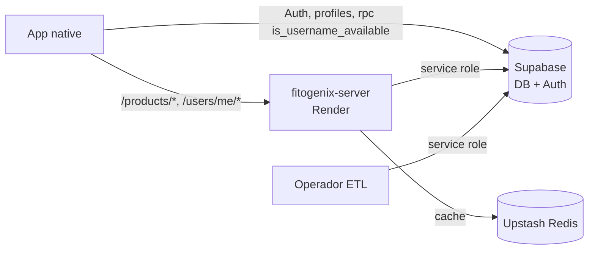
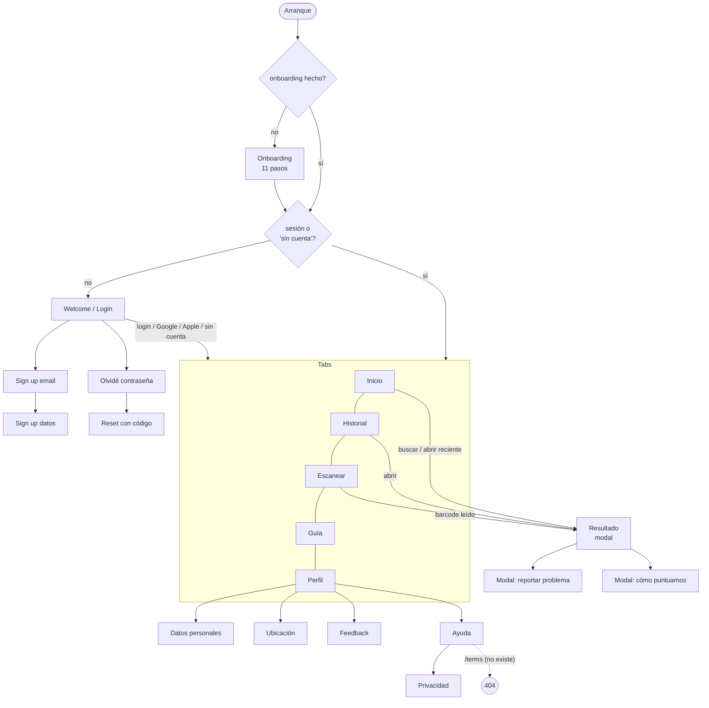

# Fase 1 — Requerimientos

> Fecha: 2026-09-28 · Base: `main` de fitogenix-server (`dae49be`) y de fitogenix-native (`976c015`).
> Los requerimientos se **derivan del código vivo**: qué hace hoy el sistema, no qué debería hacer. Cuando el código contradice lo que promete la UI o un comentario, se marca con ⚠ y se clasifica en la Fase 4.
> **PROPUESTA** = valor u objetivo que propongo yo y hay que validar. **[PREGUNTA]** = decisión pendiente.

---

## 0. Actores y límites del sistema

| Actor | Quién es | Cómo accede |
|---|---|---|
| **Anónimo** | Persona que usa la app sin cuenta ("Continuar sin cuenta") | App native → server (`/products/*`), sin token |
| **Usuario** | Persona con cuenta de Supabase Auth (email, Google o Apple) | App native → server con `Authorization: Bearer <JWT>`; app → Supabase directo para auth y `profiles` |
| **Operador de datos** | Quien corre el ETL que puebla el catálogo | `npm run etl:*` en su máquina, con credenciales de servicio |
| **Plataforma** | Render (server), Supabase (DB + Auth), Upstash (Redis) | — |

---

## 1. Requerimientos funcionales

Formato del criterio: **Dado** (estado) / **Cuando** (acción) / **Entonces** (resultado observable).

### 1.1 Catálogo y lookup

| ID | Actor | Descripción | Criterio de aceptación | Evidencia |
|---|---|---|---|---|
| RF-001 | Anónimo, Usuario | Buscar un producto por **código de barras** (8 a 14 dígitos) | **Dado** un producto en `products` con ese `barcode` y datos crudos (ingredientes o nutrientes), **cuando** se hace `POST /products/lookup {query:"<barcode>"}`, **entonces** responde 200 con un `FitogenixProduct` cuyo `productId` es el uuid de la fila y cuyo puntaje se **recalcula** con el motor vigente (`ENGINE_VERSION`), no con la columna `products.score` | `productLookupService.ts · lookupProduct, resolveByBarcode`; `routes/products/lookup.ts · productLookupRoute` |
| RF-002 | Anónimo, Usuario | Buscar un producto por **nombre** | **Dado** un texto que no es un barcode y que, normalizado (minúsculas, sin acentos), tiene 3 o más caracteres, **cuando** se hace el lookup, **entonces** se devuelve el producto más parecido por similitud trigram (RPC `search_products_by_name`, 5 candidatos, el primero con datos crudos). Con menos de 3 caracteres se trata como no encontrado | `cacheService.ts · findCachedProductByName`; RPC en `migrations/014` |
| RF-003 | Anónimo, Usuario | Informar que un producto **no está en el catálogo** | **Dado** un barcode o nombre sin match, **cuando** se hace el lookup, **entonces** responde **404** `{error:"Todavía no tenemos este producto en nuestro catálogo."}` **sin consultar proveedores externos** | `lookup.ts` (rama `!product`); docstring de `productLookupService.ts` |
| RF-004 | Anónimo, Usuario | Validar la entrada del lookup | **Dado** un body sin `query`, o con `query` vacía o de más de 200 caracteres, **cuando** se hace el lookup, **entonces** responde **400** (validación de Fastify) | `lookup.ts · schema.body` |
| RF-005 | Anónimo, Usuario | Mostrar el **puntaje y su explicación** | **Dado** un producto encontrado, **entonces** la respuesta trae: `score` 0–100 **o `null`** con `noScore {code, message}`; `scoreLabel`, `scoreColor`, `tagline` y `fito` derivados de las bandas del motor; `ingredients[]` con severidad (`sev`) e impacto; `nutrition` por 100 g/ml con nulos explícitos. Nunca se manda `breakdown` | `productLookupService.ts · mapRawToProduct, scorePresentation`; `lookupSchema.ts`; `types/fitogenix.ts` |
| RF-006 | Usuario | **Registrar el escaneo** en el historial al buscar con sesión | **Dado** un lookup exitoso con un Bearer válido, **cuando** termina la respuesta, **entonces** se hace upsert en `scan_history (user_id, product_id)` actualizando `scanned_at`, **en segundo plano**: ni demora ni rompe la respuesta; un token inválido degrada a anónimo sin error | `lookup.ts` (bloque fire-and-forget); `scanHistoryService.ts · recordScan, resolveUserIdFromToken` |
| RF-007 | App | ~~Servir la imagen del producto sin fondo~~ **SE ELIMINA (D-49)** | Reemplazado por RF-008. Hoy: `GET /products/image?url=` descarga la imagen y le quita el fondo con remove.bg (servicio pago, por imagen) | `routes/products/image.ts`; `imageService.ts · removeBackground`; native `CleanProductImage.tsx` |
| RF-008 | App | **Mostrar la imagen del producto** tal como viene de las fuentes (VTEX, Open Food Facts) | **Dado** un producto con `imageUrl`, **entonces** la app la muestra directo desde esa URL; sin `imageUrl` o si falla la carga, muestra un placeholder propio de la app. El server no procesa imágenes | **NO IMPLEMENTADO** como tal: hoy la app intenta primero la versión sin fondo |

### 1.2 Biblioteca del usuario (guardados e historial)

| ID | Actor | Descripción | Criterio de aceptación | Evidencia |
|---|---|---|---|---|
| RF-010 | Usuario | **Listar guardados** | **Dado** un usuario con sesión, **cuando** hace `GET /users/me/saved`, **entonces** recibe `{items: FitogenixProduct[]}` del más reciente al más viejo, con el puntaje recalculado; se **omiten** los productos sin datos crudos. Sin paginación | `routes/users/saved.ts`; `savedProductsService.ts · listSavedProducts`; `productRowMapper.ts` |
| RF-011 | Usuario | **Guardar** un producto | **Dado** un `productId` uuid, **cuando** hace `POST /users/me/saved {productId}`, **entonces**: existe → 200 `{ok:true}` (idempotente); no existe en `products` → 404; no es uuid → 400 | `savedProductsService.ts · saveProduct` (FK 23503 → `not_found`) |
| RF-012 | Usuario | **Quitar** un guardado | **Dado** un `productId` uuid, **cuando** hace `DELETE /users/me/saved/:productId`, **entonces** 200 `{ok:true}`, esté guardado o no (idempotente) | `savedProductsService.ts · removeSavedProduct` |
| RF-013 | Usuario | **Listar historial** de escaneos | **Dado** un usuario con sesión, **cuando** hace `GET /users/me/history?limit=n`, **entonces** recibe `{items}` del escaneo más reciente al más viejo, **un ítem por producto**, con `limit` por default 20 y acotado a 1..50. La respuesta **no trae** la fecha del escaneo | `routes/users/history.ts`; `scanHistoryService.ts · listScanHistory` |
| RF-014 | Anónimo → Usuario | **Migrar el historial anónimo** al registrarse | **Dado** un anónimo que escaneó en esta sesión de la app, **cuando** inicia sesión o se registra sin cerrar la app, **entonces** la app re-emite los lookups con token (hasta 20, del más viejo al más nuevo, best-effort) y después trae el historial del server. Si cierra la app antes, el historial anónimo se pierde (no se persiste) | native `presentation/anonScanMigration.ts`; `scanResultStore.tsx · syncFromServer, setResult` |
| RF-015 | Usuario | **Quitar un ítem** del historial | ⚠ **Solo local**: **dado** un ítem de "Recientes", **cuando** el usuario lo borra, **entonces** desaparece de la pantalla, pero **no existe endpoint para borrarlo en el server** y vuelve en la próxima sincronización | native `HistoryScreen.tsx` → `scanResultStore.tsx · removeFromHistory`; server sin `DELETE /users/me/history` ✅ **Desde F-11a** (native, 2026-09-29): con sesión, borrar llama a `DELETE /v1/users/me/history/:productId` (F-01) y el ítem no vuelve; si el server falla, vuelve a su lugar. Sin sesión sigue siendo local (el historial anónimo vive en memoria) |
| RF-017 | Usuario | **Borrar un ítem del historial en el server** (NUEVO, decisión D-13) | **Dado** un producto en el historial del usuario, **cuando** hace `DELETE /users/me/history/:productId` (uuid), **entonces** 200 `{ok:true}` (idempotente), la fila de `scan_history` se borra y no vuelve en `GET /users/me/history`. Sin token → 401; no uuid → 400 | ✅ **Implementado en F-01** (contrato `0.6.0`): `DELETE /v1/users/me/history/:productId` borra la fila del usuario del token (filtra por `user_id` y `product_id`); la base caída → 503. Native lo usa desde F-11 |
| RF-016 | Usuario | Migración única de **guardados locales viejos** (anteriores a tener backend) | **Dado** un dispositivo con guardados en AsyncStorage y sin la marca `fitogenix.savedMigratedV1`, **cuando** el usuario inicia sesión, **entonces** se suben con `POST /users/me/saved`, se descartan los que fallan y se marca la migración | **Eliminado en E-05** (la app nunca se publicó: no hay guardados viejos que migrar). Antes: native `scanResultStore.tsx · migrateLocalSavedIfNeeded` |

### 1.3 Cuenta y autenticación

| ID | Actor | Descripción | Criterio de aceptación | Evidencia |
|---|---|---|---|---|
| RF-020 | Anónimo | **Registrarse** con email | **Dado** email, contraseña, nombre, apellido, username y teléfono válidos, **cuando** confirma, **entonces** se llama `supabase.auth.signUp` con esos datos como metadata, el trigger `on_auth_user_created` crea la fila de `profiles` y la app pide confirmar el email. ⚠ **El teléfono no se guarda en `profiles`**: `handle_new_user()` solo copia nombre, apellido y username. **Decisión D-17:** se guarda en `profiles.phone` (corregir el trigger + completar los usuarios existentes desde `raw_user_meta_data`) | native `SignUpDetailsScreen.tsx · handleContinue`; `handle_new_user` (schema real) |
| RF-021 | Anónimo | Verificar que el **username está libre** | **Dado** un username que se está tipeando, **cuando** pasa el debounce, **entonces** la app llama la RPC `is_username_available` y muestra disponible, ocupado o error; con "ocupado" no deja continuar | native `SignUpDetailsScreen.tsx`, `PersonalDataScreen.tsx`; `migrations/007` |
| RF-022 | Anónimo | **Iniciar sesión** con email y contraseña | **Dado** credenciales válidas, **cuando** envía, **entonces** hay sesión y va a Inicio; con credenciales inválidas se muestra el error | native `WelcomeScreen.tsx` (`signInWithPassword`) |
| RF-023 | Anónimo | Iniciar sesión con **Google** | **Dado** un login nativo de Google, **cuando** vuelve el idToken, **entonces** `signInWithIdToken({provider:'google'})` y va a Inicio | native `lib/googleAuth.ts` |
| RF-024 | Anónimo | Iniciar sesión con **Apple** | Ídem con `provider:'apple'`. ⚠ `expo-apple-authentication` no está en `package.json`: hoy **no compila** | native `lib/appleAuth.ts` |
| RF-025 | Anónimo | **Recuperar la contraseña** | **Dado** un email, **cuando** lo pide, **entonces** llega un código (`resetPasswordForEmail`); con el código correcto y una contraseña nueva (`verifyOtp` + `updateUser`), la contraseña queda cambiada. Permite reenviar el código | native `ForgotPasswordScreen.tsx`, `ResetPasswordScreen.tsx`. **Server desde F-04:** `POST /v1/auth/password/forgot` y `/reset` (D-79); native los usa en F-08 |
| RF-026 | Anónimo | **Usar la app sin cuenta** | **Dado** el arranque sin sesión, **cuando** toca "Continuar sin cuenta", **entonces** entra a las tabs y no se le vuelve a pedir login hasta reiniciar la app o cerrar sesión (la marca vive solo en memoria) | native `lib/sessionGate.ts`; `WelcomeScreen.tsx · handleContinueWithoutAccount`; `(tabs)/index.tsx` |
| RF-027 | Usuario | **Cerrar sesión** | **Dado** un usuario con sesión, **cuando** cierra sesión, **entonces** se borran de memoria y del disco los guardados y el historial locales, se reinicia la marca de "sin cuenta" y vuelve a la bienvenida | native `ProfileScreen.tsx · handleSignOut`; `scanResultStore.tsx` (evento `SIGNED_OUT`) |
| RF-028 | Usuario | **Ver y editar datos personales** | **Dado** un usuario con sesión, **cuando** abre "Editar perfil", **entonces** ve nombre, apellido, username y teléfono de `profiles` (lectura directa a Supabase, RLS "solo el propio"), y al guardar se actualiza la fila (con username único) | native `PersonalDataScreen.tsx`; policies de `profiles` (schema real). **Server desde F-05:** `GET` / `PATCH /v1/users/me/profile` (username único → 409); native lo usa en F-09 |
| RF-029 | Usuario | **Eliminar la cuenta** | **Dado** un usuario con sesión, **cuando** confirma, **entonces** `DELETE /users/me` borra el usuario de Auth (`auth.admin.deleteUser`) y por cascada `profiles`, `saved_products` y `scan_history`; la app cierra sesión. ⚠ **Roto de punta a punta**: la app llama `fetch('/api/delete-account')`, una ruta que no existe, y `DELETE /users/me` no lo llama nadie | server `routes/users/deleteMe.ts`; native `ProfileScreen.tsx:148`; FKs `ON DELETE CASCADE` (schema real) |
| RF-030 | Sistema | **Exigir sesión** en las rutas privadas | **Dado** una request a `/users/me*`, **entonces**: sin token → 401 `"Falta el token de sesión"`; token inválido o vencido → 401 `"Sesión inválida o expirada"`; token válido → `request.userId` = id del usuario, y **toda consulta se filtra por ese id** | `plugins/auth.ts · requireAuth`; `savedProductsService`, `scanHistoryService` (`.eq('user_id', userId)`) |

### 1.4 Onboarding, contenido y soporte (solo cliente)

| ID | Actor | Descripción | Criterio de aceptación | Evidencia |
|---|---|---|---|---|
| RF-040 | Anónimo | **Onboarding** en el primer uso | **Dado** el primer arranque, **entonces** se muestran 11 pasos (bienvenida, problema, objetivos, síntomas, dieta, qué evitar, cómo se enteró, etc.) y al terminar va a Inicio. ⚠ La persistencia está **comentada** ("TODO restore when done testing"), así que el onboarding aparece **en cada arranque**. ⚠ Las respuestas **no se guardan** en ningún lado | native `lib/onboardingGate.ts`; `OnboardingScreen.tsx` |
| RF-041 | Todos | **Guía** de uso | Contenido estático con un acceso a escanear. ⚠ Menciona "fotografiá la etiqueta", que no existe | native `GuideScreen.tsx` |
| RF-042 | Todos | **Ayuda y soporte** | Botones que abren el mail para reportar un producto, pedir un producto o pedir soporte; enlaces a Privacidad y Términos. ⚠ `/terms` **no existe** | native `HelpScreen.tsx` |
| RF-043 | Todos | Enviar **feedback** | ⚠ **Simulado**: espera 700 ms y muestra "enviado" sin enviar nada. **Objetivo (D-15):** **dado** un texto no vacío, **cuando** lo envía, **entonces** llega a un endpoint dedicado del server y queda guardado en una tabla; el "enviado" solo se muestra con 2xx · **Server listo (F-07, contrato 0.9.0)**; la app lo usa en F-11b | native `FeedbackScreen.tsx · handleSend` |
| RF-044 | Todos | **Reportar un problema** con un producto | ⚠ **Simulado**: igual que RF-043. **Objetivo (D-15, D-26):** el reporte (`productId`, tipo, descripción) se guarda en una tabla a través de un endpoint dedicado; lo pueden enviar anónimos y usuarios (mismo rate limit y antispam que el feedback) · **Server listo (F-07, contrato 0.9.0)**; la app lo usa en F-11b | native `components/ProductIssueModal.tsx` |
| RF-048 | Anónimo → Usuario | **Guardar las respuestas del onboarding solo si se crea la cuenta** (NUEVO, D-20) | **Dado** un anónimo que completó el onboarding, **cuando** crea una cuenta o inicia sesión por primera vez **en la misma sesión de la app**, **entonces** las respuestas se envían al server y se guardan en una tabla asociada al usuario. **Si no crea la cuenta** (o cierra la app antes), se descartan: nunca se persisten en el dispositivo ni en el server. Datos de salud (síntomas, dieta) → ver RNF-S10 | **NO IMPLEMENTADO**. Hoy las respuestas viven en el estado de `OnboardingScreen.tsx` y se pierden. Con registro por email aplica la opción B (D-27) |
| RF-060 | Todos | **Recomendar alternativas mejores** para un producto (ROADMAP, D-22, D-24) | A definir en un diseño propio (de dónde salen las alternativas, con qué criterio de "mejor", por categoría y disponibilidad) | **NO IMPLEMENTADO**; lo promete `OnboardingScreen.tsx:541` |
| RF-061 | Todos | **Detectar ingredientes desde una foto de la etiqueta** (ROADMAP, D-22, D-24) | A definir en un diseño propio (OCR en dispositivo vs. server, qué pasa si el producto no está en el catálogo) | **NO IMPLEMENTADO**; lo prometen `OnboardingScreen.tsx:539` y `GuideScreen.tsx` |
| RF-062 | Todos | **Considerar metales pesados en el puntaje** (ROADMAP, D-25) | Se incorpora **como parte de la refactorización del motor**: el riesgo por metales pesados pondera en el `score`. El criterio y el peso se definen en el diseño del motor | **NO IMPLEMENTADO**. Hoy solo hay prosa en dos ingredientes (`ingredientData.ts:171-172`, atún y sardina); ningún paso del motor lo usa. Lo prometen `OnboardingScreen.tsx:98` (opción "Metales pesados" en "qué evitás") y `:540` |
| RF-063 | Todos | **Mostrar el contenido neto y la nutrición del envase** (REQUISITO DIFERIDO, D-37 / D-43) | Se implementa **después** del saneamiento del catálogo (D-42). Diseño preliminar y cobertura medida en [03-contratos.md §A.6](03-contratos.md): sin contenido neto → por 100 g/ml con aclaración (D-39); multipacks → por envase individual (D-40) | **NO IMPLEMENTADO**; hoy el dato existe en ~5% (OFF) + hasta ~16% en el nombre del producto |
| RF-045 | Todos | Ver la **política de privacidad** | Contenido estático | native `PrivacyScreen.tsx` |
| RF-046 | Todos | ~~**Ubicación**~~ **SE ELIMINA (D-23)** | Maqueta sin función (no pide permiso ni usa ubicación). Se quita del perfil junto con la fila "Accesibilidad" | native `LocationScreen.tsx`, `ProfileScreen.tsx` |
| RF-047 | Sistema | **Medir los escaneos fallidos** (fuera de catálogo vs. error de red) | Cada fallo emite `scan_failed {query, queryKind, reason, source}`. ⚠ No hay destino configurado (`setAnalyticsSink` nunca se llama): los eventos se descartan. **Destino diferido** (D-61, [DT-05](deuda-tecnica.md)): endpoint propio `POST /v1/events` cuando se retome | native `analytics/index.ts · track, trackScanFailed` |

### 1.5 Operación

| ID | Actor | Descripción | Criterio de aceptación | Evidencia |
|---|---|---|---|---|
| RF-050 | Plataforma | **Health check** | `GET /health` → 200 `{ok:true, ts}`. No verifica dependencias | `main.ts` |
| RF-051 | Operador | **Ingesta** de fuentes al staging | `etl:off` (dump de Open Food Facts, por país), `etl:vtex` (Carrefour/Cencosud) → filas `pending` en `products_staging` | `scripts/etl/jobs/ingestOff.ts`, `ingestVtex.ts` |
| RF-052 | Operador | **Merge** al catálogo | `etl:merge` agrupa por barcode, aplica la regla de completitud y escribe en `products` (opcionalmente enriquece con IA con `--enrich`, que gasta tokens) | `scripts/etl/jobs/runMerge.ts`; `lib/merge.ts`, `lib/completeness.ts` |
| RF-053 | Operador | **Calidad de datos** | `etl:audit-quality` / `etl:fix-quality` (dry run por default, `--apply` para escribir), `etl:check-dupes`, `etl:completeness`, `etl:stats` | `scripts/etl/jobs/*` |
| RF-054 | Operador | **Enriquecer imágenes** | `etl:images` y `etl:enrich-cencosud` completan imágenes e ingredientes desde retailers | `scripts/etl/jobs/enrichImages.ts`, `enrichCencosud.ts` |

---

## 2. Requerimientos no funcionales (escenarios medibles)

Formato: **fuente → estímulo → entorno → respuesta → métrica**. La columna **Hoy** dice si el código actual lo cumple, con evidencia. Los objetivos numéricos son **PROPUESTA** salvo que se indique otra cosa.

### 2.1 Usabilidad (prioridad 1)

| ID | Fuente → estímulo | Entorno | Respuesta esperada | Métrica | Hoy |
|---|---|---|---|---|---|
| RNF-U01 | Usuario → escanea un producto **que no está** | Normal | Mensaje de "todavía no está", **sin** "reintentar", con la salida "escanear otro" | 100% de los 404 → cartel de fuera de catálogo; 100% de los fallos de red o servidor → cartel de error con "reintentar" | ⚠ **Parcial.** El cliente separa bien los dos casos (`useScanFlow`, `useProductSearch`), pero el server responde **404 cuando Supabase falla** (ver RNF-D02): una caída se le muestra al usuario como "no está en el catálogo". ✅ **Desde H-01** la caída responde 503 |
| RNF-U02 | Usuario → apunta la cámara a un código | Normal | Feedback inmediato de que se leyó | Vibración + indicador de carga en < 100 ms desde la lectura | ✅ `useScanFlow · handleBarcodeScanned` (vibración + estado `loading`) |
| RNF-U03 | Usuario → abre un producto encontrado | Normal | Ve un puntaje, o una explicación clara de por qué no lo hay. **La medición se posterga hasta limpiar los datos** (D-19) | **≥ 95% de las filas de `products` con `score ≠ null` al recalcular con el motor vigente** (D-12). El denominador exacto está en la sección 7 | ⚠ **Riesgo alto.** El 81% de las filas escritas con v2.3 no tiene puntaje (Fase 0, §2.7.2). La cobertura real con el motor actual no está medida |
| RNF-U04 | Producto → quiere saber cuánto le falta al catálogo | Normal | Tasa de "fuera de catálogo" medida con uso real | Tasa semanal de `scan_failed{reason:out_of_catalog}` / total de escaneos, disponible en un tablero | ❌ No medible: la analítica no tiene destino (RF-047; diferido por D-61, [DT-05](deuda-tecnica.md)) |
| RNF-U05 | Anónimo → quiere guardar un producto | Sin sesión | Se lo invita a crear una cuenta, con un mensaje claro de que **sin cuenta no puede acceder a su historial ni a sus guardados** (D-14) | 100% de los intentos de guardar sin sesión → invitación a crear cuenta; 0 guardados "fantasma" | ⚠ **No cumple.** `toggleSaved` marca el producto como guardado localmente sin sesión y nunca lo sube (`scanResultStore.tsx · toggleSaved`, "Update local state immediately regardless of session") ✅ **Desde F-11a:** sin sesión, guardar no guarda nada y abre una invitación a crear cuenta con ese mensaje (copy provisorio, D-76) |
| RNF-U06 | Usuario → abre un producto que ya tiene guardado | Con sesión, después de sincronizar | El ícono de guardado refleja el estado del server | 100% de coincidencia entre el ícono y `GET /users/me/saved` | ❌ **No cumple.** El campo `id` vale **la query** en el lookup (`mapRawToProduct(off, query)` → `id: query`) y **el uuid** en los listados (`joinedRowToProduct` → `id: productId`). `isSaved(result.id)` compara ids de distinto tipo: un producto guardado aparece como no guardado, y tocar el ícono vuelve a guardarlo en vez de quitarlo |
| RNF-U07 | Usuario → borra un ítem de su historial | Con sesión | El ítem no vuelve a aparecer | 0 ítems borrados que reaparecen tras sincronizar | ❌ Reaparece (RF-015) ✅ Desde F-11a (con F-01) |
| RNF-U08 | Usuario → abre la app por segunda vez | Normal | No ve el onboarding otra vez | Onboarding solo en el primer arranque | ❌ Aparece siempre (RF-040) |
| RNF-U09 | Usuario → lee el onboarding o la guía | Normal | La app no promete funciones que no tiene | 0 funciones prometidas sin implementar | ❌ Promete "fotografiá la etiqueta", "metales pesados" y "alternativas más limpias" (`OnboardingScreen.tsx:539-541`, `GuideScreen.tsx`); no existen. Alternativas y lectura de etiquetas quedan **para después** (D-16) |
| RNF-U10 | Usuario → escanea con red lenta | 3G o 4G débil | Un límite de espera con un mensaje accionable | Timeout del cliente = 30 s con "La solicitud tardó demasiado" | ✅ `api/client.ts · lookupProduct` (AbortController 30 s). **PROPUESTA:** bajarlo a 10–15 s cuando esté medido el p95 |

| RNF-U11 | Usuario con VoiceOver/TalkBack, letra grande o "reducir movimiento" → usa cualquier pantalla | Configuración de accesibilidad del sistema activa | La app **respeta la configuración del sistema** en todas las pantallas. Es un requisito **transversal**, no una función (D-23) | 100% de los controles con solo ícono tienen `accessibilityLabel`; los textos escalan hasta 200% sin cortarse en las pantallas P-07 a P-10; con "reducir movimiento" no hay animaciones de deslizamiento; contraste de texto AA (4.5:1) | ❌ **0** `accessibilityLabel` en **72** `Pressable`; sin manejo de "reducir movimiento" (animaciones de tab: `useTabSlideAnimation`, `useSwipeTab`) ✅ **Desde F-13** (native, 2026-09-29): los 18 controles de solo ícono tienen etiqueta y un test guardián lo exige; "reducir movimiento" frena las animaciones propias (Reanimated ya lo respetaba solo, `ReduceMotion.System`); los nombres de producto de Inicio e Historial pasan a 3 líneas con letra grande. Falta el checklist manual ([checklist-accesibilidad.md](checklist-accesibilidad.md)) y el contraste AA |

### 2.2 Performance (prioridad 1)

> **Objetivos validados el 2026-09-28 (D-10).** Los valores marcados como PROPUESTA en las filas P01–P04 y D07 pasan a ser objetivos aceptados.

Estado actual: **no hay nada medido.** No hay métricas ni APM. Lo único disponible es el log de Fastify (`logger: true` en `main.ts`), que registra el `responseTime` de cada request en los logs de Render: la primera medición se puede sacar de ahí sin tocar código.

| ID | Fuente → estímulo | Entorno | Respuesta esperada | Métrica (PROPUESTA) | Hoy |
|---|---|---|---|---|---|
| RNF-P01 | App → `POST /products/lookup` por **barcode** | Carga normal; Redis y Supabase sanos | Respuesta del server | **p95 ≤ 300 ms** con hit de Redis, **p95 ≤ 800 ms** con miss (Supabase + recálculo); medido en el server (`responseTime`) sobre 7 días | Sin medir. Camino: Redis → `products` por índice único → `mapRawToProduct` (recálculo en CPU) |
| RNF-P02 | App → lookup por **nombre** | Ídem | Ídem | **p95 ≤ 1.000 ms** | Sin medir. RPC con `ILIKE '%q%' OR product_name % q` sobre índice GIN trigram (13 MB) y ranking por `similarity` |
| RNF-P03 | Usuario → escanea un código | App en 4G | Pantalla de resultado visible | **p95 ≤ 2 s** desde la lectura hasta el render (lado cliente) | Sin medir (sin analítica) |
| RNF-P04 | App → `GET /users/me/saved` o `/history` | Usuario con ≤ 50 ítems | Lista completa | **p95 ≤ 800 ms** | Sin medir. `saved` **no tiene límite ni paginación** y recalcula el puntaje de cada ítem |
| RNF-P05 | Primera request después de inactividad | Instancia de Render recién levantada | Sin "arranque en frío" visible | Primera request ≤ 2 s | ❌ **No se puede cumplir con el plan actual (free, D-11)**. **Regla aceptada (D-18):** antes de publicar en las tiendas, el server corre en una instancia siempre encendida; hasta entonces el p95 se mide sin contar los arranques en frío, que se informan aparte. Detalle:: Render duerme la instancia gratis después de un rato sin tráfico y la primera request espera a que levante (decenas de segundos). Ver la sección 7 |
| RNF-P06 | Muchas apps piden el mismo producto a la vez | Pico | Una sola resolución por clave y proceso | 1 consulta a Supabase por clave concurrente | ✅ `productLookupService.ts · withSingleflight` (en memoria, por instancia) |
| RNF-P07 | ~~App → lista con imágenes~~ | — | **OBSOLETO (D-49)**: sin `/products/image`, las imágenes ya no pasan por el server ni consumen su límite | — | — |

### 2.3 Disponibilidad (prioridad 1): qué pasa si una dependencia no responde

| ID | Dependencia caída | Respuesta esperada (PROPUESTA) | Métrica | Hoy (comportamiento real, con evidencia) |
|---|---|---|---|---|
| RNF-D01 | **Redis** (Upstash) no responde o da error | El lookup sigue funcionando desde Supabase, casi sin latencia extra | Timeout de Redis ≤ 200 ms y **sin reintentos** en el camino de la request; p95 del lookup con Redis caído ≤ p95 normal + 250 ms | ⚠ **Degrada mal.** Los errores se atrapan y el lookup cae a Supabase (`redisService.ts`: try/catch → `null`), pero el cliente `@upstash/redis` 1.38 viene con **5 reintentos y backoff exponencial** (`50·eⁿ` ms) y el server **no configura timeout**: cada lookup puede demorar varios segundos antes de caer a Supabase. ✅ **Desde H-01:** sin reintentos y 200 ms de tope; si no responde, se sigue desde Supabase |
| RNF-D02 | **Supabase DB** no responde o da error | El lookup responde **503** (error reintentable), nunca 404 | 0 respuestas 404 causadas por errores de la base | ❌ **Enmascara la caída.** `cacheService.ts · getCachedBy` y `findCachedProductByName` hacen `if (error …) return null` → el lookup responde **404 "no está en el catálogo"**. `saved` y `history` responden 500 (se propaga el error). ✅ **Desde H-01:** 503 con `Retry-After` (también si el cliente lanza), con 2 s de tope y sin los reintentos de postgrest-js |
| RNF-D03 | **Supabase Auth** no responde | Las rutas privadas responden 503; el lookup anónimo sigue funcionando | 0 respuestas 401 causadas por una caída de Auth | ❌ `plugins/auth.ts`: cualquier error de `getUser` → **401 "Sesión inválida o expirada"**, y la app lo traduce a "tenés que iniciar sesión" (`AuthRequiredError`). El lookup autenticado sigue respondiendo, pero pierde el registro de historial en silencio (✅ aceptable). ✅ **Desde H-02:** el JWT se verifica localmente con el JWKS cacheado, así que con Auth caído las rutas privadas siguen andando; solo sin claves en cache responden 503 con `Retry-After`, igual que `DELETE /v1/users/me` si Auth no confirma la sesión; el lookup sigue como anónimo |
| RNF-D04 | ~~remove.bg caído~~ | — | **OBSOLETO (D-49)**: se elimina la dependencia | — | — |
| RNF-D05 | Cualquier dependencia crítica caída | El health check lo refleja | `/health` responde ≠ 200 si Supabase no responde | ✅ Desde H-01: `/health/ready` responde 503 si Supabase no contesta en 1 s (Redis se informa, no bloquea); `/health` sigue siendo liveness |
| RNF-D06 | **Proveedores externos** de datos (OFF, IA, retailers) caídos | El runtime no se entera: solo afecta al ETL | 0 dependencias de proveedores externos en el camino de la request | ✅ Catálogo solamente, desde 2026-08-18 (`productLookupService.ts`) |
| RNF-D07 | Objetivo global | — | Disponibilidad mensual del lookup ≥ **99,5%** (validado, D-10) | Sin medir: no hay monitoreo externo |

### 2.4 Seguridad

| ID | Fuente → estímulo | Respuesta esperada | Métrica | Hoy |
|---|---|---|---|---|
| RNF-S01 | Cualquiera con la anon key → lee `products`, `products_staging` o llama `search_products_by_name` directo en Supabase | Error de permisos | **"Ningún dato de catálogo es accesible con la anon key"** (decisión D-08): 0 filas devueltas en las 3 pruebas negativas | ✅ Cumplido desde el 2026-09-29 (U-01): las 3 pruebas negativas responden `401` con `42501`. Antes: ❌ SEC-01, policy `"Anyone can read products"` + grants por default (Fase 0, §7.1) |
| RNF-S02 | Request a `/users/me*` sin token o con token inválido | 401 | 100% de las rutas privadas con `requireAuth` | ✅ `deleteMe.ts`, `saved.ts`, `history.ts` registran `requireAuth` en su propio scope. Fijado por T-04 (`plugins/auth.test.ts`) y T-05 (`routes/users/users.test.ts`) |
| RNF-S03 | Usuario A → intenta leer o modificar datos del usuario B | Imposible | 0 consultas a `saved_products`/`scan_history` sin filtro por `userId` del token | ✅ Por código (`.eq('user_id', userId)`). Ojo: el server usa service role, que **saltea RLS**, así que ese filtro es la **única** barrera. Fijado de punta a punta: T-05 (el id sale del token y se ignora el que mande el cliente) + tests de `savedProductsService` y `scanHistoryService` (el filtro en cada consulta) |
| RNF-S04 | Cliente abusivo → muchas requests | Límite por cliente y por ruta | Límites por ruta (`/auth/*`, feedback, reportes) y contador compartido entre instancias cuando haya más de una | ⚠ Un solo límite global de 60/min por IP, **en memoria** (por instancia, se pierde al reiniciar). En redes móviles con NAT, muchos usuarios comparten IP. Desde H-03 la IP es la del cliente detrás del proxy (`TRUST_PROXY` desde H-06, por dirección del proxy); los límites de `/auth/*` y feedback llegan con esas rutas (F-02, F-07). Desde F-04, `/auth/password/*` con 10/min por IP y 5 códigos fallidos por email cada 15 min. Desde F-07, `/feedback` y reportes con 5/min por IP en cada ruta |
| RNF-S05 | ~~Atacante → `/products/image?url=…` (SSRF)~~ | **OBSOLETO (D-49)**: el endpoint se elimina, y con él el riesgo | — | ✅ Endpoint eliminado en E-02 (en `main` cuando se mergee la integración) |
| RNF-S06 | Página web cualquiera → llama al server desde un navegador | Rechazo por CORS | Lista explícita de orígenes (la app nativa no usa CORS) | ✅ Desde H-03: lista explícita (`CORS_ORIGINS`); vacía = sin CORS |
| RNF-S07 | Revisión de secretos | Cada proceso tiene solo los secretos que usa | El server arranca sin `ANTHROPIC_API_KEY`/`SERPAPI_API_KEY` (D-05); ningún `.env` de cliente tiene secretos de server; 0 secretos versionados | ⚠ El server exige dos keys que no usa; el `.env` local de native tiene `SUPABASE_SECRET_KEY`, `ANTHROPIC_API_KEY` y `SERPAPI_API_KEY` (no versionados) |
| RNF-S08 | Usuario → elimina su cuenta desde la app | Se borran sus datos personales | 100% de las eliminaciones borran `auth.users` + `profiles` + `saved_products` + `scan_history` | ❌ La app no llega al server (RF-029). **Además es requisito de App Store** (la eliminación de cuenta tiene que poder iniciarse dentro de la app): bloquea la publicación |
| RNF-S10 | Usuario → responde el onboarding con **datos de salud** (síntomas, dieta) y crea la cuenta | Se guardan solo con **consentimiento explícito**, se pueden borrar, y la política de privacidad lo informa | 100% de las filas de respuestas de onboarding con consentimiento registrado (fecha + versión del texto); borrado por cascada con la cuenta (RNF-S08). Los datos de salud **no** viajan en la metadata de Supabase Auth (`user_metadata` se incluye en el JWT) | **NO IMPLEMENTADO** (nace con RF-048). Base legal: la ley 25.326 trata los datos de salud como sensibles |
| RNF-S09 | Revisión de logs | Sin tokens ni datos personales | 0 headers `Authorization` en logs | ✅ El serializer por default de Fastify no loguea headers. Se loguea la query del lookup (`product_lookup`); la URL de `/products/image?url=` dejó de loguearse con E-02 |

---

## 3. Pantallas de native (relevamiento del código)

Native es el cliente activo (D-03), así que las pantallas **se relevan** del código en vez de proponerse. La columna "Estados" usa: **L** = cargando, **V** = vacío, **NE** = no encontrado, **E** = error.

### 3.1 Mapa de navegación

### 3.2 Pantallas

| # | Pantalla (ruta) | Propósito | Datos (fuente) | Acciones | Estados | Observaciones |
|---|---|---|---|---|---|---|
| P-01 | Onboarding (`/onboarding`) | Presentar la app y perfilar al usuario | Estáticos | Avanzar 11 pasos, elegir opciones, terminar | — | ⚠ Aparece siempre (RF-040); las respuestas se descartan; promete funciones inexistentes (RNF-U09) |
| P-02 | Welcome / Login (`/welcome`) | Entrar | Supabase Auth | Login con email, Google o Apple; olvidé contraseña; registrarme; continuar sin cuenta | L (por botón), E (mensaje) | Apple no compila (RF-024) |
| P-03 | Registro: email (`/sign-up`) | Elegir método de registro | — | Seguir con email; Google | L, E | — |
| P-04 | Registro: datos (`/sign-up-details`) | Crear la cuenta | RPC `is_username_available` | Completar formulario, chequeo de username, confirmar | L, E, info "confirmá tu email" | El teléfono se pierde (RF-020) |
| P-05 | Olvidé contraseña (`/forgot-password`) | Pedir el código | Supabase Auth | Enviar email | L, E | — |
| P-06 | Reset de contraseña (`/reset-password`) | Cambiar la contraseña con el código | Supabase Auth | Ingresar código y contraseña nueva, reenviar código | L, E, hecho | — |
| P-07 | Inicio (tab `index`) | Buscar por nombre y ver recientes | `POST /products/lookup`; historial en memoria o espejo local | Buscar, abrir reciente, ir a escanear | L (botón), NE (tarjeta "no está en el catálogo" con la query), E (texto de red), V (sin recientes → invitación a escanear) | Gate de arranque: redirige a onboarding o welcome |
| P-08 | Escanear (tab `scan`) | Leer el código de barras | Cámara; `POST /products/lookup` | Escanear, linterna, reintentar, volver | pidiendo permiso, **permiso denegado**, escaneando, L, NE (con la query leída), E (con "Volver a intentar") | Estados bien separados (ADR del cliente: no-encontrado ≠ error) |
| P-09 | Resultado (`/scan-result`, modal) | Mostrar puntaje, ingredientes y nutrición | Producto en memoria (`result`) | Guardar o quitar; ver "cómo puntuamos"; reportar problema; volver | V ("No hay ningún producto escaneado todavía") | ⚠ Ícono de guardado inconsistente (RNF-U06); guardar sin sesión (RNF-U05); decide qué grupo de ingredientes destacar con **`score < 50` hardcodeado** en el cliente |
| P-10 | Historial (tab `historial`) | Ver recientes y guardados | Store: historial y guardados (server con sesión; memoria sin sesión) | Cambiar entre Recientes y Guardados, abrir, borrar o quitar | V anónimo ("Tu historial se guarda con una cuenta" + crear cuenta), V con sesión, V guardados | ⚠ Borrar de Recientes es solo local (RF-015). **No muestra la fecha del escaneo** (el server no la manda) |
| P-11 | Guía (tab `guia`) | Explicar cómo usar la app | Estáticos | Ir a escanear | — | Promete "fotografiá la etiqueta" |
| P-12 | Perfil (tab `perfil`) | Cuenta y ajustes | `profiles` (Supabase directo) | Editar perfil, Ubicación, Accesibilidad ("Próximamente"), Feedback, Ayuda, cerrar sesión, **eliminar cuenta**, redes sociales | L (eliminando), E (alerta) | ⚠ Eliminar cuenta roto (RF-029) |
| P-13 | Datos personales (`/personal-data`) | Editar el perfil | `profiles` select/update; RPC de username | Editar y guardar | L, E | — |
| P-14 | Ubicación (`/location`) | Informar sobre la ubicación | — | Abrir ajustes del sistema | — | La app no usa la ubicación: candidata a quitar **[PREGUNTA]** |
| P-15 | Feedback (`/feedback`) | Mandar comentarios | — | Escribir y "enviar" | L, enviado | ⚠ Simulado (RF-043) |
| P-16 | Ayuda (`/help`) | Soporte | — | Mails de soporte, Privacidad, Términos | — | ⚠ `/terms` no existe |
| P-17 | Privacidad (`/privacy`) | Política de privacidad | Estáticos | Leer | — | — |
| M-01 | Modal "Reportar problema" | Reportar datos incorrectos de un producto | — | Elegir tipo, describir, "enviar" | L, enviado | ⚠ Simulado (RF-044) |
| M-02 | Modal "Cómo puntuamos" | Explicar el puntaje | Estáticos | Cerrar | — | — |

### 3.3 Uso de endpoints por pantalla

| Endpoint | Pantallas que lo consumen |
|---|---|
| `POST /products/lookup` | P-07 Inicio, P-08 Escanear; migración anónima (RF-014) |
| `GET /products/image` | Toda imagen de producto (P-07, P-09, P-10) vía `CleanProductImage`. **Se elimina (D-49)**: la app usa `imageUrl` directo |
| `GET /users/me/saved` | Sincronización al iniciar sesión → P-10 |
| `POST /users/me/saved` / `DELETE /users/me/saved/:id` | P-09 (ícono de guardar), P-10 (quitar) |
| `GET /users/me/history` | Sincronización al iniciar sesión → P-07, P-10 |
| `DELETE /users/me` | **Ninguna** (P-12 llama una ruta inexistente) |
| `GET /health` | Ninguna |

---

## 4. Resumen

1. **43 RF** (7 de catálogo, 8 de biblioteca, 11 de cuenta, 12 de contenido y soporte —incluye RF-048 nuevo y los objetivos de roadmap RF-060/061/062—, 5 de operación) y **35 RNF** (11 de usabilidad, 7 de performance, 7 de disponibilidad, 10 de seguridad), todos con evidencia archivo + símbolo. 17 pantallas y 2 modales relevados.
2. El núcleo (lookup por barcode/nombre, puntaje, guardados e historial) está implementado y es coherente en el server.
3. **Rotos de punta a punta:** eliminar cuenta (RF-029, además bloquea App Store) e ícono de guardado (RNF-U06, el `id` cambia de significado según el endpoint).
4. **Simulados o sin persistir:** feedback, reportar problema, respuestas del onboarding y analítica. El onboarding aparece en cada arranque.
5. **Disponibilidad:** una caída de Supabase se muestra como "no está en el catálogo" (404) y una caída de Auth como "sesión vencida" (401). Redis caído degrada con segundos de reintentos.
6. **Performance:** no hay nada medido; los logs de Fastify en Render alcanzan para una primera medición del p95.
7. **Seguridad:** SEC-01 (catálogo público), SSRF en `/products/image` (se resuelve eliminando el endpoint, D-49), CORS abierto, rate limit en memoria.
8. **Usabilidad:** la cobertura de puntaje es el mayor riesgo de producto (81% de las filas v2.3 sin puntaje).

## 5. Decisiones tomadas en la Fase 1 (2026-09-28)

| # | Tema | Decisión |
|---|---|---|
| D-10 | Objetivos de performance y disponibilidad | Se validan: p95 barcode ≤ 300 ms con hit / ≤ 800 ms con miss, nombre ≤ 1 s, de punta a punta ≤ 2 s, disponibilidad mensual 99,5% |
| D-11 | Hosting | Render plan **free** por ahora; es posible migrar a otro proveedor. La arquitectura no se tiene que atar a Render (se formaliza en un ADR en la Fase 2) |
| D-12 | Cobertura de puntaje | El 95% de los productos de las tablas tienen que poder calcularse (definición exacta en la sección 7) |
| D-13 | Quitar del historial | Se agrega el endpoint `DELETE /users/me/history/:productId` (RF-017) |
| D-14 | Guardar sin cuenta | El botón invita a crear una cuenta, con un mensaje claro de que sin cuenta no hay acceso al historial ni a los guardados |
| D-15 | Feedback y reportes de producto | Endpoint dedicado en el server + almacenamiento en tabla |
| D-16 | Alternativas y lectura de etiquetas | Buenas ideas, pero quedan fuera de alcance por ahora: hay que diseñarlas antes. Mientras tanto, el texto de la app no debe prometerlas |
| D-17 | Teléfono | Se guarda en `profiles.phone` |

## 6. Decisiones de la segunda ronda (2026-09-28)

| # | Tema | Decisión |
|---|---|---|
| D-18 | Hosting vs. objetivos | Antes de publicar en las tiendas, el server corre en una instancia siempre encendida (del proveedor que sea). Hasta entonces, el p95 se mide sin contar los arranques en frío, que se informan aparte |
| D-19 | Cobertura del 95% | Es **deuda técnica conocida**: muchos datos de la base están incompletos. La medición (con `scripts/score-histogram.ts`) se hace **después de limpiar los datos**. La definición de la sección 7.2 queda como definición de trabajo, a confirmar en ese momento. El saneamiento de datos entra al plan como ítem propio |
| D-20 | Respuestas del onboarding | Se guardan **solo si el usuario crea una cuenta**: viven en la sesión de la app y, si se crea la cuenta, se persisten en una tabla; si no, se descartan (RF-048). Por los datos de salud aplica RNF-S10 |
| D-21 | Feedback | Es importante **tenga o no cuenta** el usuario: el endpoint acepta anónimos y usuarios. Al ser público, necesita su propio rate limit y protección antispam |
| D-22 | Texto que promete alternativas y lectura de etiquetas | **No se saca**: esas funcionalidades pasan a ser **objetivos del roadmap** (RF-060, RF-061), con diseño propio |
| D-23 | Ubicación y Accesibilidad | Se quitan del perfil. La accesibilidad es un **requisito transversal** de toda la app (RNF-U11), no una función |

### Tercera ronda (2026-09-28)

| # | Tema | Decisión |
|---|---|---|
| D-24 | Cuándo se hacen alternativas y lectura de etiquetas | **Antes de publicar en las tiendas, después de dejar limpia la codebase.** Hay otras prioridades antes, pero son requisito del lanzamiento. Orden macro: limpieza (este plan) → otras prioridades → RF-060 / RF-061 → publicación |
| D-25 | Metales pesados | Se consideran y **ponderan en el puntaje**, como parte de la **refactorización del motor** (RF-062) |
| D-26 | Reportes de producto | Se aceptan de todos (anónimos y usuarios), con la misma protección que el feedback |

**Consideración de diseño para RF-062 (no bloquea esta fase):** los metales pesados **no figuran en la etiqueta** ni en los datos que carga el ETL (OFF, VTEX). El motor no los puede leer: los tiene que **inferir** (por ejemplo, riesgo por ingrediente o categoría, como arroz, cacao o pescados grandes) o traerlos de una fuente externa. Esa elección define qué tan defendible es el puntaje, y va en el ADR del motor. Como el scoring es de alto riesgo, este cambio exige tener antes los tests de caracterización (paso 1 del plan).

| D-27 | Respuestas del onboarding con registro por email | **Opción B** (sección 7.6): al tocar "registrarme" se guardan en el teléfono con vencimiento corto (24 h); se envían al server en el primer inicio de sesión y se borran del teléfono; también se borran al vencer o al elegir "continuar sin cuenta". Nunca llegan al server sin cuenta |

**Fase 1 cerrada el 2026-09-28** ("OK fase 1"). Sin preguntas pendientes.

### Cambios posteriores (durante las Fases 2 y 3)

| # | Tema | Decisión |
|---|---|---|
| D-42 | Saneamiento del catálogo | La base tiene muchos errores y datos faltantes. Se va a tratar **en una sesión aparte, dedicada**, con el objetivo de **migrar a una tabla de productos limpia** (discrepancias y faltantes resueltos y validados). Es un proyecto propio: este plan solo registra sus dependencias (cobertura del 95% D-19, contenido neto D-43) |
| D-49 | Imágenes | **Se elimina remove.bg** y el endpoint `/products/image`. La app muestra las imágenes que ya vienen de VTEX y Open Food Facts (RF-008) |
| D-50 | Hosting de imágenes | Queda como **deuda técnica** ([DT-04](deuda-tecnica.md)): evaluar un servicio externo que guarde las imágenes y las sirva siempre por HTTPS |
| D-43 | Contenido neto (D-37) | Queda como **requisito diferido** (RF-063): se piensa y se implementa después del saneamiento (D-42) |
| D-28 | Comunicación cliente ↔ backend | **El cliente no hace requests directas a Supabase: todo pasa por el server.** Afecta el *cómo* de RF-020 a RF-028 (registro, username, login con email / Google / Apple, recuperación de contraseña, sesión, perfil): el comportamiento esperado no cambia, pero native deja de llamar a Supabase y usa endpoints nuevos del server. Ver [ADR-0010](adr/0010-server-unica-puerta-de-entrada.md) y [02-arquitectura.md §7 y §9](02-arquitectura.md) |

## 7. Aclaraciones sobre las respuestas

### 7.1 Plan free de Render vs. los objetivos (D-10 y D-11)

Los dos puntos chocan. En el plan free, Render duerme la instancia después de un rato sin tráfico y la **primera request después espera a que levante** (decenas de segundos; ver la documentación de Render para el valor vigente). Con poco tráfico eso pasa seguido, así que el p95 y la disponibilidad que validaste no se pueden medir ni cumplir de forma honesta en ese plan.

**Recomendación:** fijar la regla *"antes de publicar en las tiendas, el server corre en una instancia siempre encendida (del proveedor que sea)"* y, mientras tanto, medir el p95 **excluyendo** los arranques en frío, informándolos aparte. Del lado positivo: con una sola instancia, el rate limit y el singleflight en memoria no son un problema todavía.

**[PREGUNTA 1]** ¿Aceptás esa regla?

### 7.2 Qué cuenta en el 95% (D-12)

Tres cosas definen el número:

1. **Denominador.** Propuesta: todas las filas de `products` (hoy 81.449).
2. **Productos fuera de alcance.** El motor no puntúa a propósito ciertos productos (por ejemplo, fuera de alcance como el alcohol) y lo informa con un `noScore.code`. ¿Cuentan como "no calculados" o se excluyen del denominador? Propuesta: **se excluyen solo los fuera de alcance**; los de "datos insuficientes" y "lista no identificable" cuentan como fallas.
3. **Qué se hace con los que no llegan.** Dos palancas, que se pueden combinar: (a) **completar datos** con el ETL (enriquecer ingredientes o nutrientes) y hacer crecer la tabla de ingredientes reconocidos; (b) **no publicar** en el catálogo los productos que no se pueden calcular (quedarían en staging hasta completarse).

Línea de base: `scripts/score-histogram.ts` ya recalcula todo el catálogo con el motor actual, **en solo lectura**, y desglosa los "sin puntaje" por código. Su encabezado cita un 28,7% sin puntaje en una corrida anterior; el 81% de la Fase 0 es solo sobre las filas escritas con v2.3. Hay que correrlo de nuevo para tener el número real.

**[PREGUNTA 2]** ¿Validás la definición (denominador = `products`, excluyendo solo los fuera de alcance)? ¿Qué palanca preferís: (a), (b) o ambas?
**[PREGUNTA 3]** ¿Corrés vos `npx tsx scripts/score-histogram.ts` desde tu checkout (usa tu `.env`, no escribe nada), o me autorizás a correrlo yo con ese `.env`?

### 7.3 Feedback, reportes y onboarding (D-15)

La respuesta cubre feedback y reportes de producto. Quedan dos puntos:

1. **Respuestas del onboarding** (objetivos, **síntomas**, dieta, qué evita, cómo nos conoció). La pregunta 6 también las incluía. Ojo: síntomas y dieta son **datos de salud**, que la ley argentina de datos personales (25.326) trata como datos sensibles. Guardarlos exige consentimiento explícito y actualizar la política de privacidad. Propuesta: guardar **solo "cómo nos conoció"** (dato de marketing, no sensible) y dejar de pedir síntomas hasta que haya una función que los use.
2. **¿Sin cuenta se puede enviar feedback o reportes?** Si sí, el endpoint queda público y necesita un rate limit propio; si no, va con `requireAuth`. Propuesta: **reportes y feedback solo con cuenta**, para evitar spam.

**[PREGUNTA 4]** ¿Qué se hace con las respuestas del onboarding? ¿Feedback y reportes requieren cuenta?

### 7.4 El texto que promete funciones futuras (D-16)

Si alternativas y lectura de etiquetas quedan para después, el onboarding y la guía no deberían ofrecerlas hoy: la app se publicaría prometiendo algo que no hace. Recomiendo corregir el texto ya (entra como ítem del plan) y volver a agregarlo cuando existan.

**[PREGUNTA 5]** ¿Corregimos el texto ahora?

### 7.5 Ubicación y Accesibilidad: qué son y qué podrían aportar

**Ubicación.** Hoy es una **maqueta**: muestra "Servicios de ubicación", "Actual", "Actualizar" y "Guardar en cuenta", pero la app no pide permiso de ubicación (`app.json` solo declara la cámara) ni usa ninguna librería de ubicación. Lo que **podría** aportar:

1. **País del usuario.** El catálogo se carga por país (el ETL trae Argentina por default) y los octógonos del motor siguen la normativa argentina. Si la app se expande a otros países, el país define qué catálogo y qué reglas aplican.
2. **Alternativas cercanas** (D-16, a futuro): sugerir productos que se consigan en la zona.
3. **Analítica de cobertura** por región.

Para (1) no hace falta el GPS: alcanza con elegir el país en el perfil, sin pedir permisos. Pedir ubicación sin una función que la use además complica la revisión de App Store, que exige justificar cada permiso.

**Accesibilidad.** Hoy es una fila "Próximamente". Una pantalla de accesibilidad propia suele sobrar: iOS y Android ya tienen tamaño de letra, lector de pantalla y "reducir movimiento", y la app tiene que **respetar esa configuración**. Lo que falta es eso:

- **0 `accessibilityLabel`** en toda la app, contra **72 `Pressable`**: los botones que son solo un ícono (tab bar, volver, guardar) no se entienden con VoiceOver o TalkBack.
- No se contempla "reducir movimiento", y la app tiene animaciones de deslizamiento entre tabs.
- El escalado de fuente no está bloqueado (bien), pero no hay evidencia de que los layouts de alto fijo lo soporten.

**Recomendación:** quitar las dos filas del perfil. La accesibilidad pasa a ser un requisito no funcional (usabilidad: respetar la configuración del sistema, etiquetas en los controles, reducir movimiento). Si en el futuro hay varios países, el país se elige en el perfil.

**[PREGUNTA 6]** ¿Quitamos Ubicación y Accesibilidad del perfil y sumo accesibilidad como requisito no funcional?

### 7.6 Trade-off: respuestas del onboarding y registro por email (RF-048)

**El problema.** Con registro por email, Supabase no da sesión hasta que el usuario confirma el correo:

1. El usuario completa el onboarding sin cuenta. Las respuestas quedan **en la memoria de la app**.
2. Se registra con email. La app muestra "Te enviamos un email para confirmar tu cuenta. Confirmala y después iniciá sesión" (`SignUpDetailsScreen.tsx`). **Todavía no hay sesión**, así que no se pueden enviar las respuestas al server: el endpoint necesita saber de qué usuario son.
3. El usuario va a su app de mail, toca el link (se abre en el navegador) y vuelve a Fitogenix a iniciar sesión.
4. Si en el medio el sistema operativo cerró la app (pasa con frecuencia en iOS y Android cuando otra app está adelante un rato) o el usuario la cerró, **la memoria se perdió**: cuando inicia sesión, ya no hay respuestas para guardar.

Con Google o Apple no pasa: la sesión se crea en el momento y las respuestas se envían enseguida.

**Opciones:**

| Opción | Cómo funciona | A favor | En contra |
|---|---|---|---|
| A. Solo memoria | Lo descrito arriba | Máxima privacidad: los datos de salud nunca se escriben en ningún lado sin cuenta | Se pierden justo para quien **eligió** registrarse por email |
| B. Guardado temporal **en el dispositivo** | Las respuestas se guardan en el teléfono (AsyncStorage) **solo al tocar "registrarme"**, con vencimiento corto (por ejemplo 24 h). Se envían al server en el primer inicio de sesión y se borran del teléfono. Se borran también si vence el plazo o si elige "continuar sin cuenta" | No se pierden; los datos **no salen del teléfono** hasta que hay cuenta y consentimiento | Durante el plazo, datos de salud quedan en el teléfono sin cuenta. Es un poco más de código (vencimiento y borrado) |
| C. Enviar al server al registrarse | El server guarda las respuestas ligadas al usuario **sin confirmar** | No se pierden | Requiere un endpoint sin sesión que acepte datos para un usuario: inseguro (cualquiera podría escribir datos para otro). Guarda datos de salud antes de que exista una cuenta confirmada. **Descartada** |
| D. Volver a preguntar | Si se perdieron, se piden de nuevo después del primer login | Simple | Mala experiencia: repetir el onboarding |

**Recomendación: B.** Respeta tu regla de fondo (sin cuenta, los datos nunca llegan al server y se descartan) y evita perder las respuestas del usuario que sí se registró. El descarte sigue existiendo: si no se registra, se borran al elegir "sin cuenta" o al vencer el plazo.

