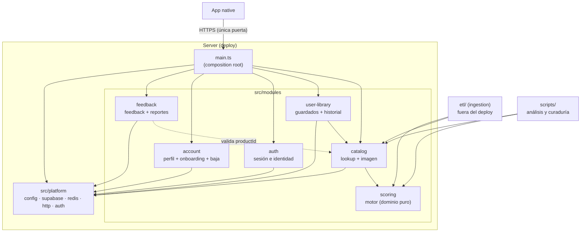
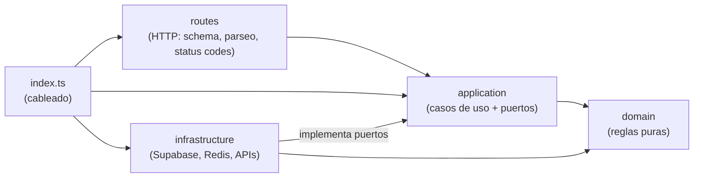
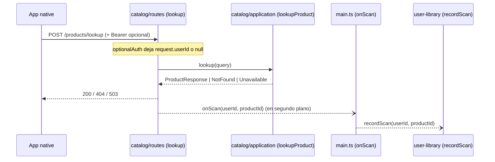

# Fase 2 — Arquitectura objetivo

> Fecha: 2026-09-28 · Base: `main` de fitogenix-server (`dae49be`).
> Alcance: la organización **interna del server** (y del ETL, que vive en el mismo repo). Native se toca solo en su frontera con el server y Supabase; su reorganización interna no es parte de este plan.
> **Revisado el 2026-09-28:** (1) el cliente ya no habla con Supabase, todo pasa por el server (D-28, [ADR-0010](adr/0010-server-unica-puerta-de-entrada.md)); se suma el módulo `auth`. (2) Se agregan las interfaces entre módulos (§8), la superficie HTTP objetivo (§9) y el análisis de campos usados y sobrantes ([03-contratos.md, Parte A](03-contratos.md)).
> Las decisiones se registran como ADRs en [`docs/adr/`](adr/). Los ADRs citados en comentarios del código (`ADR-002`, `ADR-007`, etc.) son del repo fuera de alcance y **no** son estos: acá se numeran con 4 dígitos (`ADR-0001`…).

---

## 1. Principios y criterio de corte

1. **Monolito modular** ([ADR-0001](adr/0001-monolito-modular.md)): un solo proceso y un solo deploy, pero con módulos por **capacidad de negocio** y fronteras verificadas por herramienta (`dependency-cruiser`, §6).
2. **Una tabla, un dueño** ([ADR-0005](adr/0005-acceso-a-datos-y-propiedad-de-tablas.md)): solo la infraestructura del módulo dueño lee o escribe su tabla. Los demás pasan por su API pública.
3. **El motor de puntaje es dominio puro** ([ADR-0003](adr/0003-scoring-dominio-puro.md)): sin I/O, sin config, sin frameworks; es la única fuente de umbrales y de presentación del puntaje.
4. **El ETL no es parte del deploy** ([ADR-0004](adr/0004-etl-fuera-del-runtime.md)): vive en el repo, usa las APIs públicas de `scoring` y `catalog`, y el server nunca lo importa.
5. **Fallar distinto según qué falla** ([ADR-0006](adr/0006-fallas-de-dependencias.md)): "no está en el catálogo" (404) nunca se confunde con "la base no responde" (503).
6. **El server es la única puerta de entrada** ([ADR-0010](adr/0010-server-unica-puerta-de-entrada.md)): la app solo conoce la URL del server; no tiene credenciales ni SDK de Supabase.
7. **KISS antes que simetría.** Las capas están **permitidas, no exigidas**: un módulo sin reglas de negocio no tiene carpeta `domain/`, y ninguna carpeta existe vacía. No hay contenedor de inyección de dependencias: el cableado se hace a mano en el `index.ts` de cada módulo (§3.2).

Criterio SOLID/DRY aplicado, en concreto:

| Principio | Dónde se aplica | Qué problema de hoy resuelve |
|---|---|---|
| **S** (una responsabilidad) | `productLookupService.ts` (resolver + mapear + presentar + cachear) se parte en caso de uso, presentación y adaptadores | Hoy un cambio de presentación del puntaje obliga a tocar el archivo del lookup |
| **O/C** + **D** (inversión de dependencias) | Los casos de uso dependen de *puertos* (interfaces) y la infraestructura los implementa | Hoy no se puede testear el lookup sin mockear módulos de Supabase y Redis |
| **I** (interfaces chicas) | El puerto de lectura del catálogo (`ProductReader`) y el de escritura (`ProductWriter`) se separan: el server solo necesita leer, el ETL escribe | Hoy el server carga código de escritura que solo usa el ETL (`setCachedProduct`, `buildCachePayload`) |
| **DRY** | Un solo cliente Supabase admin (hoy hay 5 `createClient`, uno **por request** en `deleteMe.ts`); una sola `normalizeQuery` (hoy hay dos que normalizan distinto: `queryNormalization.ts` y `redisService.ts`); un solo lugar para los umbrales (hoy `< 40` en `mapRawToProduct` y `< 50` en `ScanResultScreen.tsx`) | Divergencias silenciosas |
| **KISS** | Sin DI container, sin event bus, sin CQRS; `feedback` sin capas de dominio | Tamaño real del código: ~9.300 líneas en `src/`, la mitad son tests |

---

## 2. Módulos

### 2.1 Mapa de módulos y dependencias permitidas



Reglas de la figura (las hace cumplir §6):

1. Un módulo importa a otro **solo por su `index.ts`** (API pública).
2. `scoring` no importa **nada** (ni `platform`, ni paquetes npm).
3. `catalog` no conoce a `user-library`, `auth`, `account` ni `feedback`. El registro del escaneo (hoy `lookup.ts` → `scanHistoryService.recordScan`) se **inyecta** desde `main.ts` como callback (§3.3): la flecha va de `user-library` a `catalog`, nunca al revés, y no hay ciclo.
4. `platform` no importa módulos.
5. Nada de `src/` importa `etl/` ni `scripts/`.
6. `auth` y `account` no se importan entre sí: los dos usan Supabase Auth a través de `platform`, cada uno para lo suyo (sesión vs. datos de la cuenta).

### 2.2 Ficha por módulo

| Módulo | Responsabilidad | API pública (`index.ts`) | Depende de (permitido) | Prohibido | Tablas / recursos propios | Tamaño |
|---|---|---|---|---|---|---|
| **scoring** | Calcular el puntaje de un producto a partir de sus datos crudos y derivar su presentación (label, color, fito, highlight). Incluye la tabla de ingredientes y la rúbrica | `scoreProduct(input)`, `presentScore(score)`, `ENGINE_VERSION`, tipos (`ProductInput`, `ScoreBreakdown`, `AnalyzedIngredient`, `NoScoreCode`, `NutritionFacts`) | — | Cualquier I/O, `process.env`, `platform`, otros módulos, paquetes npm | — | Grande (~4.000 líneas con tests); **alto riesgo** |
| **catalog** | Resolver un producto por barcode o nombre (Redis → Supabase), armar la respuesta del lookup y ofrecer lectura y escritura de `products` a otros módulos y al ETL | `registerCatalog(app, deps)`, `productResponseFromRow(row)` (para listados), `createProductWriter()` (para el ETL), tipos `RawProduct`, `ProductResponse` | `scoring`, `platform` | `user-library`, `account`, `feedback`, `etl` | `products`, RPC `search_products_by_name`, claves Redis `ftg:product:*` y `ftg:search:*` | Mediano |
| **user-library** | Guardados e historial del usuario: listar, guardar, quitar, registrar escaneo, borrar ítem del historial (RF-017) | `registerUserLibrary(app, deps)`, `recordScan(userId, productId)` | `catalog` (presentar productos), `platform` | `account`, `feedback`, `etl` | `saved_products`, `scan_history` | Chico (casi sin dominio) |
| **account** | Datos de la cuenta del usuario: ver y editar el perfil (`profiles`), guardar las respuestas del onboarding con consentimiento (RF-048, RNF-S10), eliminar la cuenta | `registerAccount(app, deps)` | `platform` | `catalog`, `user-library`, `auth`, `feedback`, `etl` | `profiles`, `onboarding_responses` (nueva); borra en `auth.users` vía Admin API | Chico |
| **auth** (nuevo, ADR-0010) | Sesión e identidad sobre Supabase Auth: registro, disponibilidad de username, login con email / Google / Apple, refresh, logout, recuperación de contraseña. El cliente no toca Supabase | `registerAuth(app, deps)` | `platform` | `catalog`, `user-library`, `account`, `feedback`, `etl` | Supabase Auth (sin tablas propias); ejecuta `is_username_available` | Chico, pero **alto riesgo** (credenciales) |
| **feedback** | Recibir feedback y reportes de producto, de anónimos y usuarios (D-21, D-26) | `registerFeedback(app, deps)` | `catalog` (verificar que el `productId` exista, opcional), `platform` | `user-library`, `account`, `etl` | `feedback`, `product_reports` (nuevas) | **Trivial**: ruta + validación + insert. No lleva `domain/` ni `application/` |
| **platform** (no es un módulo de negocio) | Infraestructura compartida: config del server, cliente Supabase admin único, cliente Redis con timeout, armado de Fastify (CORS, rate limit, manejo de errores), `requireAuth` / `optionalAuth`, health | Funciones sueltas por archivo | Paquetes npm | Cualquier módulo | — | Chico; `http/auth.ts` es **alto riesgo** |
| **ingestion** (`etl/`) | Poblar y sanear el catálogo: ingesta a staging, merge, completitud, enriquecimiento con IA, calidad de datos | Entry points `etl/jobs/*.ts` | `catalog` (escritor y tipos), `scoring` | `src/platform/http`, `user-library`, `account`, `feedback` | `products_staging`; escribe `products` **solo** vía `catalog.createProductWriter()` | Mediano; fuera del deploy |

Módulos que **no** se crean, y por qué:

- **"product" genérico:** `domain/product/` mezcla hoy scoring, parseo de datos crudos y plausibilidad nutricional. Se reparte por capacidad (scoring, catalog, etl), no por sustantivo.
- **"image" o "media":** no hace falta. Con D-49 el server no procesa imágenes: la app usa la `imageUrl` que viene de VTEX u Open Food Facts.
- **Validación del token dentro de `auth`:** `requireAuth` / `optionalAuth` siguen en `platform/http/auth.ts` porque los usan todos los módulos. El módulo `auth` es el que **emite** sesiones (login, refresh); `platform` solo las **verifica**.

---

## 3. Capas dentro de cada módulo

### 3.1 Regla de dependencia



| Capa | Puede importar | No puede importar | Qué vive acá |
|---|---|---|---|
| `domain/` | Su propio `domain/`, API pública de `scoring` | `application/`, `infrastructure/`, `routes/`, `platform/`, `fastify`, `@supabase/*`, `@upstash/*` | Tipos del dominio y funciones puras (parsear un producto crudo, clasificar la query) |
| `application/` | `domain/`, APIs públicas de otros módulos | `infrastructure/`, `routes/`, `fastify`, `@supabase/*`, `@upstash/*`, `process.env` | Casos de uso (`lookupProduct`, `saveProduct`) y **puertos** (`ProductReader`, `ProductCache`, `SavedRepository`) |
| `infrastructure/` | `application/` (para implementar puertos), `domain/`, `platform/` | `routes/` | Adaptadores: repositorios Supabase, cache Redis |
| `routes/` | `application/`, `domain/` (tipos), `platform/http` | `infrastructure/` | Plugins de Fastify: schema de request/response, mapeo de resultados a status HTTP |
| `index.ts` | Todo lo del módulo | — | Crea los adaptadores, se los pasa a los casos de uso y registra las rutas |

### 3.2 Cableado sin contenedor de DI

Cada módulo expone una función que recibe lo compartido y devuelve el plugin listo:

```ts
// src/modules/catalog/index.ts (esquema, no es código final)
export function registerCatalog(app: FastifyInstance, deps: { supabase; redis; onScan?: (userId, productId) => void }) {
  const reader = supabaseProductReader(deps.supabase);          // infrastructure
  const cache = redisProductCache(deps.redis);                  // infrastructure
  const lookup = makeLookupProduct({ reader, cache });          // application
  return app.register(lookupRoutes({ lookup, onScan: deps.onScan })); // routes
}
```

Los tests de casos de uso reciben **fakes** de los puertos, sin mockear módulos. Los de rutas usan `app.inject()` sobre `platform/http/buildApp.ts`.

### 3.3 El caso del registro de escaneo (sin ciclo)

Hoy `routes/products/lookup.ts` importa `scanHistoryService`: el catálogo conoce el historial. En el objetivo:



`main.ts` le pasa a `catalog` un `onScan` que llama a `userLibrary.recordScan`. Además, el token opcional se valida una sola vez en `optionalAuth` (hoy se valida aparte, en segundo plano, con `resolveUserIdFromToken`).

---

## 4. Árbol de carpetas objetivo

```
src/
  main.ts                         composition root: arma platform, registra módulos, cablea onScan
  platform/
    config.ts                     env del server: SOLO lo que usa (D-05)
    supabase.ts                   cliente admin único (service role)
    redis.ts                      cliente Upstash con timeout y sin reintentos (ADR-0006)
    http/
      buildApp.ts                 Fastify + CORS con lista + rate limit + error handler
      errors.ts                   DependencyUnavailableError → 503
      auth.ts                     requireAuth / optionalAuth            ⚠ alto riesgo
      health.ts                   /health (liveness) y /health/ready (readiness)
  modules/
    scoring/
      index.ts                    API pública
      domain/…                    motor (hoy domain/product/scoring/**) + tabla de ingredientes
    catalog/
      index.ts
      routes/  lookup.route.ts · lookup.schema.ts · product.route.ts (GET /products/:id)
      application/  lookupProduct.ts · productResponse.ts · ports.ts
      domain/  rawProduct.ts · query.ts · productData.ts
      infrastructure/  supabaseProductReader.ts · supabaseProductWriter.ts · redisProductCache.ts · productRow.ts
    user-library/
      index.ts
      routes/  saved.route.ts · history.route.ts
      application/  saved.ts · history.ts · ports.ts
      infrastructure/  supabaseSavedRepository.ts · supabaseHistoryRepository.ts
    auth/
      index.ts
      routes/  signup.route.ts · login.route.ts · oauth.route.ts · session.route.ts (refresh, logout) · password.route.ts · username.route.ts
      application/  signUp.ts · logIn.ts · refresh.ts · resetPassword.ts · ports.ts
      infrastructure/  supabaseAuthGateway.ts          (sin estado: persistSession=false)
    account/
      index.ts
      routes/  profile.route.ts · onboarding.route.ts · deleteMe.route.ts
      application/  profile.ts · saveOnboarding.ts · deleteAccount.ts · ports.ts
      infrastructure/  supabaseProfileRepository.ts · supabaseOnboardingRepository.ts · supabaseAuthAdmin.ts
    feedback/
      index.ts
      routes/  feedback.route.ts · productReport.route.ts
      infrastructure/  supabaseFeedbackRepository.ts
etl/                              antes scripts/etl (ADR-0004)
  config.ts                       env del ETL (ANTHROPIC_API_KEY, SUPABASE_*)
  adapters/ · jobs/ · lib/
  enrichment/claudeEnricher.ts    antes src/services/claudeService.ts
  quality/nutrientPlausibility.ts antes src/domain/product/nutrientPlausibility.ts
scripts/                          análisis y curaduría (audit-scores, score-histogram, capture-golden…)
supabase/migrations/              ADR-0009
```

---

## 5. Mapeo de cada archivo actual a su módulo y capa

Acción: **MOVER** (sin cambios de lógica), **PARTIR** (se reparte en varios destinos), **ELIMINAR** (código muerto, Fase 0 §2.5), **FUSIONAR**.

### 5.1 `src/domain/`

| # | Archivo actual | Destino (módulo · capa) | Acción | Nota |
|---|---|---|---|---|
| 1 | `domain/product/ftgEngine.ts` · `ftgScoreWithBreakdown`, `ENGINE_VERSION`, re-exports de tipos | `scoring` · `index.ts` | FUSIONAR | La fachada pasa a ser la API pública del módulo. **Hecho en M-03:** `ftgScoreWithBreakdown` quedó como `scoreProduct` |
| 2 | `domain/product/ftgEngine.ts` · `extractNutrition`, `extractCategory` | `catalog` · `domain/productData.ts` | PARTIR | Parsean datos crudos: no son puntaje |
| 3 | `domain/product/ftgEngine.ts` · `ftgScore`, `ftgAnalyzeIngredients`, `ingredientCount` | — | ELIMINAR | Solo las usan scripts; los scripts pasan a `scoreProduct`. **Corregido en M-03:** `ftgScore` se borró en E-03; `ftgAnalyzeIngredients` queda público como `analyzeIngredients` (lo usa `capture-golden`); `ingredientCount` lo usa `claudeService` (no solo scripts) y se mudó ahí, para irse con él al ETL en M-08 |
| 4 | `domain/product/ingredientData.ts` | `scoring` · `domain/data/ingredients.ts` | MOVER | La consume `scoring/catalog.ts`. Hecho en M-03 |
| 5 | `domain/product/productService.ts` | — | ELIMINAR | Re-export de `resolveProductStatus` + 2 funciones sin uso |
| 6 | `domain/product/nutrientPlausibility.ts` (+test) | `etl` · `quality/nutrientPlausibility.ts` | MOVER | Solo lo usan el ETL y `claudeService` |
| 7 | `domain/product/scoring/*.ts` (pipeline, steps, gates, ledger, classify, cleaning, matching, seals, explain, text, types, constants, catalog) (+tests) | `scoring` · `domain/` | MOVER | **Sin cambios de lógica**; primero, tests de caracterización |
| 8 | `domain/product/scoring/presentation.ts` | `scoring` · `domain/presentation.ts`, expuesto como `presentScore` | MOVER + ampliar | Absorbe `scorePresentation` y el `flagged` de `productLookupService.ts`, derivado de `BAD_BELOW` en vez del `40` hardcodeado |
| 9 | `domain/product/scoring/rubric/*.ts` | `scoring` · `domain/rubric/` | MOVER | — |
| 10 | `domain/product/scoring/index.ts` (barrel con ~30 re-exports sin uso) | `scoring` · `index.ts` | FUSIONAR y achicar | Solo lo que usan `catalog`, `etl` y `scripts` |

### 5.2 `src/services/`

| # | Archivo actual · símbolo | Destino (módulo · capa) | Acción | Nota |
|---|---|---|---|---|
| 11 | `productLookupService.ts` · `lookupProduct`, `resolveByBarcode`, `resolveByName`, `withSingleflight`, `logSource` | `catalog` · `application/lookupProduct.ts` | PARTIR | Depende de puertos `ProductReader` y `ProductCache` |
| 12 | `productLookupService.ts` · `mapRawToProduct`, `cleanName`, `scorePresentation` | `catalog` · `application/productResponse.ts` (usa `scoring.presentScore`) | PARTIR | `id` = `productId` siempre (se define en la Fase 3) |
| 13 | `productLookupService.ts` · `nameKey` | `catalog` · `domain/query.ts` | PARTIR | Junto con `isBarcode` (hoy regex inline) |
| 14 | `cacheService.ts` · `getCachedProductByBarcode`, `findCachedProductByName`, `getCachedBy`, `escapeLikeToken` | `catalog` · `infrastructure/supabaseProductReader.ts` | PARTIR | Deja de tragarse los errores: lanza `DependencyUnavailableError` (ADR-0006). **M-04:** mudado sin cambios (sigue tragándose los errores hasta H-01) |
| 15 | `cacheService.ts` · `rowToCachedRaw`, `asStringRecord`, `asStringArray` | `catalog` · `infrastructure/productRow.ts` | PARTIR | Mapper fila → `RawProduct`; lo reusa `productResponseFromRow`. Hecho en M-04 |
| 16 | `cacheService.ts` · `buildCachePayload`, `setCachedProduct`, `findUpgradableNameRow` | `catalog` · `infrastructure/supabaseProductWriter.ts`, expuesto como `createProductWriter()` | PARTIR | Solo lo usa el ETL (ADR-0004). **M-04:** mudado; el ETL usa solo `buildCachePayload`, y `setCachedProduct` / `findUpgradableNameRow` no tienen consumidores |
| 17 | `cacheService.ts` · `getCachedProductByNameKey` | — | ELIMINAR | Sin uso |
| 18 | `redisService.ts` · `getFromRedis`, `setInRedis`, `get/setSearchBarcode`, `unwrapCachedProduct` | `catalog` · `infrastructure/redisProductCache.ts` | MOVER | El cliente pasa a `platform/redis.ts`; se elimina su `normalizeQuery` duplicada. **M-04:** mudado; la `normalizeQuery` duplicada sigue hasta H-04 (unificarla cambia las claves) |
| 19 | `queryNormalization.ts` · `normalizeQuery` | `catalog` · `domain/query.ts` | MOVER | Única normalización (DRY). Hecho en M-04 |
| 20 | `productRowMapper.ts` · `joinedRowToProduct` | `catalog` · `index.ts` como `productResponseFromRow` | MOVER | Lo consume `user-library` para presentar productos embebidos |
| 21 | `imageService.ts` · `removeBackground` | — | ELIMINAR | Se elimina remove.bg (D-49); se lleva `REMOVE_BG_API_KEY` |
| 22 | `imageService.ts` · `fetchRetailerImage`, `fetchSearchImageUrl` | — | ELIMINAR | Sin uso; se lleva `SERPAPI_API_KEY` |
| 23 | `savedProductsService.ts` · `listSavedProducts`, `saveProduct`, `removeSavedProduct` | `user-library` · `application/saved.ts` + `infrastructure/supabaseSavedRepository.ts` | PARTIR | — |
| 24 | `scanHistoryService.ts` · `recordScan`, `listScanHistory` | `user-library` · `application/history.ts` + `infrastructure/supabaseHistoryRepository.ts` | PARTIR | + `removeFromHistory` (RF-017) |
| 25 | `scanHistoryService.ts` · `resolveUserIdFromToken` | `platform` · `http/auth.ts` (`optionalAuth`) | MOVER | ⚠ alto riesgo (auth) |
| 26 | `claudeService.ts` · `enrichWithAI` (+test) | `etl` · `enrichment/claudeEnricher.ts` | MOVER | `@anthropic-ai/sdk` deja de ser dependencia del server |
| 27 | `offService.ts` | — | ELIMINAR | Sin importadores |
| 28 | `fallbackFoodApi.ts` (+test) | — | ELIMINAR | Cascada retirada; se lleva `EDAMAM_*` |
| 29 | `openBeautyFactsApi.ts` (+test) | — | ELIMINAR | Cascada retirada |

### 5.3 Resto de `src/`

| # | Archivo actual | Destino | Acción | Nota |
|---|---|---|---|---|
| 30 | `main.ts` | `main.ts` (composition root) + `platform/http/buildApp.ts` | PARTIR | `buildApp` separado para testear con `inject()` |
| 31 | `config.ts` | `platform/config.ts` (server) + `etl/config.ts` (ETL) | PARTIR | Cada proceso exige solo lo suyo (D-05) |
| 32 | `plugins/auth.ts` · `requireAuth` | `platform/http/auth.ts` | MOVER | ⚠ alto riesgo; su propio cliente Supabase pasa a `platform/supabase.ts` |
| 33 | `routes/products/lookup.ts` | `catalog/routes/lookup.route.ts` | MOVER | Sin `import` de `user-library` (§3.3) |
| 34 | `routes/products/lookupSchema.ts` | `catalog/routes/lookup.schema.ts` | MOVER | La Fase 3 decide la fuente única del contrato |
| 35 | `routes/products/image.ts` | — | ELIMINAR | D-49; native pasa a usar `imageUrl` directo |
| 36 | `routes/users/saved.ts`, `history.ts` | `user-library/routes/*` | MOVER | + `DELETE /users/me/history/:productId` |
| 37 | `routes/users/deleteMe.ts` | `account/routes/deleteMe.route.ts` + `application/deleteAccount.ts` + `infrastructure/supabaseAuthAdmin.ts` | PARTIR | Deja de crear un cliente Supabase por request |
| 38 | `types/fitogenix.ts` · `FitogenixProduct` | `catalog` · tipo `ProductResponse` (derivado del schema, Fase 3) | MOVER | — |
| 39 | `types/fitogenix.ts` · `RawOFFProduct` | `catalog` · `domain/rawProduct.ts` (`RawProduct`) | MOVER | El ETL lo importa desde `catalog/index.ts` |

### 5.4 Fuera de `src/`

| # | Actual | Destino | Acción |
|---|---|---|---|
| 40 | `scripts/etl/**` | `etl/**` | MOVER; imports de `src/services/*` → APIs públicas de `catalog` y `scoring` |
| 41 | `scripts/{audit-scores,score-histogram,capture-golden,add-en-aliases}.ts` | `scripts/` | Se quedan; imports → `scoring/index.ts` |
| 42 | `scripts/test-search-rpc.ts` | — | ELIMINAR (smoke manual de una sola vez; confirmado, D-31) |
| 43 | `migrations/*.sql` | `supabase/migrations/` + baseline | ADR-0009 |
| 44 | `MOTOR_V21_INFORME.md` | `docs/` (histórico) o eliminar | Se decide en la Fase 4 |

---

## 6. Hacer cumplir las reglas: `dependency-cruiser`

Borrador en [`docs/borradores/dependency-cruiser.cjs`](borradores/dependency-cruiser.cjs), para copiar a la raíz como `.dependency-cruiser.cjs` en el PR que cree la estructura de módulos. Cubre:

| Regla | Qué prohíbe |
|---|---|
| `no-circular` | Cualquier ciclo |
| `modulo-solo-por-index` | Importar el interior de otro módulo (solo `modules/<x>/index.ts`) |
| `scoring-es-puro` | Que `scoring` importe algo fuera de sí mismo (incluidos paquetes npm y builtins de Node) |
| `catalog-no-conoce-consumidores` | `catalog` → `user-library` / `account` / `feedback` |
| `platform-no-importa-modulos` | `platform` → `modules` |
| `domain-puro` / `application-sin-infra` / `routes-sin-infra` | Las flechas prohibidas de §3.1 |
| `supabase-redis-solo-en-infra` | `@supabase/*` y `@upstash/*` fuera de `infrastructure/` y `platform/` |
| `fastify-solo-en-routes-y-http` | `fastify` en `domain/` o `application/` |
| `anthropic-solo-en-etl` | `@anthropic-ai/sdk` fuera de `etl/` |
| `src-no-importa-etl-ni-scripts` | `src/**` → `etl/**` o `scripts/**` |
| `etl-solo-apis-publicas` | `etl/**` → cualquier cosa de `src/` que no sea `modules/{catalog,scoring}/index.ts` |
| `no-env-fuera-de-config` | Se controla con una regla de lint (`no-restricted-properties` sobre `process.env`), porque dependency-cruiser no analiza expresiones |

Se engancha como `npm run lint:deps` y como paso de CI (el CI existe desde T-01: `.github/workflows/ci.yml`; `lint:deps` se suma en M-01).

**Verificado sobre el código actual** (dependency-cruiser 18.4 + TypeScript 6.0.3, salida en [`raw/server-depcruise-borrador-sobre-codigo-actual.txt`](raw/server-depcruise-borrador-sobre-codigo-actual.txt)): la config carga, cruza 112 módulos y marca **30 violaciones**, todas esperables porque describen el trabajo de migración:

| Regla | Violaciones | Qué señala |
|---|---|---|
| `scripts-solo-apis-publicas` | 22 | `scripts/` y el ETL (todavía en `scripts/etl/`) importan el interior de `src/` (`services/*`, `config.ts`, `types/*`) |
| `supabase-redis-solo-en-infra` | 6 | `@supabase/*` y `@upstash/*` usados en `services/`, `routes/users/deleteMe.ts` y `plugins/auth.ts` |
| `anthropic-solo-en-etl` | 2 | `src/services/claudeService.ts` y `scripts/etl/lib/qualityAI.ts` (este último desaparece al mudar a `etl/`) |

Dos notas de configuración que costaron encontrar: (1) dependency-cruiser necesita `typescript` resoluble desde donde corre (con `npx` aislado no parsea los `.ts` y reporta "0 modules"); instalado como `devDependency` del repo no hay problema. (2) `node_modules` **no** va en `exclude` (va en `doNotFollow`): excluirlo saca las dependencias npm del análisis y las reglas de SDKs no disparan.

---

## 7. Frontera con native: el server como única puerta (ADR-0010)

Decisión de producto D-28: **native no hace requests directas a Supabase**.

| Recurso | Hoy | Objetivo |
|---|---|---|
| Catálogo, guardados, historial | Native → server | Sin cambios |
| Registro, login (email, Google, Apple), refresh, logout, recuperación de contraseña | Native → Supabase Auth (SDK + anon key) | Native → **`/auth/*`** del server → Supabase Auth |
| Disponibilidad de username | Native → RPC `is_username_available` | Native → `GET /auth/username-availability` |
| Perfil (`profiles`) | Native → `select`/`update` directo con RLS | Native → `GET`/`PATCH /users/me/profile` |
| Eliminar cuenta | Native → `/api/delete-account` (**no existe**) | Native → `DELETE /users/me` |
| Onboarding, feedback, reportes | No existen | Native → endpoints nuevos (§9) |
| Credenciales de Supabase en la app | Anon key embebida | **Ninguna** |
| Acceso `anon` a la base | Catálogo legible (SEC-01), `profiles` y RPC | **Ninguno** |

Qué cambia en native (se detalla en el plan): sale `@supabase/supabase-js`; entra un cliente de auth propio que guarda los tokens en `expo-secure-store` y refresca con `/auth/refresh`; el idToken de Google y Apple se sigue obteniendo con los SDK nativos y se manda al server.

Costos que se aceptan (detalle en ADR-0010): el server queda en el camino del login (refuerza D-18); los límites por IP de Supabase Auth se comparten entre todos los usuarios (**a verificar** en el dashboard antes de migrar); el server maneja contraseñas en tránsito (redact en logs + rate limit propio en `/auth/*`).

---

## 8. Interfaces entre módulos (contratos internos)

Firmas de la API pública de cada módulo (`index.ts`) y de sus puertos. Son la parte "interna" del contrato: lo que un módulo puede pedirle a otro. Los tipos de datos concretos (qué campos lleva cada DTO) salen de [03-contratos.md](03-contratos.md).

### 8.1 `scoring` (dominio puro)

```ts
export const ENGINE_VERSION: string;

/** Entrada: solo los campos que el motor usa (03-contratos A.3). */
export interface ProductInput {
  product_name?: string;
  ingredients_text?: string;
  nutriments?: Record<string, unknown>;
  additives_tags?: readonly string[];
  categories?: string;
}

export function scoreProduct(input: ProductInput): ScoreBreakdown;   // score | null, noScore, ingredients, …

/** Única fuente de presentación del puntaje (ADR-0003). */
export function presentScore(score: number | null): {
  label: 'EXCELENTE' | 'BUENO' | 'MODERADO' | 'MALO' | 'SIN DATOS SUFICIENTES';
  color: string;
  fito: 'fito' | 'nofito' | 'none';
  highlight: 'cuestionables' | 'beneficiosos';   // reemplaza flagged (<40) y el <50 del cliente
};
```

### 8.2 `catalog`

```ts
// API pública
export function registerCatalog(app, deps: { supabase; redis; onScan?: OnScan }): Promise<void>;
export function productSummaryFromRow(row: ProductRow): ProductSummary | null;  // para listados de user-library
export function createProductWriter(supabase): ProductWriter;                    // solo para etl/
export type { RawProduct, ProductSummary, ProductDetail };

export type OnScan = (userId: string, productId: string) => void;

// Puertos (application/ports.ts)
export interface ProductReader {
  findByBarcode(barcode: string): Promise<ProductRecord | null>;     // null = no existe; falla técnica = DependencyUnavailableError
  searchByName(normalizedQuery: string, limit: number): Promise<ProductRecord[]>;
  findById(id: string): Promise<ProductRecord | null>;               // para GET /products/:id (03-contratos A.1.3)
}
export interface ProductCache {                                       // Redis; todo método falla "en silencio" (miss)
  get(key: string): Promise<ProductDetail | null>;
  set(key: string, value: ProductDetail, ttlSeconds: number): Promise<void>;
  getBarcodeForQuery(normalizedQuery: string): Promise<string | null>;
  setBarcodeForQuery(normalizedQuery: string, barcode: string): Promise<void>;
}
export interface ProductWriter {                                      // lo usa solo el ETL
  upsert(raw: RawProduct, key: { barcode: string }): Promise<{ id: string }>;
}
```

### 8.3 `user-library`

```ts
export function registerUserLibrary(app, deps: { supabase }): Promise<void>;
export function recordScan(userId: string, productId: string): Promise<void>;   // nunca lanza (fire-and-forget)

// Puertos
export interface SavedRepository {
  list(userId: string): Promise<Array<{ row: ProductRow; savedAt: string }>>;
  add(userId: string, productId: string): Promise<'ok' | 'not_found'>;
  remove(userId: string, productId: string): Promise<void>;
}
export interface HistoryRepository {
  list(userId: string, limit: number): Promise<Array<{ row: ProductRow; scannedAt: string }>>;
  upsert(userId: string, productId: string, at: Date): Promise<void>;
  remove(userId: string, productId: string): Promise<void>;                      // RF-017
}
```

### 8.4 `auth`

```ts
export function registerAuth(app, deps: { supabaseAuth }): Promise<void>;

export interface AuthGateway {                       // envuelve Supabase Auth, sin estado
  signUp(input: SignUpInput): Promise<'confirmation_required' | 'username_taken' | 'email_taken'>;
  isUsernameAvailable(username: string): Promise<boolean>;
  logIn(email: string, password: string): Promise<Session | 'invalid_credentials' | 'email_not_confirmed'>;
  logInWithIdToken(provider: 'google' | 'apple', idToken: string, nonce?: string): Promise<Session>;
  refresh(refreshToken: string): Promise<Session | 'invalid_refresh_token'>;
  logOut(accessToken: string): Promise<void>;
  sendPasswordResetCode(email: string): Promise<void>;
  resetPassword(email: string, code: string, newPassword: string): Promise<'ok' | 'invalid_code'>;
}
export type Session = { accessToken: string; refreshToken: string; expiresAt: number; user: { id: string; email: string } };
```

### 8.5 `account`

```ts
export function registerAccount(app, deps: { supabase }): Promise<void>;

export interface ProfileRepository {
  get(userId: string): Promise<Profile | null>;
  update(userId: string, patch: ProfilePatch): Promise<Profile | 'username_taken'>;
}
export interface OnboardingRepository {
  save(userId: string, answers: OnboardingAnswers, consent: { acceptedAt: Date; textVersion: string }): Promise<void>;
}
export interface AuthAdmin {
  deleteUser(userId: string): Promise<void>;          // cascada: profiles, saved, history, onboarding
}
```

### 8.6 `feedback`

Trivial: la ruta valida y llama directo al repositorio (sin `application/`).

```ts
export function registerFeedback(app, deps: { supabase; productExists?: (id: string) => Promise<boolean> }): Promise<void>;
export interface FeedbackRepository {
  saveFeedback(input: { userId: string | null; message: string; appVersion?: string }): Promise<void>;
  saveProductReport(input: { userId: string | null; productId: string; type: ReportType; message?: string }): Promise<void>;
}
```

### 8.7 `platform`

```ts
export function loadServerConfig(env): ServerConfig;                 // falla al arrancar si falta algo que se usa
export function createSupabaseAdmin(config): SupabaseClient;         // único, service role
export function createRedis(config): RedisLike | null;               // timeout 200 ms, 0 reintentos
export function buildApp(config): FastifyInstance;                   // CORS, rate limit, error handler, health
export const requireAuth: FastifyPlugin;                             // request.userId: string   (401/503)
export const optionalAuth: FastifyPlugin;                            // request.userId: string | null
export class DependencyUnavailableError extends Error { dependency: 'supabase' | 'supabase-auth' | 'redis' }
```

---

## 9. Superficie HTTP objetivo

Todo lo que native va a llamar. Schemas completos en [03-contratos.md §B.3](03-contratos.md). **Todas las rutas llevan el prefijo `/v1`** (D-44), salvo `/health` y `/health/ready`; en esta tabla se omite para abreviar.

| # | Método y ruta | Módulo | Auth | Estado | Reemplaza / motivo |
|---|---|---|---|---|---|
| 1 | `POST /products/lookup` | catalog | Opcional | Existe | Respuesta achicada (03-contratos A.1) |
| 2 | `GET /products/:id` | catalog | Opcional | **Nuevo** (D-32) | Detalle al abrir un producto desde un listado |
| 3 | ~~`GET /products/image?url=`~~ | — | — | **Se elimina** (D-49) | La app usa `imageUrl` directo |
| 4 | `GET /users/me/saved` | user-library | Sí | Existe | Devuelve resumen + `savedAt` |
| 5 | `POST /users/me/saved` | user-library | Sí | Existe | — |
| 6 | `DELETE /users/me/saved/:productId` | user-library | Sí | Existe | — |
| 7 | `GET /users/me/history?limit=` | user-library | Sí | Existe | Devuelve resumen + `scannedAt` |
| 8 | `DELETE /users/me/history/:productId` | user-library | Sí | **Nuevo** | RF-017 |
| 9 | `POST /auth/signup` | auth | No | **Nuevo** | `supabase.auth.signUp` |
| 10 | `GET /auth/username-availability?username=` | auth | No | **Nuevo** | RPC directa |
| 11 | `POST /auth/login` | auth | No | **Nuevo** | `signInWithPassword` |
| 12 | `POST /auth/oauth/google` | auth | No | **Nuevo** | `signInWithIdToken` |
| 13 | `POST /auth/oauth/apple` | auth | No | **Nuevo** | `signInWithIdToken` |
| 14 | `POST /auth/refresh` | auth | Refresh token | **Nuevo** | Refresh del SDK |
| 15 | `POST /auth/logout` | auth | Sí | **Nuevo** | `signOut` |
| 16 | `POST /auth/password/forgot` | auth | No | **Nuevo** | `resetPasswordForEmail` |
| 17 | `POST /auth/password/reset` | auth | No | **Nuevo** | `verifyOtp` + `updateUser` |
| 18 | `GET /users/me/profile` | account | Sí | **Nuevo** | `select` directo a `profiles` |
| 19 | `PATCH /users/me/profile` | account | Sí | **Nuevo** | `update` directo a `profiles` |
| 20 | `POST /users/me/onboarding` | account | Sí | **Nuevo** | RF-048 (con consentimiento, RNF-S10) |
| 21 | `DELETE /users/me` | account | Sí | Existe | Native pasa a llamarlo (RF-029) |
| 22 | `POST /feedback` | feedback | Opcional | **Nuevo** | RF-043 (D-21) |
| 23 | `POST /products/:productId/reports` | feedback | Opcional | **Nuevo** | RF-044 (D-26) |
| 24 | `GET /health` · `GET /health/ready` | platform | No | Existe / **Nuevo** | ADR-0006 |

Reglas comunes a todos: schema de request **y** de response declarados; `additionalProperties: false` en los bodies; errores con un formato único `{ error: string, code: string }`; `401` sin sesión, `503` si una dependencia no responde; rate limit propio en `/auth/*`, `/feedback` y `/reports`.

---

## 10. ADRs de esta fase

| ADR | Título | Estado |
|---|---|---|
| [0001](adr/0001-monolito-modular.md) | Monolito modular con módulos por capacidad | Propuesto |
| [0002](adr/0002-capas-y-cableado.md) | Capas por módulo, puertos y cableado sin contenedor de DI | Propuesto |
| [0003](adr/0003-scoring-dominio-puro.md) | Scoring como dominio puro y única fuente de presentación del puntaje | Propuesto |
| [0004](adr/0004-etl-fuera-del-runtime.md) | El ETL fuera del runtime, con config propia | Propuesto |
| [0005](adr/0005-acceso-a-datos-y-propiedad-de-tablas.md) | Propiedad de tablas y acceso a Supabase por actor | Propuesto (revisado por 0010) |
| [0006](adr/0006-fallas-de-dependencias.md) | Timeouts, errores de dependencias y health | Propuesto |
| [0007](adr/0007-portabilidad-de-hosting.md) | Portabilidad de hosting | Propuesto |
| [0008](adr/0008-validacion-de-jwt.md) | Validación del JWT: local con JWKS vs. `getUser` | **Aceptado** (D-29) |
| [0009](adr/0009-migraciones.md) | Un solo mecanismo de migraciones + baseline | Propuesto |
| [0010](adr/0010-server-unica-puerta-de-entrada.md) | El server como única puerta de entrada del cliente | Propuesto (D-28) |

---

## 11. Resumen

1. Seis módulos de negocio (`scoring`, `catalog`, `user-library`, `auth`, `account`, `feedback`), una capa compartida (`platform`) y el ETL fuera del deploy (`etl/`).
2. **El server es la única puerta de entrada** (D-28, ADR-0010): la app deja de usar Supabase; auth y perfil pasan por 11 endpoints nuevos; `anon` queda sin acceso a la base.
3. `scoring` es dominio puro y el único dueño de umbrales y presentación: desaparecen el `< 40` del server y los `< 50` y 75/50/25 de native.
4. Sin ciclos: el registro del escaneo se inyecta desde `main.ts`.
5. Capas permitidas, no obligatorias; `feedback` es trivial. Sin contenedor de DI.
6. Interfaces entre módulos definidas (§8) y superficie HTTP objetivo (§9): 23 endpoints, 7 que ya existen y 16 nuevos (`/products/image` se elimina, D-49).
7. Análisis de campos ([03-contratos.md](03-contratos.md), Parte A): el producto pasa de 22 a ~13 campos, cada ingrediente de 10 a 3; `id` pasa a ser siempre el uuid; `noScore` existe pero la app no lo muestra.
8. 44 archivos o símbolos mapeados; `dependency-cruiser` verificado sobre el código actual (30 violaciones esperables).
9. 10 ADRs; el de JWT quedó aceptado (validación local, D-29).

## 12. Decisiones y [PREGUNTA]

| # | Decisión |
|---|---|
| D-29 | Validación local del JWT con JWKS; consulta extra a Supabase en `DELETE /users/me` (ADR-0008 aceptado) |
| D-30 | Reenviar la IP real del usuario a Supabase Auth ("IP Address Forwarding") con `trustProxy` bien configurado (ADR-0010) |
| D-31 | Se elimina `scripts/test-search-rpc.ts` |

Decisiones de campos: ver [03-contratos.md §A.0](03-contratos.md).

Respondidas el 2026-09-28: la clave vigente es **ECC (P-256)** (requisito de D-29 cumplido); límites confirmados (refresh 150 cada 5 min por IP; emails 30 por hora por proyecto).

**Sin preguntas pendientes en la arquitectura.**
