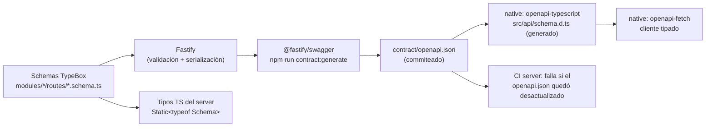

# Fase 3 — Contratos y datos

> **Estado:** Parte A (uso real de campos) adelantada durante la Fase 2; Parte B (reconciliación de migraciones, contrato objetivo por endpoint, flujos de datos y fuente única) completada el 2026-09-28.
> Base: `main` de fitogenix-server (`dae49be`) y de fitogenix-native (`976c015`); schema real en [`raw/supabase-schema.json`](raw/supabase-schema.json).
> Método: para cada campo se buscó **quién lo produce** (server, ETL o base) y **quién lo consume** (pantallas de native, código del server, ETL o scripts). La búsqueda en native excluye los tipos espejo (`lib/contracts/`), los tests y el motor local muerto.

## A.0 Decisiones sobre campos (2026-09-28)

| # | Tema | Decisión |
|---|---|---|
| D-32 | Listados vs. detalle | Los listados (`saved`, `history`) devuelven un **resumen**; al elegir un producto se pide el detalle con **`GET /products/:id`** (nuevo) |
| D-33 | `aiEnriched` | No se le muestra al usuario: **sale del contrato**. La columna `ai_enriched` queda como dato interno del ETL (104 filas) |
| D-34 | `transFat`, `cholesterol` | **Se muestran**: quedan en el contrato y native suma las dos filas |
| D-35 | Columnas denormalizadas | Se **eliminan** `score`, `score_label`, `sello` y `engine_version` (+ su índice). Los scripts que las leen (`stats.ts`) pasan a recalcular, como ya hace `score-histogram.ts` |
| D-36 | `nova_group` | Se **elimina** (columna, campo de `RawProduct` y de `ProductInput`): el motor no la usa desde v2.1 |
| D-37 | Contenido neto | Se quiere mostrar el **contenido neto** y la **información nutricional del envase**, en lugar de "por 100 g". **Diferido (D-43):** queda como requisito (RF-063) para después del saneamiento del catálogo (D-42). **Hasta entonces el contrato sigue por 100 g/ml** |
| D-38 | `tagline` | **Se elimina** del contrato y de `presentScore`: ninguna pantalla lo usa. (No estaba en la base: se calculaba en vivo desde el puntaje. Si algún día se quiere mostrar, sale de la banda del puntaje en el momento, sin persistir nada) |
| D-39 | Producto sin contenido neto | Se muestra la nutrición **por 100 g/ml, con la aclaración** |
| D-40 | Multipacks ("6 x 200 ml") | Nutrición **por envase individual** |
| D-41 | Restos de la búsqueda con IA | **Se eliminan** las 5 filas `data_source = 'ai'` (previa verificación de guardados/historial), la columna `name_key` con su UNIQUE, y `manufacturer_info` |

Veredictos:

| Veredicto | Significado |
|---|---|
| **USAR** | Se produce y se consume: queda |
| **QUITAR DEL CONTRATO** | Se manda al cliente pero nadie lo lee: sale de la respuesta (puede seguir existiendo adentro del server) |
| **QUITAR** | Nadie lo produce o nadie lo consume en ningún lado: se elimina |
| **CORREGIR** | Se usa, pero el valor o su significado están mal |
| **REVISAR** | Depende de una decisión pendiente |

---

## A.1 Respuesta de producto (`FitogenixProduct`)

La devuelven `POST /products/lookup`, `GET /users/me/saved` y `GET /users/me/history`. Tipo: `src/types/fitogenix.ts · FitogenixProduct`; schema de serialización: `routes/products/lookupSchema.ts`; espejo en native: `src/lib/contracts/product.ts`.

> **Estado (K-04, 2026-09-29, contrato `0.3.0`):** los veredictos de esta tabla están aplicados. `FitogenixProduct` ya no existe: el lookup y `GET /v1/products/:id` responden `ProductDetail` y los listados `SavedItem` / `HistoryItem` (resumen + fecha), con la forma de §B.2 (`catalog/application/productResponse.ts`, schemas en `catalog/routes/product.schema.ts`). Salieron `productId` (unificado con `id`), `subtitle`, `category`, `categoryEmoji`, `scoreAvailable`, `flagged`, `emoji`, `bgColor`, `dataSource`, `aiEnriched` y `tagline`; `ingredients[]` quedó en `{ name, sev, desc }`. Pendiente: `isSaved` (D-47, diferido hasta después de H-02, D-71). La tabla queda como registro de la auditoría.

| # | Campo | Qué es / de dónde sale | ¿Lo lee native? (evidencia) | Veredicto |
|---|---|---|---|---|
| 1 | `id` | **En el lookup = la query** (`mapRawToProduct(off, query)`); **en los listados = el uuid** (`joinedRowToProduct`) | Sí: `key` de listas, `isSaved(result.id)`, `removeFromHistory(p.id)`, dedup del historial | **CORREGIR**: tiene dos significados según el endpoint y rompe el ícono de guardado (RNF-U06). Pasa a ser **siempre el uuid** y se unifica con `productId` |
| 2 | `productId` | uuid de `products.id` | Sí: `scanResultStore.tsx · resolveProductId` → guardar y quitar | **USAR**, fusionado con `id` (un solo identificador) |
| 3 | `name` | `cleanName(product_name)` | Sí: `HomeScreen`, `ScanHistoryRow`, `useProductResult` | **USAR** |
| 4 | `subtitle` | `off.quantity`, pero **`products` no tiene columna `quantity`**: siempre `null` en runtime | No (las coincidencias son estilos) | **QUITAR**. Cuando se implemente RF-063 entra `netContent` (§A.6) |
| 5 | `brand` | `products.brand` | Sí: `ScanHistoryRow`, `useProductResult` | **USAR** |
| 6 | `category` | `extractCategory(categories)` | No | **QUITAR DEL CONTRATO** (el motor sí usa `categories` internamente) |
| 7 | `categoryEmoji` | Constante `'🍽️'` | No | **QUITAR** |
| 8 | `score` | Motor, recalculado en cada lectura | Sí: `ScanHistoryRow`, `HomeScreen`, `ScoreDial` | **USAR** |
| 9 | `scoreAvailable` | `breakdown.scoreAvailable` (equivale a `score !== null`) | No | **QUITAR** (redundante con `score`) |
| 10 | `noScore {code, message}` | Motor: por qué no hay puntaje (6 códigos: `fuera-de-alcance`, `no-alimentario`, `sin-ingredientes`, `solo-categorias`, `sin-identificar`, `solo-certificaciones`) | **No** | **USAR, y que native lo muestre**. Hoy un producto sin puntaje muestra "—" sin explicación: incumple RNF-U03 ("o una explicación clara de por qué no lo hay") |
| 11 | `flagged` | `score < 40` hardcodeado | No | **QUITAR** del contrato (lo reemplaza `highlight`, fila 26). Adentro, el motor lo deriva de la banda (ADR-0003) |
| 12 | `emoji` | Constante `'📦'` | Sí: fallback de imagen en `CleanProductImage` | **QUITAR**: es una constante, el cliente puede tener su propio placeholder |
| 13 | `bgColor` | Constante `'#f8faf7'` | No | **QUITAR** |
| 14 | `imageUrl` | `products.image_url` | Sí: `CleanProductImage` (P-07, P-09, P-10) | **USAR** |
| 15 | `ingredients[]` | Motor (§7): un ítem por ingrediente | Sí: `useProductResult`, `ScanResultScreen` | **USAR**, achicando subcampos (A.1.1) |
| 16 | `nutrition{}` | `extractNutrition(nutriments)`, por 100 g/ml | Sí: `ScanResultScreen` (8 filas) | **USAR**, achicando subcampos (A.1.2) |
| 17 | `dataSource` | `products.data_source` (`off`/`obf`/`edamam`/`ai`) | No | **QUITAR DEL CONTRATO**. Sigue siendo interno (TTL de Redis más corto para `ai`) |
| 18 | `aiEnriched` | `products.ai_enriched` | No | **QUITAR DEL CONTRATO** (D-33) |
| 19 | `scoreLabel` | `getScoreLabel(score)` | Sí: `ScanHistoryRow`, `HomeScreen`, `ScoreDial` | **USAR** |
| 20 | `scoreColor` | Color de la banda | Sí: `ScanHistoryRow`, `HomeScreen`, `ScoreDial` | **USAR** |
| 21 | `tagline` | Frase corta de la banda del puntaje (`constants.ts · TIERS[].message`), calculada en vivo | Se arma en `useProductResult`, pero **ninguna pantalla lo muestra** | **QUITAR** (D-38) |
| 22 | `fito` | `'fito' \| 'nofito' \| 'none'` desde `resolveProductStatus` | Sí: sello en `ScanResultScreen` | **USAR** |

**Duplicaciones de umbrales en native** (el cliente recalcula lo que ya manda el server):

- `HomeScreen.tsx · scoreColor()` y `scoreLabel()`: cortes 75/50/25 como *fallback* si `scoreColor`/`scoreLabel` vinieran vacíos. Nunca vienen vacíos (son requeridos en el schema): **QUITAR** el fallback.
- `ScanResultScreen.tsx`: `isBad = score < 50` decide qué grupo de ingredientes destacar. Se reemplaza por un campo derivado del server (fila 26).

### A.1.1 Subcampos de `ingredients[]` (`AnalyzedIngredient`)

| Campo | ¿Lo lee native? | Veredicto |
|---|---|---|
| `name` | Sí (`IngredientPill`, keys) | **USAR** |
| `sev` (`red`/`orange`/`yellow`/`green`/`gray`) | Sí (agrupa y colorea) | **USAR** |
| `desc` | Sí (`IngredientPill`) | **USAR** |
| `position` | No | **QUITAR DEL CONTRATO**: el array ya viene en orden de etiqueta |
| `impact` | No | **QUITAR DEL CONTRATO** (interno del motor) |
| `delta` | No | **QUITAR DEL CONTRATO** (es la cuenta interna que se decidió no exponer, igual que `breakdown`) |
| `flag` | No | **QUITAR DEL CONTRATO** |
| `marker` | No | **QUITAR DEL CONTRATO** |
| `percent` | No | **QUITAR DEL CONTRATO** |
| `detail` | No | **QUITAR DEL CONTRATO** |

Resultado: cada ingrediente pasa de 10 campos a 3. En un producto con 30 ingredientes, es la parte más pesada de la respuesta.

### A.1.2 Subcampos de `nutrition{}`

| Campo | ¿Lo lee native? | Veredicto |
|---|---|---|
| `calories`, `protein`, `carbs`, `sugars`, `fats`, `satFats`, `sodium`, `fiber` | Sí (`useProductResult · NUTRITION_ROWS`) | **USAR** |
| `transFat`, `cholesterol` | No | **USAR** (D-34): native suma las dos filas |

### A.1.3 Campos que faltan

| # | Campo propuesto | Por qué |
|---|---|---|
| 23 | `savedAt` (en `GET /users/me/saved`) | Los listados no traen la fecha. El historial no puede mostrar "escaneado hace 2 días" (P-10) |
| 24 | `scannedAt` (en `GET /users/me/history`) | Ídem |
| 25 | `isSaved` (en el lookup, con sesión) | Hoy el cliente cruza con su lista local para saber si está guardado; con `id` unificado alcanza, pero el server lo sabe sin costo extra en un solo `select` |
| 26 | `highlight: 'cuestionables' \| 'beneficiosos'` | Reemplaza el `score < 50` del cliente y el `flagged` del server: la decisión de qué destacar sale del motor (ADR-0003) |

**Decidido (D-32):** los listados devuelven un **resumen** (`id`, `name`, `brand`, `imageUrl`, `score`, `scoreLabel`, `scoreColor` + `savedAt`/`scannedAt`) y el detalle se pide con **`GET /products/:id`** al abrir el producto. Hoy cada listado recalcula el puntaje y serializa los ingredientes de **todos** los ítems (RNF-P04). Nota: el resumen también necesita el puntaje, así que el listado sigue recalculándolo (el motor corre en memoria y es barato); lo que se ahorra es serializar ingredientes y nutrición.

---

## A.2 Requests: schemas de entrada actuales

| Endpoint | Entrada | Schema | Observación |
|---|---|---|---|
| `POST /products/lookup` | body `{ query }` | ✅ string 1..200 | Sin `additionalProperties: false` (se aceptan campos de más en silencio). **K-04 (D-70):** ahora un campo de más → `400` |
| ~~`GET /products/image`~~ | query `url` | — | **Eliminado en E-02** (D-49) |
| `DELETE /users/me` | — | — | — |
| `GET /users/me/saved` | — | — | Sin paginación |
| `POST /users/me/saved` | body `{ productId }` | ✅ uuid | Sin `additionalProperties: false`. **K-04 (D-70):** ahora un campo de más → `400` |
| `DELETE /users/me/saved/:productId` | param | ✅ uuid | — |
| `GET /users/me/history` | query `limit` | ✅ integer, default 20 | El rango 1..50 se ajusta en el handler en vez de declararse en el schema (`minimum`/`maximum`) |
| `GET /health` | — | — | — |

Schemas de **respuesta**: solo el lookup tiene uno (`lookupResponseSchema`, 200 y 404). Los demás endpoints no declaran respuesta: **no hay contrato** para `saved`, `history`, `deleteMe`, `image` ni para los errores 400/401/500.

---

## A.3 Tipos internos con campos de más

| Tipo | Campo | Situación | Veredicto |
|---|---|---|---|
| `scoring/types.ts · ProductInput` | `product_name`, `ingredients_text`, `nutriments`, `additives_tags`, `categories` | Los lee el motor (`pipeline.ts`, `steps.ts`, `gates.ts`, `matching.ts`) | **USAR** |
| ídem | `nova_group` | El propio comentario del tipo dice que desde v2.1 **no participa del cálculo** | **QUITAR** de la entrada del motor |
| ídem | `labels_tags`, `image_url`, `image_front_url` | Declarados, no los lee ningún paso del motor | **QUITAR** de la entrada del motor |
| `types/fitogenix.ts · RawOFFProduct` | `quantity`, `serving_size`, `labels_tags` | El ETL los junta en el merge (`merge.ts:127-130`) pero **no hay columna** en `products`: se pierden al escribir | **REVISAR** (A.4): se persisten o se dejan de juntar |
| ídem | `image_front_url` | Nunca viene de la base (no hay columna); solo lo usan servicios muertos | **QUITAR** |
| ídem | `_aiEnriched`, `_aiSource` | Banderas internas del pipeline | **USAR** (internas; nunca en el contrato) |
| `cacheService.ts · CachedProductRow` | `nameKey` | Se lee de la base pero nadie lo consume en runtime | **QUITAR** del tipo de lectura |

---

## A.4 Columnas de la base

Fuente: schema real. "Runtime" = el server en producción; "ETL" = `scripts/etl/**`; "Native" = la app.

### `products` (≈81 mil filas, 65 MB)

| Columna | Escribe | Lee | Veredicto |
|---|---|---|---|
| `id` | default | Runtime (identidad, FKs) | **USAR** |
| `barcode` | ETL | Runtime (lookup por barcode) | **USAR** |
| `product_name` | ETL | Runtime (nombre, búsqueda trigram) | **USAR** |
| `brand` | ETL | Runtime | **USAR** |
| `category` | ETL | Runtime → motor (`categories`) | **USAR** |
| `image_url` | ETL (`enrichImages`) | Runtime | **USAR** |
| `ingredients_text` | ETL | Runtime → motor | **USAR** |
| `nutriments` (jsonb) | ETL | Runtime → motor + `nutrition` | **USAR** |
| `additives_tags` (jsonb) | ETL | Runtime → motor | **USAR** |
| `data_source` | ETL | Runtime (TTL de Redis) | **USAR** (interna) |
| `ai_enriched` | ETL | Nadie en runtime tras D-33 | **USAR** como dato interno del ETL (104 filas) |
| `nova_group` | ETL | Runtime la lee, pero el motor no la usa | **QUITAR** (D-36). Es la clasificación NOVA de Open Food Facts (1 a 4, grado de procesamiento); 3.955 filas la tienen |
| `score`, `score_label`, `sello` | ETL (denormalizado) | **Solo scripts**; el runtime recalcula. El 70% está calculado con motores viejos | **QUITAR** (D-35) |
| `engine_version` | ETL | Solo scripts y un índice | **QUITAR** (D-35), junto con `products_engine_version_idx` |
| `name_key` | Lookup viejo (filas solo-IA) | **Nadie en runtime** | **QUITAR** (D-41) |
| `manufacturer_info` | ETL (`fixDataQuality`) | Nadie | **QUITAR** (D-41): 0 filas con dato |
| `created_at` | default | Nadie | **USAR** (auditoría, costo nulo) |
| `updated_at` | ETL | ETL, índice `products_missing_ingredients_idx` | **USAR** |
| — `net_content_value`, `net_content_unit` (no existen) | — | — | **DIFERIDO** (D-43): se diseñan con la tabla limpia (D-42) |

Índices de `products`:

| Índice | Query que lo usa | Veredicto |
|---|---|---|
| `products_pkey` (id) | FKs, embeds de `saved`/`history` | **USAR** |
| `products_barcode_key` (UNIQUE barcode) | Lookup por barcode, upsert del ETL | **USAR** |
| `products_barcode_unique_idx` (UNIQUE parcial) | Ninguna distinta de la anterior | **QUITAR** (duplicado, DB-02) |
| `products_name_trgm_idx` (GIN trigram) | RPC `search_products_by_name` | **USAR** |
| `products_name_key_key` (UNIQUE name_key) | Upsert por `name_key` (ETL viejo) | **QUITAR** (D-41) |
| `products_engine_version_idx` | Scripts de recálculo | **QUITAR** (D-35) |
| `products_data_source_idx` | `etl:stats` | **USAR** (barato) o quitar si no se usa |
| `products_missing_ingredients_idx` | ETL de enriquecimiento (candidatos sin ingredientes) | **USAR** mientras dure el saneamiento (D-19) |

### `saved_products` y `scan_history`

| Columna | Veredicto |
|---|---|
| `id` (uuid, PK) | **USAR** (PK técnica; el negocio usa `(user_id, product_id)`) |
| `user_id`, `product_id` | **USAR** |
| `created_at` / `scanned_at` | **USAR**, y exponerlas en la respuesta (A.1.3 filas 23–24) |

Índices: `*_user_idx (user_id, created_at/scanned_at DESC)` para el listado ordenado y `*_user_product_key` para el upsert: **USAR** los dos.

### `profiles`

| Columna | Veredicto |
|---|---|
| `id`, `first_name`, `last_name`, `username` | **USAR** (native: perfil y registro) |
| `phone` | **CORREGIR**: se pide en el registro pero `handle_new_user` no lo guarda (D-17) |
| `created_at` | **USAR** |

### `products_staging` (ETL)

Todas las columnas las usa `scripts/etl/lib/staging.ts` salvo `fetched_at` (solo default): **USAR**. Índices `products_staging_barcode_idx` y `products_staging_run_id_idx` con 0 scans, pero las estadísticas se resetearon hace poco (Fase 0, §2.7.1): **REVISAR** después de la próxima corrida del ETL.

### Tablas sin dueño

`productos_validados`, `registro_controles`, `validation_runs`: **QUITAR** por etapas (DB-01).

---

## A.5 Resumen de la limpieza de contrato

| | Hoy | Después (con D-32 a D-37) |
|---|---|---|
| Campos de primer nivel del **detalle** | 22 | 12: `id`, `name`, `brand`, `imageUrl`, `score`, `scoreLabel`, `scoreColor`, `noScore`, `fito`, `highlight`, `ingredients`, `nutrition` |
| Campos del **resumen** (listados) | 22 (el detalle completo) | 7 + fecha: `id`, `name`, `brand`, `imageUrl`, `score`, `scoreLabel`, `scoreColor`, `savedAt`/`scannedAt` |
| Subcampos por ingrediente | 10 | 3 |
| Subcampos de nutrición | 10 (por 100 g/ml) | 10 (por 100 g/ml; `basis` y envase llegan con RF-063) |
| Identificadores del producto | 2, con `id` ambiguo | 1 (`id` = uuid) |
| Columnas de `products` | 20 | 13 (−`score`, `score_label`, `sello`, `engine_version`, `nova_group`, `name_key`, `manufacturer_info`). Las de contenido neto llegan con la tabla limpia (D-42) |
| Endpoints con schema de respuesta | 1 de 8 | Todos (Parte B) |

## A.6 Contenido neto e información nutricional por envase (D-37) — **DIFERIDO** (D-43)

> Esta sección queda como **insumo para la sesión de saneamiento del catálogo** (D-42). No entra en el contrato de esta fase.

**Qué se pidió:** mostrar el contenido neto del producto y la tabla nutricional **del envase completo**, siempre, en lugar de "por 100 g/ml".

**Qué implica:**

1. **El dato no está en la base.** El contenido neto (`quantity`) solo lo trae el adaptador de Open Food Facts (`offAdapter.ts:94`), como **texto libre** ("500 g", "1 L", "6 x 200 ml", "450 g peso neto escurrido 300 g"). El adaptador de VTEX (Carrefour, Cencosud) **no lo trae**, y el merge lo descarta porque `products` no tiene columna. La **consulta 6** de [`sql/fase3-schema-real.sql`](sql/fase3-schema-real.sql) mide cuántos productos del catálogo lo tienen, por fuente.
2. **Hay que estructurarlo.** Para multiplicar la nutrición hace falta número + unidad: columnas nuevas `net_content_value` (numérico) y `net_content_unit` (`g` | `ml`), más un parser en el ETL que convierta el texto libre (kg → g, l/lt/cc → ml) y **deje en `null`** lo que no pueda interpretar con seguridad (multipacks, peso escurrido, rangos).
3. **La conversión es de presentación.** `nutriments` sigue guardado por 100 g/ml (así viene de las fuentes), y **el motor sigue calculando por 100 g/ml**: los octógonos de la Ley 27.642 se definen por 100 g/ml. El server calcula `nutrition` del envase (`valor_100 × contenido / 100`) al armar la respuesta. El puntaje no cambia.
4. **Contrato:** `subtitle` (siempre `null` hoy) se reemplaza por `netContent: { value: number, unit: 'g' | 'ml' } | null`, y `nutrition` pasa a tener `basis: 'envase' | '100g' | '100ml'`, para que la app diga qué está mostrando.

**Decisiones de presentación:** sin contenido neto interpretable → nutrición **por 100 g/ml con la aclaración** (D-39, `basis: '100g' | '100ml'`); multipacks → **por envase individual** (D-40).

**Cobertura real (consulta 6, 2026-09-28):**

| Fuente | Productos en catálogo | Con contenido neto | Con porción |
|---|---|---|---|
| vea | 66.969 | 0 | 0 |
| disco | 66.942 | 0 | 0 |
| jumbo | 53.794 | 0 | 0 |
| carrefour | 23.434 | 0 | 0 |
| off (Open Food Facts) | 7.657 | 4.061 | 5.394 |

Un producto puede venir de varias fuentes, así que las filas se superponen. Aun así, **como máximo 4.061 de 81.449 productos (~5%) tienen contenido neto hoy**. Con solo esa fuente, el 95% mostraría "por 100 g" (D-39). Para que D-37 tenga efecto real, el dato hay que conseguirlo de las fuentes VTEX:

1. **Del nombre del producto:** los nombres de supermercado suelen traerlo ("Leche Entera 1 L", "Galletitas x 118 g"); de hecho, `productLookupService.ts · cleanName` ya **borra** esos patrones del nombre al mostrarlo. La **consulta 7** lo midió (2026-09-28): **13.101 de 81.449 productos (16%)** tienen una cantidad reconocible en el nombre, y **643** parecen multipacks. Sumado a los 4.061 de OFF (se pueden superponer), la cobertura alcanzable hoy es de **como mucho ~21%**: el resto necesita el adaptador VTEX o una fuente nueva.
2. **Del adaptador VTEX:** la API de VTEX puede traer unidad de medida y multiplicador por ítem. Hoy `vtexAdapter.ts` no los toma, y el staging guarda el payload **ya adaptado**, así que re-ingerir sería necesario. **A verificar** al trabajar el adaptador.

Esto entra en el plan como parte del **saneamiento de datos** (D-19): primero parser desde el nombre (barato, sin re-ingesta), después el adaptador VTEX si la cobertura no alcanza.

**Riesgos a considerar:**

- **Envases grandes:** una bolsa de arroz de 1 kg muestra ~3.600 kcal. Es correcto, pero la app tiene que dejar claro que es el envase entero.
- **Nombres ambiguos:** "450 g peso neto escurrido 300 g", rangos o unidades raras. El parser deja `null` ante la duda (→ se muestra por 100 g, D-39): nunca inventa un contenido neto.

## A.7 Filas y columnas de la búsqueda con IA retirada (consulta 5)

Resultado de la consulta 5 (2026-09-28), sobre 81.449 productos:

| Métrica | Filas |
|---|---|
| Sin barcode | 5 |
| Con `name_key` | 6 |
| Solo por nombre (sin barcode, con `name_key`) | 5 |
| `data_source = 'ai'` (producto **inventado por IA**, sin fuente pública) | 5 |
| Enriquecidas con IA (`ai_enriched`) | 104 |
| Con `nova_group` | 3.955 |
| Con `manufacturer_info` | **0** |

**Aprobado (D-41):**

1. **Eliminar las 5 filas `data_source = 'ai'`**: son productos que la IA completó sin respaldo de una base pública, en la era de la cascada. Antes, verificar si algún usuario las guardó o las tiene en el historial: por la FK con `ON DELETE CASCADE`, borrarlas quita esos guardados.
2. **Eliminar la columna `name_key`** y su UNIQUE (`products_name_key_key`): después del punto 1, ninguna fila la necesita. Desaparecen también el TTL especial de Redis para `ai` y la rama `name_key` del escritor del catálogo.
3. **Eliminar la columna `manufacturer_info`**: 0 filas con dato. El mismo criterio que aplicaste a `nova_group`: si no se usa, se elimina.
4. **Conservar `ai_enriched`** como dato interno del ETL (104 filas).

## [PREGUNTA] de la Parte A

Ninguna pendiente (consulta 7 respondida el 2026-09-28).

---

# Parte B — Contrato objetivo, datos y fuente única

> Completada el 2026-09-28, después del "OK fase 2". Incorpora las decisiones D-28 a D-43.

## B.1 Reconciliación `migrations/` ↔ schema real

Schema real: [`raw/supabase-schema.json`](raw/supabase-schema.json) (consultas 1 a 4). Registro de migraciones en la base: **una sola entrada** (`20260923014352 validation_tables_v1`), así que ninguna de las `001`–`014` quedó registrada: se aplicaron a mano.

### B.1.1 Migración por migración

| Migración | Qué crea o cambia | ¿Está en producción? | Observación |
|---|---|---|---|
| `001_product_cache` | `UNIQUE (barcode)` en `products` | ✅ `products_barcode_key` | **No crea la tabla `products` ni las columnas crudas** que su propio comentario describe (`ingredients_text`, `nutriments`, `nova_group`, `additives_tags`, `engine_version`, `ai_enriched`, `updated_at`): se crearon a mano, fuera del repo |
| `002_cache_key` | Columna `cache_key` + UNIQUE | ✅ y después **revertida** por la `006` | Historia: hoy no existe |
| `003_drop_product_name_unique` | Borra `products_product_name_unique_idx` | ✅ (no existe) | — |
| `004_saved_products` | Tabla, índice, RLS, 3 policies | ✅ | — |
| `005_scan_history` | Tabla, índice, RLS, 4 policies | ✅ | — |
| `006_product_identity` | `name_key` + UNIQUE; `product_id` en guardados e historial; borra `cache_key` y columnas viejas de `products` | ✅ | `name_key` se elimina (D-41) |
| `007_username_availability` | Función `is_username_available` | ✅ | **Da por existente la tabla `profiles`**, que no crea ninguna migración |
| `008_engine_version_index` | Índices `engine_version` y `data_source`; COMMENTs | ✅ | El de `engine_version` se elimina (D-35); los COMMENTs citan documentos fuera de alcance |
| `009_products_staging` | Tabla, 3 índices, RLS sin policies | ✅ | — |
| `010_incomplete_products` | CHECK de `merge_status` con `merged_incomplete`; índice `products_missing_ingredients_idx` | ✅ | — |
| **`011`** | — | — | **Hueco explicado:** `a0560ca` renumeró `010_manufacturer_info` → `012` y `011_score_nullable` → `013` por choque con `010_incomplete_products`. No falta nada |
| `012_manufacturer_info` | Columna `manufacturer_info` | ✅ | Se elimina (D-41) |
| `013_score_nullable` | `score` y `sello` nullables; COMMENTs | ✅ | El COMMENT de `sello` en producción es el de la `015` descartada. Las dos columnas se eliminan (D-35) |
| `014_product_search_trgm` | `pg_trgm`, índice GIN trigram, RPC `search_products_by_name` | ✅ | `pg_trgm` quedó en el schema `public` |

### B.1.2 En producción, sin migración en el repo

| Objeto | Origen probable | Destino |
|---|---|---|
| Tabla `products` (definición base y columnas crudas) | Creada a mano antes de la `001` | Baseline (ADR-0009) |
| RLS activo en `products` + policy `"Anyone can read products"` | A mano | Baseline + cierre (SEC-01, ADR-0010) |
| `products_barcode_unique_idx` (duplicado) | A mano | Se elimina |
| Tabla `profiles`, índice `lower(username)`, 2 policies | A mano (era Expo) | Baseline |
| `handle_new_user()` + trigger `on_auth_user_created` | A mano | Baseline (y ver B.4.6) |
| COMMENT de `products.sello` (texto de la `015`) | Rama descartada `feat/sello-corte-40` | Baseline (D-09); desaparece con la columna (D-35) |
| `productos_validados`, `registro_controles`, `validation_runs` | CLI/MCP (`validation_tables_v1`), sin archivo | Se eliminan por etapas (DB-01) |

### B.1.3 Orden de migraciones objetivo (ADR-0009)

1. **Baseline** = `supabase db dump --schema-only` revisado contra `raw/supabase-schema.json`, marcado como aplicado (`supabase migration repair`), sin ejecutarse en producción.
2. **SEC-01 / ADR-0010:** revocar `anon` en todo `public` (catálogo, staging, RPCs, `profiles`); borrar la policy pública. *(`profiles` e `is_username_available` se cierran cuando native deje de usarlos.)*
3. **Limpieza de `products`:** borrar las 5 filas `ai` (antes: verificar guardados e historial), `name_key` + UNIQUE, `manufacturer_info`, `nova_group`, `score`, `score_label`, `sello`, `engine_version` + índice, `products_barcode_unique_idx`.
4. **Tablas nuevas:** `onboarding_responses`, `feedback`, `product_reports` (RLS activo, sin grants para `anon`).
5. **`profiles`:** guardar `phone` (D-17), según B.4.6.
6. **DB-01:** tablas de validación (backup → revoke 2 semanas → DROP).

La tabla de productos limpia (D-42) se diseña en su sesión propia y **no** entra en este orden.

---

## B.2 Componentes compartidos del contrato

Notación TypeScript. En el código se escriben como schemas TypeBox (B.5) y de ahí salen el tipo TS, la validación, la serialización y el OpenAPI.

```ts
/** Formato ÚNICO de error en todos los endpoints. */
type ApiError = {
  error: string;   // mensaje para mostrar (español)
  code: ErrorCode; // estable, para que la app decida qué hacer
};
type ErrorCode =
  | 'VALIDATION_ERROR' | 'UNAUTHENTICATED' | 'NOT_FOUND' | 'PRODUCT_NOT_IN_CATALOG'
  | 'RATE_LIMITED' | 'DEPENDENCY_UNAVAILABLE' | 'INTERNAL'
  | 'INVALID_CREDENTIALS' | 'EMAIL_NOT_CONFIRMED' | 'EMAIL_TAKEN' | 'USERNAME_TAKEN'
  | 'INVALID_REFRESH_TOKEN' | 'INVALID_CODE';

type Uuid = string;          // format: uuid
type IsoDateTime = string;   // format: date-time

type ScoreLabel = 'EXCELENTE' | 'BUENO' | 'MODERADO' | 'MALO' | 'SIN DATOS SUFICIENTES';
type NoScoreCode = 'fuera-de-alcance' | 'no-alimentario' | 'sin-ingredientes'
                 | 'solo-categorias' | 'sin-identificar' | 'solo-certificaciones';

/** Resumen: lo que muestran Inicio e Historial (D-32). */
type ProductSummary = {
  id: Uuid;                  // SIEMPRE el uuid de products.id (se unifica con productId)
  name: string;
  brand: string | null;      // hoy '' cuando falta → pasa a null
  imageUrl: string | null;
  score: number | null;      // entero 0..100, null = el motor no puntúa
  scoreLabel: ScoreLabel;
  scoreColor: string;        // hex del rango
};

/** Detalle: pantalla de resultado. */
type ProductDetail = ProductSummary & {
  noScore: { code: NoScoreCode; message: string } | null;  // la app lo MUESTRA (A.1 fila 10)
  fito: 'fito' | 'nofito' | 'none';
  highlight: 'cuestionables' | 'beneficiosos' | 'ninguno'; // reemplaza flagged y el <50 del cliente; 'ninguno' sin puntaje (D-71)
  ingredients: Ingredient[];                               // en orden de etiqueta
  nutrition: Nutrition;                                    // por 100 g/ml hasta RF-063
  // isSaved?: boolean — D-47, diferido hasta después de H-02 (D-71)
};
type Ingredient = {
  name: string;
  sev: 'red' | 'orange' | 'yellow' | 'green' | 'gray';
  desc: string;
};
type Nutrition = {           // por 100 g/ml; cada valor puede faltar en el origen
  calories: number | null; protein: number | null; carbs: number | null; sugars: number | null;
  fats: number | null; satFats: number | null; transFat: number | null; cholesterol: number | null;
  sodium: number | null; fiber: number | null;
};

type SavedItem   = ProductSummary & { savedAt: IsoDateTime };
type HistoryItem = ProductSummary & { scannedAt: IsoDateTime };

type Session = { accessToken: string; refreshToken: string; expiresAt: number; user: { id: Uuid; email: string } };
type Profile = { firstName: string | null; lastName: string | null; username: string | null; phone: string | null };

type OnboardingAnswers = {   // claves ESTABLES (hoy diets y allergies usan el texto de la etiqueta)
  goals: Array<'healthier' | 'toxins' | 'condition' | 'energy' | 'family' | 'weight'>;
  symptoms: Array<'energy' | 'fog' | 'digestion' | 'skin' | 'sleep' | 'weight'>;          // dato de salud
  diets: Array<'none' | 'gluten_free' | 'paleo' | 'carnivore' | 'vegetarian' | 'pescatarian' | 'kosher' | 'dairy_free' | 'vegan'>;
  allergies: Array<'none' | 'peanut' | 'tree_nuts' | 'dairy' | 'egg' | 'soy' | 'shellfish' | 'gluten'>; // dato de salud
  avoid: Array<'seedoils' | 'sweeteners' | 'dyes' | 'metals' | 'preservatives' | 'sugar'>;
  source: 'instagram' | 'tiktok' | 'friend' | 'podcast' | 'doctor' | 'appstore' | 'other' | null;
};
```

**Estado de los tipos de producto (K-04, 2026-09-29, D-70, D-71):** `ProductSummary`, `ProductDetail`, `SavedItem` y `HistoryItem` implementados tal como están arriba (sin `isSaved`). Los tipos viven en `catalog/application/productResponse.ts` y `user-library/application/{saved,history}.ts`; los schemas TypeBox en `catalog/routes/product.schema.ts` y `user-library/routes/library.schema.ts`, atados a los tipos en compilación (`SameShape`). Los enums (`sev`, `NoScoreCode`, `fito`, `highlight`) exigen la unión completa del motor (`StringEnum`) y `ScoreLabel` sale de `scoring.scoringBands()`. `highlight` corta en el borde de la banda Buena (50) y lo calcula `scoring.presentScore` (ADR-0003). Todos los campos de los objetos anidados son requeridos. En el OpenAPI, `ProductSummary` y `ProductDetail` son componentes; `SavedItem` / `HistoryItem` repiten los campos del resumen (aplanados) más la fecha.

Los enums de onboarding salen de las constantes de `OnboardingScreen.tsx` (`GOALS`, `SYMPTOMS`, `DIETS`, `ALLERGIES`, `AVOID` y las fuentes). `diets` y `allergies` hoy se identifican por su **texto** ("Sin Gluten", "Maní"): el contrato usa claves estables y la app mapea.

**Estado de `ApiError` (K-03, 2026-09-29, D-69):** implementado en `platform/http/schemas.ts` (`ApiErrorSchema`, `ERROR_CODES`) y `platform/http/errors.ts` (`apiError`, `registerErrorHandling`). `ErrorCode` tiene **solo los códigos que el server responde hoy**: `VALIDATION_ERROR`, `UNAUTHENTICATED`, `NOT_FOUND`, `PRODUCT_NOT_IN_CATALOG`, `RATE_LIMITED` e `INTERNAL`. Los demás de la lista de arriba se suman con el ítem que los empieza a responder (`DEPENDENCY_UNAVAILABLE` con H-01, los de `/auth/*` con F-02 y F-03) y se anotan en `contract/CHANGELOG.md`. Cómo se arma cada error:

**H-01 (2026-09-29, contrato `0.4.0`):** se suma `DEPENDENCY_UNAVAILABLE` (503 + `Retry-After: 10`) cuando la base no responde o falla, en el lookup, el detalle, guardados e historial. "No está" (404) queda solo para una consulta que salió bien sin filas. El 503 ante una caída de Supabase Auth llega con H-02.

| Caso | Status | `code` | `error` |
|---|---|---|---|
| Validación de body, params o querystring (ajv), JSON roto | 400 | `VALIDATION_ERROR` | "La solicitud no es válida." (fijo; el detalle de ajv va al log, D-69) |
| Otros 4xx de Fastify antes del handler (413, 415…) | el suyo | `VALIDATION_ERROR` | ídem |
| Sin token o sesión inválida (`requireAuth`) | 401 | `UNAUTHENTICATED` | el mensaje de siempre ("Falta el token de sesión" / "Sesión inválida o expirada") |
| Lookup sin producto | 404 | `PRODUCT_NOT_IN_CATALOG` | "Todavía no tenemos este producto en nuestro catálogo." |
| Guardar un `productId` que no existe | 404 | `NOT_FOUND` | "Producto no encontrado en el catálogo" |
| Ruta inexistente (incluidas las viejas sin `/v1`) | 404 | `NOT_FOUND` | "La ruta no existe." |
| Rate limit | 429 (+ `Retry-After`) | `RATE_LIMITED` | "Demasiadas solicitudes. Intentá de nuevo en un momento." |
| Error que responde un handler | 500 | `INTERNAL` | el mensaje propio del handler |
| Excepción que no atrapa nadie | 500 | `INTERNAL` | "Ocurrió un error inesperado. Intentá de nuevo en un momento." (sin el mensaje interno; va al log) |

---

## B.3 Endpoints: request, response, errores y validación

Reglas comunes (todas las rutas): schema de request **y** de response declarados; `additionalProperties: false` en bodies y querystrings; strings con `maxLength`; errores con `ApiError`; `401 UNAUTHENTICATED` sin sesión válida; `503 DEPENDENCY_UNAVAILABLE` si Supabase o Supabase Auth no responden (ADR-0006); `429 RATE_LIMITED` con `Retry-After`.

Límites por ruta (**validados, D-48**; se ajustan con datos reales): general 60/min por IP (como hoy); `/auth/*` 10/min por IP y 5 intentos fallidos cada 15 min por email; `/feedback` y reportes 5/min por IP. (El límite de imágenes ya no aplica: D-49.)

### B.3.1 `catalog`

| # | Endpoint | Auth | Request | 2xx | Errores | Hoy |
|---|---|---|---|---|---|---|
| 1 | `POST /products/lookup` | Opcional | body `{ query: string (1..200, trim) }` | `200 ProductDetail` | `400`, `404 PRODUCT_NOT_IN_CATALOG`, `429`, `503` | Con `/v1` y los errores `400`/`404`/`429`/`500` declarados (K-03); responde `ProductDetail` y rechaza campos de más (K-04, D-70); 503 si la base falla (H-01) |
| 2 | `GET /products/:id` | Opcional | params `{ id: Uuid }` | `200 ProductDetail` | `400`, `404 NOT_FOUND`, `503` | **Hecho en K-04** (D-32): no registra el escaneo; sin nombre, el de reemplazo es el barcode de la fila; 503 si la base falla (H-01) |
| 3 | ~~`GET /products/image`~~ | — | — | — | — | **Se elimina (D-49)**: la app muestra `imageUrl` directo |

### B.3.2 `user-library`

| # | Endpoint | Auth | Request | 2xx | Errores | Hoy |
|---|---|---|---|---|---|---|
| 4 | `GET /users/me/saved` | Sí | — | `200 { items: SavedItem[] }` | `401`, `503` | **K-04:** resumen + `savedAt` (ISO); sin nombre, el barcode de la fila (antes, el uuid). 503 si la base falla (H-01) |
| 5 | `POST /users/me/saved` | Sí | body `{ productId: Uuid }` | `200 { ok: true }` | `400`, `401`, `404 NOT_FOUND`, `503` | Schema de request OK; campos de más → 400 (K-04, D-70) |
| 6 | `DELETE /users/me/saved/:productId` | Sí | params `{ productId: Uuid }` | `200 { ok: true }` | `400`, `401`, `503` | Schema de params OK |
| 7 | `GET /users/me/history` | Sí | query `{ limit?: integer 1..50 (default 20) }` | `200 { items: HistoryItem[] }` | `400`, `401`, `503` | **K-04:** resumen + `scannedAt` (ISO); parámetros de más → 400 (D-70). El rango se sigue ajustando en el handler en vez del schema |
| 8 | `DELETE /users/me/history/:productId` | Sí | params `{ productId: Uuid }` | `200 { ok: true }` | `400`, `401`, `503` | **Nuevo** (RF-017) |

### B.3.3 `auth` (ADR-0010)

| # | Endpoint | Auth | Request | 2xx | Errores |
|---|---|---|---|---|---|
| 9 | `POST /auth/signup` | No | `{ email (format email), password (8..72), firstName (1..60), lastName (1..60), username (3..30, ^[a-z0-9_.]+$), phone (E.164) }` | `201 { status: 'confirmation_required' }` | `400`, `409 EMAIL_TAKEN`, `409 USERNAME_TAKEN`, `429`, `503` |
| 10 | `GET /auth/username-availability` | No | query `{ username }` (mismas reglas) | `200 { available: boolean }` | `400`, `429`, `503` |
| 11 | `POST /auth/login` | No | `{ email, password }` | `200 Session` | `400`, `401 INVALID_CREDENTIALS`, `403 EMAIL_NOT_CONFIRMED`, `429`, `503` |
| 12 | `POST /auth/oauth/google` | No | `{ idToken: string }` | `200 Session` | `400`, `401 INVALID_CREDENTIALS`, `429`, `503` |
| 13 | `POST /auth/oauth/apple` | No | `{ idToken: string, nonce?: string }` | `200 Session` | ídem |
| 14 | `POST /auth/refresh` | Refresh token | `{ refreshToken: string }` | `200 Session` | `400`, `401 INVALID_REFRESH_TOKEN`, `429`, `503` |
| 15 | `POST /auth/logout` | Sí | — | `204` | `401`, `503` |
| 16 | `POST /auth/password/forgot` | No | `{ email }` | `202` **siempre** (no revela si el email existe) | `400`, `429` |
| 17 | `POST /auth/password/reset` | No | `{ email, code (6 dígitos), newPassword (8..72) }` | `204` | `400`, `401 INVALID_CODE`, `429`, `503` |

Todos los bodies de `/auth/*` se excluyen de los logs (redact de `password`, `newPassword`, `refreshToken`, `idToken`, `code`).

### B.3.4 `account`

| # | Endpoint | Auth | Request | 2xx | Errores |
|---|---|---|---|---|---|
| 18 | `GET /users/me/profile` | Sí | — | `200 Profile` | `401`, `404 NOT_FOUND` (sin fila de perfil), `503` |
| 19 | `PATCH /users/me/profile` | Sí | `Partial<Profile>` con las mismas reglas que el registro; al menos un campo | `200 Profile` | `400`, `401`, `409 USERNAME_TAKEN`, `503` |
| 20 | `POST /users/me/onboarding` | Sí | `{ answers: OnboardingAnswers, consent: { healthData: true, textVersion: string } }` | `204` | `400` (incluye `consent.healthData !== true` si hay `symptoms` o `allergies`), `401`, `503` |
| 21 | `DELETE /users/me` | Sí (+ `getUser`, ADR-0008) | — | `204` | `401`, `503` |

### B.3.5 `feedback`

| # | Endpoint | Auth | Request | 2xx | Errores |
|---|---|---|---|---|---|
| 22 | `POST /feedback` | Opcional | `{ message: string (1..2000), appVersion?: string, platform?: 'ios' \| 'android' }` | `202` | `400`, `429`, `503` |
| 23 | `POST /products/:productId/reports` | Opcional | params `{ productId: Uuid }`, body `{ type: 'info' \| 'ingredients' \| 'score' \| 'image' \| 'other', message?: string (≤ 2000) }` | `202` | `400`, `404 NOT_FOUND`, `429`, `503` |

### B.3.6 `platform`

| # | Endpoint | Auth | 2xx | Errores |
|---|---|---|---|---|
| 24a | `GET /health` | No | `200 { ok: true }` (liveness) | — |
| 24b | `GET /health/ready` | No | `200 { ok: true, deps: { supabase: 'up', redis: 'up' \| 'down' \| 'disabled' } }` | `503` si Supabase no responde |

---

## B.4 Flujos de datos: Row → dominio → DTO (y el camino inverso)

### B.4.1 Lookup (lectura)

| Paso | Hoy (archivo · símbolo) | Objetivo |
|---|---|---|
| 1. Cache | `redisService.getFromRedis` → **`FitogenixProduct` ya serializado**, dentro de un sobre `{ engineVersion, product }` | `ProductCache.get` → **datos crudos** (`RawProduct` + `id`), sin DTO |
| 2. Base | `cacheService.getCachedBy` / `findCachedProductByName` → fila de `products` | `ProductReader.findByBarcode` / `searchByName` |
| 3. Row → dominio | `cacheService.rowToCachedRaw` → `RawOFFProduct` | `infrastructure/productRow.ts · toRawProduct` → `RawProduct` (sin `nova_group`, `labels_tags`, `image_front_url`) |
| 4. Dominio → cálculo | `mapRawToProduct` → `ftgScoreWithBreakdown` + `scorePresentation` | `scoring.scoreProduct` + `scoring.presentScore` |
| 5. Dominio → DTO | `mapRawToProduct` arma `FitogenixProduct` (22 campos) | `application/productResponse.ts · toProductDetail` → `ProductDetail` (12 campos) |
| 6. DTO → JSON | `lookupSchema.ts` (JSON Schema transcripto a mano) filtra | Schema TypeBox único (B.5) |

**Resuelto en K-02 (2026-09-29):** Redis guarda `{ productId, dataSource, raw }` y el lookup recalcula al leer; las entradas con el formato viejo se leen como miss. Lo que sigue es el análisis original. **Riesgo encontrado en este análisis:** Redis guardaba el **DTO serializado** y el schema de respuesta declara casi todos los campos como `required`. Si se agrega un campo requerido al contrato **sin** cambiar `ENGINE_VERSION`, las entradas viejas de Redis no lo tienen, `fast-json-stringify` lanza, y **ese producto responde 500 hasta que venza su TTL (7 días)**. Cachear los **datos crudos** en vez del DTO elimina el problema: el cálculo corre en memoria y es barato, así el cache no depende ni del motor ni del contrato, y desaparece la lógica de sobre versionado (`unwrapCachedProduct`). **PROPUESTA.**

### B.4.2 Listados de guardados e historial (lectura)

| Paso | Hoy | Objetivo |
|---|---|---|
| Base | Embed `saved_products(product_id, created_at, products(*))` | Igual (una consulta), pero sin `products(*)`: solo las columnas que usa el resumen y el cálculo |
| Row → dominio | `productRowMapper.joinedRowToProduct` → `rowToCachedRaw` → `mapRawToProduct` (**detalle completo** por ítem, fecha descartada) | `catalog.productSummaryFromRow` → `ProductSummary` + `savedAt` / `scannedAt` |
| DTO → JSON | Sin schema de response | `{ items: SavedItem[] }` / `{ items: HistoryItem[] }` |

### B.4.3 Guardar / quitar / borrar del historial (escritura)

`{ productId }` (DTO) → caso de uso con el `userId` del token → `SavedRepository.add` / `remove`, `HistoryRepository.remove` → fila `(user_id, product_id)`. Hoy la FK `23503` se traduce a `not_found` dentro del servicio: pasa al adaptador.

### B.4.4 Registro de escaneo (escritura en segundo plano)

Hoy: la ruta vuelve a validar el token (`resolveUserIdFromToken`) y llama a `recordScan`. Objetivo: `optionalAuth` deja `request.userId`; la ruta llama a `onScan(userId, product.id)` (inyectado desde `main.ts`) → `HistoryRepository.upsert`.

### B.4.5 Sesión (auth)

DTO de login / refresh / OAuth → `AuthGateway` (Supabase Auth, sin estado) → respuesta de Supabase → `Session` (solo `accessToken`, `refreshToken`, `expiresAt`, `user.id`, `user.email`; nunca el objeto crudo de Supabase).

### B.4.6 Registro y perfil (escritura)

Hoy: `signUp` manda nombre, apellido, username y **teléfono** en `options.data` (metadata del usuario) → el trigger `handle_new_user` copia a `profiles` (**sin el teléfono**, D-17).

**Problema adicional:** en Supabase, la metadata del usuario viaja **dentro del JWT** (`user_metadata`), en cada request. Poner ahí el teléfono (D-17) haría que un dato personal viaje en todos los tokens.

**Objetivo (PROPUESTA):** con ADR-0010 el server ya está en el medio del registro:

1. `POST /auth/signup` → `AuthGateway.signUp(email, password)` **sin** datos personales en la metadata (Supabase devuelve el `user.id` aunque falte confirmar el email).
2. El server inserta la fila de `profiles` (nombre, apellido, username, **teléfono**) con la secret key, en la misma operación. Si el insert falla por username duplicado, borra el usuario recién creado y responde `409 USERNAME_TAKEN`.
3. En el primer login con Google o Apple, si no hay fila de `profiles`, el server la crea (con lo que traiga el proveedor).
4. El trigger `handle_new_user` queda sin uso y se elimina.

Así el teléfono se guarda (D-17) sin viajar en el token, y la creación del perfil queda en código testeable en vez de en un trigger de la base.

### B.4.7 Onboarding (escritura)

`OnboardingAnswers` + `consent` → `account.saveOnboarding` → fila de `onboarding_responses` (`user_id`, `answers jsonb`, `consent_health_data_at`, `consent_text_version`, `created_at`), borrado en cascada con el usuario (RNF-S10). En native, las respuestas viven en memoria y en el almacenamiento temporal de 24 h (D-27) hasta tener sesión.

### B.4.8 Feedback y reportes (escritura)

DTO → fila de `feedback` (`id`, `user_id` nullable, `message`, `app_version`, `platform`, `created_at`) o de `product_reports` (`id`, `user_id` nullable, `product_id` FK, `type`, `message`, `created_at`, `status` default `'open'`). Sin guardar la IP en la tabla (el rate limit la usa en memoria).

### B.4.9 Mappers y tipos duplicados que se eliminan

| Qué | Copias hoy | Objetivo |
|---|---|---|
| **Contrato del producto** | **4**: `src/types/fitogenix.ts · FitogenixProduct` (TS), `routes/products/lookupSchema.ts` (JSON Schema transcripto a mano y atado con `satisfies`), native `src/lib/contracts/product.ts` (espejo manual, 133 líneas) y native `src/domain/product/lookupProduct.ts` (reexporta para no romper imports) | **1**: schema TypeBox en el server → OpenAPI → tipos generados en native (B.5) |
| Tipos del motor reexportados | `ftgEngine.ts` reexporta 14 tipos; `types/fitogenix.ts` reexporta 3; `scoring/index.ts` ~30 | `scoring/index.ts` con lo mínimo (ADR-0003) |
| Fila → producto | `cacheService.rowToCachedRaw` + `productRowMapper.joinedRowToProduct` (existe para esquivar un ciclo) | `catalog/infrastructure/productRow.ts` (lectura) + `supabaseProductWriter` (escritura, inversa de `buildCachePayload`) |
| Normalización de la query | `queryNormalization.normalizeQuery` y `redisService.normalizeQuery` (**normalizan distinto**: la de Redis no quita acentos) | Una sola (`catalog/domain/query.ts`). **Hecho en H-04** |
| Presentación del puntaje | `scorePresentation` (server), `scoring/presentation.ts`, `HomeScreen.tsx · scoreColor/scoreLabel`, `ScanResultScreen.tsx · score < 50` | `scoring.presentScore` y campos derivados en el contrato |
| Cliente Supabase | 5 (`auth.ts`, `cacheService`, `savedProductsService`, `scanHistoryService`, `deleteMe` por request) | 1 admin + 1 de auth sin estado (`platform/supabase.ts`) |
| `RawOFFProduct` vs. `ProductInput` | Superposición estructural con campos de más en los dos | `RawProduct` (catalog, datos) y `ProductInput` (scoring, mínimo) separados a propósito |

---

## B.5 Fuente única del contrato: TypeBox → OpenAPI → tipos del cliente

Decisión en [ADR-0011](adr/0011-contrato-http-fuente-unica.md). **Estado (K-01, K-03 y K-04, 2026-09-29):** pasos 1 a 3 hechos: schemas TypeBox, `contract/openapi.json` generado y verificado en CI, tests de contrato en `src/contract.test.ts`. Desde K-03 el contrato es `/v1` con el formato único de errores (`0.2.0`); desde K-04, detalle y resumen del producto y campos de más rechazados (`0.3.0`). **Paso 4 hecho en K-05** (native): `src/api/schema.d.ts` generado con `openapi-typescript` y cliente sobre `openapi-fetch`; se borraron el espejo manual y el reexport. El paso 4 es K-05 (native). Resumen del pipeline:



1. **Schemas TypeBox** en cada módulo (`@sinclair/typebox` + `@fastify/type-provider-typebox`): de un solo lugar salen el tipo TS del handler, la validación del request (ajv), la serialización de la respuesta (fast-json-stringify) y el OpenAPI. Los componentes compartidos (`ApiError`, `ProductSummary`, `ProductDetail`) se registran con `$id` y se referencian.
2. **`@fastify/swagger`** genera OpenAPI 3.1. Un script (`npm run contract:generate`) arma la app sin escuchar puertos y escribe `contract/openapi.json`, que **se commitea**. En producción **no** se expone la UI de Swagger.
3. **CI del server:** regenera el archivo y **falla si hay diferencias** (nadie cambia el contrato sin que quede en el diff). Tests de contrato con `app.inject()`: cada ruta responde algo que valida contra su schema, incluidos los errores.
4. **Native:** `openapi-typescript` genera `src/api/schema.d.ts` desde el `openapi.json` del server, y `openapi-fetch` reemplaza los `fetch` a mano de `src/api/client.ts`. Se borran `src/lib/contracts/product.ts` y `src/domain/product/lookupProduct.ts`. El archivo generado se commitea en native, así su CI no necesita el repo del server.
5. **Versionado:** `contract/CHANGELOG.md`; cambios aditivos libres; cambios que rompen, coordinados con un release de native. Antes de publicar en las tiendas, la app tiene que tolerar campos desconocidos y el server tiene que poder convivir con versiones viejas de la app (las tiendas no actualizan a todos a la vez).

---

## B.6 Resumen de la Fase 3

1. **La base no se reconstruye desde el repo:** además de lo de la Fase 0, **ninguna migración crea la tabla `products`** ni sus columnas crudas. El hueco `011` es un renumerado, no una migración perdida. Queda un orden de 6 pasos a partir de un baseline (ADR-0009).
2. **Contrato del producto:** de 22 a 12 campos (detalle) y 7 + fecha (resumen); `id` siempre uuid; `noScore` se muestra; `highlight` reemplaza los umbrales del cliente; un formato de error único con 13 códigos estables.
3. **23 endpoints especificados** (request, response, errores, auth, límites): 7 existentes con sus faltantes marcados y 16 nuevos. `/products/image` se elimina (D-49).
4. **Riesgo nuevo:** Redis guarda el DTO serializado, y un campo requerido nuevo sin cambio de versión del motor daría 500 durante días. Propuesta: cachear los datos crudos.
5. **Riesgo nuevo:** la metadata del registro viaja en el JWT. Propuesta: el server crea el perfil (con teléfono) y se elimina el trigger.
6. **El contrato hoy existe 4 veces** (TS, JSON Schema a mano, espejo en native, reexport). Objetivo: 1 schema TypeBox → OpenAPI commiteado → tipos generados en native, con chequeo en CI (ADR-0011).
7. Otros 6 duplicados identificados (normalización de la query que **normaliza distinto**, presentación del puntaje, mappers de fila, 5 clientes Supabase).

## B.7 Decisiones y [PREGUNTA]

| # | Tema | Decisión |
|---|---|---|
| D-44 | Versión de la API | **Todas las rutas llevan el prefijo `/v1`** (`/v1/products/lookup`, `/v1/auth/login`…). Excepción: `/health` y `/health/ready`, que no son parte del contrato con la app |
| D-45 | Cache de Redis | **Se guardan los datos crudos** del producto (`RawProduct` + `id`), no la respuesta armada (B.4.1). Desaparece el sobre versionado por motor |
| D-46 | Perfil | **El server crea el perfil** (con teléfono) al registrar; sin datos personales en la metadata del JWT; se elimina el trigger `handle_new_user` (B.4.6) |
| D-47 | `isSaved` | Se incluye en `ProductDetail` cuando la request trae sesión |
| D-48 | Límites por ruta | Se validan los de B.3 |
| D-49 | Imágenes | **Se elimina remove.bg** y `GET /products/image`: la app muestra la `imageUrl` que viene de VTEX y Open Food Facts. Desaparecen el costo por imagen, el SSRF (RNF-S05) y el consumo del límite por las imágenes (RNF-P07) |

Preguntas originales:

1. **Prefijo de versión:** ¿agregamos `/v1` a todas las rutas ahora? Recomiendo **sí**: la app no está publicada y hacerlo hoy no cuesta nada; después de publicar, cambiarlo obliga a mantener dos versiones.
2. **Cache de datos crudos en Redis** (B.4.1): ¿de acuerdo?
3. **Perfil creado por el server** (B.4.6), sin datos personales en la metadata del JWT y sin el trigger: ¿de acuerdo?
4. **`isSaved` en el detalle:** con sesión, el server dice si el producto está guardado, y la app no tiene que cruzar con su lista local. ¿Lo incluimos?
5. **Límites por ruta** (B.3): ¿validás los valores propuestos como punto de partida?

### B.7.1 Imágenes: resuelto por D-49

Se elimina remove.bg y el endpoint `GET /products/image`: las imágenes que traen VTEX y Open Food Facts ya son buenas. La app las muestra directo desde `imageUrl`, con un placeholder propio si falta o falla. Con esto desaparecen el cobro por imagen, el SSRF, el cupo compartido y la variable `REMOVE_BG_API_KEY`.

**A considerar (no bloquea):**

1. **Imágenes con `http://`:** iOS bloquea por default cargar imágenes sin HTTPS (App Transport Security). La **consulta 8** de [`sql/fase3-schema-real.sql`](sql/fase3-schema-real.sql) cuenta cuántas `image_url` son `http://` y de qué hosts vienen. Si hay, el ETL las pasa a `https` cuando el host lo soporta, o se revisan en la sesión del catálogo limpio (D-42).
2. **Dependencia de hosts de terceros:** si un supermercado cambia o bloquea sus URLs, la app muestra el placeholder. Es aceptable hoy; guardar copias propias se puede evaluar en la sesión del catálogo (D-42).

**Registrado como deuda técnica [DT-04](deuda-tecnica.md#dt-04--hosting-propio-de-imágenes)** (2026-09-28): hosting propio de imágenes en un servicio externo, servido siempre por HTTPS.
