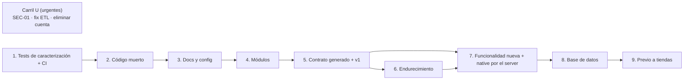

# Fase 5 — Plan de limpieza

> Fecha: 2026-09-28 · Base: `main` de fitogenix-server (`dae49be`) y de fitogenix-native (`976c015`).
> Traduce las Fases 0 a 4 en un backlog ejecutable. Cada ítem cita el requisito (RF/RNF), la decisión (D-xx) o el ADR que lo justifica. Registro de decisiones: [decisiones.md](decisiones.md).

## 0. Cómo leer este plan

### 0.1 Orden obligatorio de etapas

El orden de las etapas 1 a 5 es **obligatorio** (pedido del responsable del proyecto). Las etapas 6 a 9 vienen después y dependen de ellas.

| Etapa | Qué | Por qué en este orden |
|---|---|---|
| **1** | Tests de caracterización en scoring y auth (+ CI) | Nada se toca sin red de seguridad en las dos zonas de alto riesgo |
| **2** | Eliminar código muerto (server y native) | Achica lo que después hay que mover |
| **3** | Corregir docs y config desactualizadas | Deja el repo diciendo la verdad antes de reorganizarlo |
| **4** | Reorganizar el server en módulos (un PR por módulo, < ~400 líneas, reversible, **sin cambios de comportamiento**) | ADR-0001, ADR-0002 |
| **5** | Contrato generado (TypeBox → OpenAPI → tipos de native) + contrato v1 | ADR-0011, D-44 |
| 6 | Endurecimiento del server (fallas de dependencias, JWT local, CORS, límites) | ADR-0006, ADR-0008 |
| 7 | Funcionalidad nueva del server + migración de native a "todo por el server" | ADR-0010, D-28 y RF nuevos |
| 8 | Base de datos: limpieza y tablas nuevas (cuando el código ya no depende de lo que se borra) | ADR-0009 |
| 9 | Previo a publicar en tiendas (no es limpieza; se lista para no perderlo) | D-18, D-24 |

**Carril paralelo "U" (urgentes), aprobado (D-56):** tres ítems que no tocan la estructura del código y corrigen seguridad o datos hoy, **fuera del orden obligatorio**.

**Ramas (D-59):** en cada repo, una rama de integración `fitogenix/refactor-cleanup` que parte de `main`; cada ítem se hace en su rama y se mergea a la integración; al terminar el refactor, la integración se mergea a `main`.

### 0.2 Columnas del backlog

| Columna | Significado |
|---|---|
| **ID** | `U-` carril urgente · `T-` etapa 1 · `E-` etapa 2 · `C-` etapa 3 (`D-` queda para decisiones) · `M-` etapa 4 · `K-` etapa 5 · `H-` etapa 6 · `F-` etapa 7 · `B-` etapa 8 · `L-` etapa 9 |
| **Prio** | **P0** = bloquea o es un riesgo real hoy · **P1** = necesario para el objetivo · **P2** = mejora |
| **Acción** | ELIMINAR · MOVER · REFACTOR · TESTEAR · DOCUMENTAR (y AGREGAR para funcionalidad nueva) |
| **Riesgo** | Alto · Medio · Bajo (probabilidad × impacto de romper algo en producción) |
| **Tests antes → después** | Qué tiene que estar verde **antes** de mergear y qué tests se **agregan** |
| **PR** | PR sugerido. Cada PR: < ~400 líneas de diff (los renombres puros no cuentan), revertible con `git revert`, con su contraparte en `docs/` (§9) |

---

## 1. Carril U — Urgentes (aprobado, D-56)

| ID | Estado |
|---|---|
| U-01 | **SQL entregado, pendiente de corrida** (D-58): [`sql/u01/`](sql/u01/README.md) en `fix/u01-cerrar-catalogo`, mergeado a `fitogenix/refactor-cleanup`. Probado en un Postgres local con los roles de Supabase simulados. Se cierra cuando el responsable devuelva los resultados de las pruebas P y S |
| U-02 | ✅ Hecho: `d9fabb5` en `fix/etl-paginacion` (server), mergeado a `fitogenix/refactor-cleanup`. Tests nuevos fallan sin el arreglo (verificado) |
| U-03 | ✅ Hecho: `97d4998` en `fix/eliminar-cuenta` (native), mergeado a `fitogenix/refactor-cleanup`. 5 tests nuevos; `tsc` sin errores nuevos |

| ID | Prio | Acción | Repo | Archivos / recurso | RF / ADR / D | Riesgo | Tests antes → después | PR |
|---|---|---|---|---|---|---|---|---|
| U-01 | P0 | REFACTOR (SQL) | Supabase | Borrar la policy `"Anyone can read products"`; `REVOKE` de `anon`/`authenticated` sobre `products` y `products_staging`; `REVOKE EXECUTE` de `search_products_by_name` para `anon`, `authenticated` y `PUBLIC`. Script con rollback: [`sql/u01/`](sql/u01/README.md). Sin tocar default privileges (D-60) | SEC-01, D-08, RNF-S01, ADR-0005 | Medio | Antes: precondiciones V-01/V-02/V-03 (verificadas). Después: 3 pruebas negativas con la anon key + smoke de `POST /products/lookup` por barcode y por nombre en producción | `U1 fix(db): cerrar el catálogo a la anon key` |
| U-02 | P0 | REFACTOR | server | `scripts/etl/lib/staging.ts · fetchRowsForBarcodes` (aplicar [`raw/fix-paginacion-etl-6c4b561.patch`](raw/fix-paginacion-etl-6c4b561.patch)) | RF-052, D-53 | Bajo (fuera del runtime) | Antes: suite del ETL verde. Después: test con más filas que el límite de PostgREST | `U2 fix(etl): paginar fetchRowsForBarcodes` |
| U-03 | P0 | REFACTOR | native | `src/screens/ProfileScreen.tsx` (`/api/delete-account` → `DELETE {BACKEND_URL}/users/me` vía `api/client.ts · deleteAccountRemote`) | RF-029, RNF-S08 (bloquea App Store) | Bajo | Después: test de `deleteAccountRemote` (200, 401, error de red) | `U3 fix(native): eliminar cuenta llama al server` |

---

## 2. Etapa 1 — Tests de caracterización (scoring y auth) + CI

Objetivo: fijar el comportamiento **actual**, aunque sea incorrecto, para que cualquier cambio posterior sea visible. Un test que fija un bug lleva el comentario `// CARACTERIZA: comportamiento actual, cambia en <ID>`.

| ID | Estado |
|---|---|
| T-01 | ✅ Hecho en `ci/t01-tests-y-tipos`, mergeado a `fitogenix/refactor-cleanup`. `npm run typecheck` (src + `tsconfig.scripts.json`: 32 archivos de `scripts/`, 0 errores) y `npm test` (424) en cada push y PR. Falta ver el primer run en GitHub (no se pusheó) |
| T-02 | ✅ Hecho en `test/t02-caracterizar-presentacion`, mergeado a `fitogenix/refactor-cleanup`. 32 tests nuevos: bordes de banda en `presentation.test.ts`; `fito` y `flagged` por borde en `productLookupService.presentation.test.ts` (motor simulado; `flagged` < 40 marcado `CARACTERIZA … K-04`); snapshot de la respuesta completa de `mapRawToProduct` para 10 goldens (`__snapshots__/`, generado, 966 líneas). Prueba de mutación: mover el corte de `flagged` o un color de banda hace fallar la suite |
| T-03 | En curso en `test/t03-golden-catalogo` (sin mergear): consulta [`sql/t03-muestra-catalogo.sql`](sql/t03-muestra-catalogo.sql) entregada; el golden y su test se agregan cuando llegue la muestra (D-58) |
| T-04 | ✅ Hecho en `test/t04-caracterizar-auth`, mergeado a `fitogenix/refactor-cleanup`. `src/plugins/auth.test.ts`: 17 tests con Supabase simulado. Cuatro `CARACTERIZA … H-02`: Auth caído → 401; `getUser` que lanza → 500; `Bearer` sin espacio se manda como token; un header sin prefijo `Bearer` se usa entero como token. Prueba de mutación verificada |
| T-05 a T-07 | Pendientes |

| ID | Prio | Acción | Repo | Archivos | RF / ADR / D | Riesgo | Tests antes → después | PR |
|---|---|---|---|---|---|---|---|---|
| T-01 | P0 | TESTEAR (infra) | server | `.github/workflows/ci.yml` (nuevo): `npm ci`, `tsc --noEmit`, `vitest run`, **y typecheck de `scripts/`** (hoy `tsconfig` solo incluye `src/`: el ETL no se chequea); `.nvmrc` + `engines.node` (22.x) | ADR-0007 | Bajo | Antes: suite local verde (421). Después: CI verde en el PR | `PR-01 ci: tests y tipos en cada PR` |
| T-02 | P0 | TESTEAR | server | `src/domain/product/scoring/presentation.test.ts` y `src/services/productLookupService.test.ts` (ampliar) | ADR-0003, RF-005 | Bajo | Antes: suites del motor verdes. Después: bordes de banda (0, 24, 25, 39, 40, 49, 50, 74, 75, 100, `null`) para label, color, fito y **`flagged` actual (< 40)**; snapshot de la respuesta completa de `mapRawToProduct` para 10 productos de `regression.test.ts` | `PR-02 test(scoring): caracterizar presentación y respuesta` |
| T-03 | P1 | TESTEAR | server | `scripts/capture-golden.ts` + fixture nuevo (muestra anonimizada de ~200 productos del catálogo) | ADR-0003 | Bajo | Después: golden de `scoreProduct` sobre la muestra; falla si cambia un solo puntaje | `PR-03 test(scoring): golden sobre muestra del catálogo` |
| T-04 | P0 | TESTEAR | server | `src/plugins/auth.test.ts` (nuevo) | RF-030, RNF-S02, ADR-0008 | Bajo | Después: sin header → 401; `Bearer` vacío → 401; token inválido → 401; vencido → 401; válido → `request.userId`; **error de Supabase Auth → 401 (caracteriza RNF-D03, cambia en H-02)**; una ruta pública no pasa por el hook | `PR-04 test(auth): caracterizar requireAuth` |
| T-05 | P0 | TESTEAR | server | `src/routes/users/*.test.ts` (nuevos, con `app.inject()`) | RF-010 a RF-013, RF-029, RNF-S03 | Bajo | Después: status y forma de cada ruta privada; **aislamiento**: el usuario A nunca ve ni borra datos del B (el `user_id` sale del token, nunca del request) | `PR-05 test(users): rutas privadas y aislamiento` |
| T-06 | P1 | TESTEAR | server | `src/routes/products/lookup.test.ts` (ampliar) | RF-003, RNF-D02 | Bajo | Después: **base caída → 404 (caracteriza, cambia en H-01)**; Redis caído → 200 desde Supabase; body con campos extra → hoy se acepta | `PR-06 test(lookup): caracterizar fallas de dependencias` |
| T-07 | P1 | TESTEAR | native | `src/api/client.test.ts`, `src/presentation/scanResultStore.test.tsx` (ampliar) | Coherente con `REFACTOR_PLAN.md` T1.1 (D-55) | Bajo | Después: header de auth, 401 → `AuthRequiredError`, 404 → `null` / `ProductNotInCatalogError`, timeout; sincronización de guardados e historial | `PR-N01 test(native): caracterizar api/client y store` |

---

## 3. Etapa 2 — Eliminar código muerto

| ID | Prio | Acción | Repo | Archivos | RF / ADR / D | Riesgo | Tests antes → después | PR |
|---|---|---|---|---|---|---|---|---|
| E-01 | P1 | ELIMINAR | server | `src/services/offService.ts`; `fallbackFoodApi.ts` + test; `openBeautyFactsApi.ts` + test; `config.ts · edamamAppId/Key`; `.env.example · EDAMAM_*` | 04-analisis §2.1 #1-3 | Bajo | Antes: CI verde. Después: CI verde; `knip` sin esos archivos | `PR-07 chore: eliminar la cascada retirada` |
| E-02 | P1 | ELIMINAR | server | `imageService.ts` completo (`fetchRetailerImage`, `fetchSearchImageUrl`, `removeBackground`); `routes/products/image.ts` y su registro en `main.ts`; `config.ts · serpApiKey, removeBgApiKey`; `.env.example` | D-49, RF-007, RNF-S05, D-05 | Bajo (native cae a la foto original ante error: `CleanProductImage.tsx · onError`) | Antes: CI verde. Después: CI verde; `GET /products/image` → 404 | `PR-08 chore: eliminar remove.bg y el proxy de imágenes` |
| E-03 | P1 | ELIMINAR | server | `domain/product/productService.ts`; `cacheService.ts · getCachedProductByNameKey`; `ftgEngine.ts · ftgScore`; `scripts/test-search-rpc.ts`; `MOTOR_V21_INFORME.md`; hook `prestart` de `package.json` | D-31, D-54, 04-analisis §2.1 | Bajo | Antes/después: CI verde; `knip` | `PR-09 chore: eliminar restos sin uso` |
| E-04 | P2 | ELIMINAR | server | `domain/product/scoring/index.ts`: re-exports sin consumidores (lista de `knip --production`) | ADR-0003 | Medio (scoring) | Antes/después: T-02 y T-03 idénticos | `PR-10 chore(scoring): achicar el barrel` |
| E-05 | P1 | ELIMINAR | native | `src/domain/product/ftgEngine.ts`; `src/presentation/hooks/useUserInitial.ts` (confirmar con knip); `@expo/ngrok`; `design_handoff_scan_home/`, `Fitogenix onboarding flow design.zip`, `database/openfoodfacts_export.csv`, `fitogenix_scoring_*.md`; `scanResultStore.tsx · migrateLocalSavedIfNeeded` y `SAVED_MIGRATED_KEY` (RF-016). **No** se borra `src/analytics/` aunque knip marque tipos sin uso: es el punto de enchufe de DT-05 (D-61) | 04-analisis §2.1 N1-N3, N8 | Bajo | Antes: T-07 verde. Después: T-07 verde; `knip` | `PR-N02 chore(native): eliminar código y archivos sin uso` |
| E-06 | P1 | ELIMINAR | native | `src/screens/LocationScreen.tsx`, `app/location.tsx`, filas "Ubicación" y "Accesibilidad" de `ProfileScreen.tsx`; enlace a `/terms` de `HelpScreen.tsx` | D-23, RF-046, RF-042 | Bajo | Después: `tsc` verde | `PR-N03 chore(native): quitar pantallas sin función` |
| E-07 | P2 | ELIMINAR | native | `vercel.json`, script `build` web, `app.json · web`. **`react-native-web` se queda como `devDependency`**: `vitest.config.ts` lo usa para simular `react-native` en los tests | 04-analisis §2.1 N4 | Medio | Después: build de EAS (development) OK en iOS y Android | `PR-N04 chore(native): quitar el target web` |

---

## 4. Etapa 3 — Corregir docs y config desactualizadas

| ID | Prio | Acción | Repo | Archivos | RF / ADR / D | Riesgo | Tests antes → después | PR |
|---|---|---|---|---|---|---|---|---|
| C-01 | P0 | REFACTOR (config) | native | `package.json` (+ `expo-apple-authentication`); corregir los 6 errores de `tsc` (rutas tipadas, `absoluteFillObject` → `absoluteFill`, nombre de ícono); `lib/onboardingGate.ts` (restaurar la persistencia) | RF-024, RF-040, RNF-U08 | Bajo | Después: CI de native verde (`tsc` + tests); test de `onboardingGate` (el segundo arranque no muestra el onboarding) | `PR-N05 fix(native): compilar y persistir el onboarding` |
| C-02 | P1 | DOCUMENTAR | server | `README.md` (reescribir: apuntar a `docs/`, variables y rutas reales, sin la cascada ni citas fuera de alcance) | 04-analisis §3.1 | Bajo | — | `PR-11 docs: README al día` |
| C-03 | P1 | REFACTOR (config) | server | `src/config.ts` (`ANTHROPIC_API_KEY` opcional para el server; el ETL la exige al usarla); `.env.example`; `package.json · description` | D-05, SEC-04 | Bajo | Antes/después: CI verde; test: el server arranca sin `ANTHROPIC_API_KEY` | `PR-12 chore(config): el server exige solo lo que usa` |
| C-04 | P2 | DOCUMENTAR | server | Comentarios desactualizados: `productLookupService.ts:18-38`, `lookup.ts:42-47`, `scanHistoryService.ts:35-40`, `redisService.ts:24` y cache texto→barcode, `lookupSchema.ts`; citas a `fitogenix-agents` en `scripts/etl/README.md`, `qualityHeuristics.ts`, `auditDataQuality.ts` | 04-analisis §3.1 | Bajo | CI verde | `PR-13 docs: comentarios que describen lo que existe` |
| C-05 | P1 | DOCUMENTAR | server + Supabase | **Baseline** de migraciones: `supabase init`, `supabase db dump --schema-only` revisado contra [`raw/supabase-schema.json`](raw/supabase-schema.json), `supabase migration repair`; `migrations/001-014` → `supabase/migrations/legacy/`; incluir la `015` (D-09); **default privileges de `public` sin grants para `anon`/`authenticated`** (D-60; foto actual en la consulta 1E de [`sql/u01/`](sql/u01/1-verificacion.sql)) | ADR-0009, DB-02, D-09 | Medio (historial de migraciones, no el schema) | Después: la baseline aplicada a una base vacía reproduce el schema real (diff vacío) | `PR-14 chore(db): baseline de migraciones` |
| C-06 | P1 | DOCUMENTAR | native | `README.md` (real), `AGENTS.md` (Expo 57), `CLAUDE.md` (sin el SSOT externo), `.env.example` (solo `EXPO_PUBLIC_BACKEND_URL` y los client IDs de Google), comentarios de `api/client.ts` y `CleanProductImage.tsx`, encabezado de `scanCopy.ts`; `eas.json · appleId` → configuración de EAS | 04-analisis §3.2, SEC-06 | Bajo | — | `PR-N06 docs(native): docs y config al día` |
| C-07 | P1 | DOCUMENTAR | native | `docs/REFACTOR_PLAN.md`: responder B1-B3 y aplicar los 3 ajustes (capa de servicios solo contra el server, tipos generados, imágenes directas) | D-55, 04-analisis §5 | Bajo | — | `PR-N06` (mismo PR) |
| C-08 | P1 | Acción manual | local | Borrar `SUPABASE_SECRET_KEY`, `ANTHROPIC_API_KEY` y `SERPAPI_API_KEY` del `.env` de native; **vaciar la Papelera** (contiene `ENVIRONMENT.md`) | SEC-02, SEC-03, D-51 | — | — | — |

---

## 5. Etapa 4 — Reorganizar el server en módulos

Reglas: **mudanzas sin cambios de comportamiento**; los tests de las etapas 1 y 2 pasan **sin tocarlos** (solo cambian los imports); un módulo por PR; cada PR revertible por sí solo. Mapa archivo por archivo: [02-arquitectura.md §5](02-arquitectura.md).

| ID | Prio | Acción | Repo | Archivos | RF / ADR / D | Riesgo | Tests antes → después | PR |
|---|---|---|---|---|---|---|---|---|
| M-01 | P1 | MOVER | server | `src/platform/{config,supabase,redis}.ts` (un solo cliente Supabase admin); `.dependency-cruiser.cjs` desde [`borradores/`](borradores/dependency-cruiser.cjs) con las reglas de módulos en `warn` + script `lint:deps` en CI | ADR-0001, ADR-0002, ADR-0005 | Medio | Antes: CI verde. Después: CI verde + `lint:deps` corriendo | `PR-15 refactor(platform): config y clientes compartidos` |
| M-02 | P1 | MOVER | server | `src/platform/http/{buildApp,auth,errors}.ts`; `main.ts` pasa a ser composition root | ADR-0002 | **Alto (auth)** | Antes/después: **T-04 y T-05 idénticos** | `PR-16 refactor(platform): app HTTP y auth` |
| M-03 | P1 | MOVER | server | `domain/product/scoring/**` + `ingredientData.ts` → `modules/scoring/domain/**`; `modules/scoring/index.ts` (fusiona `ftgEngine.ts`); `extractNutrition` / `extractCategory` → `modules/catalog/domain/productData.ts` | ADR-0003 | **Alto (scoring)** | Antes/después: **T-02, T-03 y las 10 suites del motor idénticas**; regla `scoring-es-puro` en `error` | `PR-17 refactor(scoring): módulo de dominio puro` |
| M-04 | P1 | REFACTOR | server | `modules/catalog/infrastructure/{supabaseProductReader,productRow,redisProductCache,supabaseProductWriter}.ts` + `application/ports.ts` (desde `cacheService.ts`, `redisService.ts`, `queryNormalization.ts`) | ADR-0002 | Medio | Antes/después: `cacheService.test` y `redisService.test` portados; tests nuevos de adaptadores | `PR-18 refactor(catalog): adaptadores` |
| M-05 | P1 | REFACTOR | server | `modules/catalog/application/{lookupProduct,productResponse}.ts`, `routes/lookup.*`; `onScan` inyectado desde `main.ts` (elimina `lookup.ts → scanHistoryService`); se borra `productRowMapper.ts` | ADR-0002, 02-arquitectura §3.3 | Medio | Antes/después: `productLookupService.test`, `lookup.test` y T-02 idénticos; tests del caso de uso con fakes | `PR-19 refactor(catalog): caso de uso y rutas` |
| M-06 | P1 | REFACTOR | server | `modules/user-library/**` (desde `savedProductsService`, `scanHistoryService`, `routes/users/{saved,history}.ts`) | ADR-0002 | Medio | Antes/después: T-05 idéntico | `PR-20 refactor(user-library): módulo` |
| M-07 | P1 | REFACTOR | server | `modules/account/**` (desde `routes/users/deleteMe.ts`; sin cliente Supabase por request) | ADR-0002 | Medio | Antes/después: T-05 (`DELETE /users/me`) idéntico | `PR-21 refactor(account): módulo` |
| M-08 | P1 | MOVER | server | `scripts/etl/**` → `etl/**`; `etl/config.ts`; `claudeService.ts` (+ `ingredientCount`) → `etl/enrichment/`; `nutrientPlausibility.ts` → `etl/quality/`; `@anthropic-ai/sdk` → `devDependencies`; scripts `etl:*` de `package.json` | ADR-0004, D-05 | Medio (fuera del runtime) | Antes/después: suites del ETL idénticas; regla `etl-solo-apis-publicas` en `error` | `PR-22 refactor(etl): fuera del runtime` |
| M-09 | P1 | REFACTOR | server | `scripts/*.ts` → APIs públicas de `scoring` / `catalog` (`capture-golden` sigue usando `ftgAnalyzeIngredients` vía `scoring`); `types/fitogenix.ts` → `catalog` (`RawProduct`) | ADR-0004 | Bajo | CI verde | `PR-23 refactor(scripts): APIs públicas` |
| M-10 | P1 | TESTEAR (infra) | server | `.dependency-cruiser.cjs`: **todas** las reglas en `error` (las 30 violaciones resueltas); `knip --production` en CI | ADR-0001 | Bajo | `lint:deps` y `knip` verdes | `PR-24 ci: hacer cumplir las fronteras` |

---

## 6. Etapa 5 — Contrato generado + contrato v1

| ID | Prio | Acción | Repo | Archivos | RF / ADR / D | Riesgo | Tests antes → después | PR |
|---|---|---|---|---|---|---|---|---|
| K-01 | P1 | REFACTOR | server | TypeBox + `@fastify/type-provider-typebox` + `@fastify/swagger`; schemas de los endpoints **tal como están hoy** (sin cambiar la forma); `npm run contract:generate` → `contract/openapi.json`; CI falla si hay diferencias | ADR-0011 | Medio | Antes/después: `lookup.test` y T-05 idénticos; tests de contrato (cada respuesta valida contra su schema) | `PR-25 feat(contract): OpenAPI generado del contrato actual` |
| K-02 | P1 | REFACTOR | server | Redis guarda **datos crudos** (`RawProduct` + `id`), no el DTO; se elimina el sobre versionado (`unwrapCachedProduct`) | D-45, 03-contratos §B.4.1 | Medio | Antes: `redisService.test`. Después: las entradas viejas se ignoran sin error; un campo nuevo del contrato no rompe las entradas cacheadas | `PR-26 refactor(catalog): cache de datos crudos` |
| K-03 | P1 | REFACTOR | server | Prefijo **`/v1`** en todas las rutas + formato de error único `{ error, code }`; **sin alias** de las rutas viejas (D-57): server y native cambian en el mismo release | D-44, 03-contratos §B.2 | Medio | Después: tests de contrato de errores (400, 401, 404, 429) | `PR-27 feat(contract): v1 y errores uniformes` |
| K-04 | P1 | REFACTOR | server | `ProductDetail` de 12 campos (`id` = uuid, `highlight`, `noScore`, `isSaved`); `ProductSummary` + `savedAt` / `scannedAt` en listados; `scoring.presentScore` (sin `tagline` ni `sello`, `highlight` en vez de `flagged`); `GET /v1/products/:id` | D-32 a D-38, D-47, ADR-0003, RF-005, RNF-U06 | **Alto (contrato + scoring)** | Antes: K-01 a K-03. Después: T-02 actualizado **a propósito** (el cambio de `flagged` → `highlight` queda en el diff y en `contract/CHANGELOG.md`) | `PR-28 feat(contract): detalle y resumen v1` |
| K-05 | P1 | REFACTOR | native | `openapi-typescript` → `src/api/schema.d.ts` (commiteado) + `openapi-fetch` en `api/client.ts`; se borran `lib/contracts/product.ts` y `domain/product/lookupProduct.ts` | ADR-0011 | Medio | Antes: T-07. Después: T-07 adaptado; `tsc` verde | `PR-N07 feat(native): tipos generados del contrato` |
| K-06 | P1 | REFACTOR | native | Pantallas con el contrato v1: `id` único (arregla el ícono de guardado), mostrar `noScore`, `highlight` en vez de `score < 50`, sin los fallbacks 75/50/25 de `HomeScreen`, filas de grasas trans y colesterol, imagen directa desde `imageUrl` con placeholder propio, abrir el detalle con `GET /v1/products/:id` | RNF-U03, RNF-U06, D-32, D-34, D-49, RF-008 | Medio | Después: tests de `useProductResult` y del ícono de guardado | `PR-N08 feat(native): pantallas con el contrato v1` |
| ~~K-07~~ | — | — | — | Innecesario: sin alias (D-57) | D-57 | — | — | — |

---

## 7. Etapas 6 a 9

### 7.1 Etapa 6 — Endurecimiento del server

| ID | Prio | Acción | Repo | Archivos | RF / ADR / D | Riesgo | Tests antes → después | PR |
|---|---|---|---|---|---|---|---|---|
| H-01 | P0 | REFACTOR | server | `DependencyUnavailableError`, manejador de errores central, timeouts (Redis 200 ms sin reintentos; Supabase 2 s), `/health/ready` | ADR-0006, RNF-D01/D02/D05, RNF-U01 | Medio | Antes: T-06. Después: T-06 actualizado a propósito (**base caída → 503**; Redis caído → 200 rápido) | `PR-30 fix: 503 ante caídas, nunca 404` |
| H-02 | P1 | REFACTOR | server | JWT local con JWKS (`jose`); `optionalAuth` reemplaza a `resolveUserIdFromToken`; `getUser` extra en `DELETE /v1/users/me` | ADR-0008 (aceptado), RNF-D03 | **Alto (auth)** | Antes: T-04 y T-05. Después: T-04 actualizado a propósito (**Auth caído → 503**; y decidir los otros tres `CARACTERIZA` de `auth.test.ts`: `getUser` que lanza, `Bearer` sin espacio, header sin prefijo) + `iss` / `aud` incorrectos → 401 | `PR-31 feat(auth): validación local del JWT` |
| H-03 | P1 | REFACTOR | server | CORS con lista explícita (o deshabilitado: la app nativa no lo necesita); límites por ruta (D-48); `logger.redact` | RNF-S04, RNF-S06, D-48 | Bajo | Después: tests de 429 por ruta | `PR-32 feat: CORS, límites y redact` |
| H-04 | P2 | REFACTOR | server | Una sola `normalizeQuery`, también para las claves de Redis | 03-contratos §B.4.9 | Bajo | Después: test de normalización con acentos | `PR-33 fix(catalog): normalización única` |
| H-05 | P2 | AGREGAR | server | `Dockerfile` multi-stage | ADR-0007 | Bajo | Después: build de la imagen en CI | `PR-34 chore: Dockerfile portable` |

### 7.2 Etapa 7 — Funcionalidad nueva y native "todo por el server"

| ID | Prio | Acción | Repo | Archivos | RF / ADR / D | Riesgo | Tests antes → después | PR |
|---|---|---|---|---|---|---|---|---|
| F-01 | P1 | AGREGAR | server | `DELETE /v1/users/me/history/:productId` | RF-017, D-13 | Bajo | Tests de ruta (200, 400, 401, aislamiento) | `PR-35 feat(user-library): borrar del historial` |
| F-02 | P0 | AGREGAR | server | Módulo `auth`: `signup` + `username-availability` (el server crea `profiles` con el teléfono, D-46) | ADR-0010, RF-020/021, D-17, D-46 | **Alto** | Tests de contrato y de error (email tomado, username tomado, se deshace el usuario si falla el perfil) | `PR-36 feat(auth): registro` |
| F-03 | P0 | AGREGAR | server | `login`, `oauth/google`, `oauth/apple`, `refresh`, `logout`; reenvío de IP con `trustProxy` (D-30); rate limit por email | ADR-0010, D-30, RF-022/023/024/027 | **Alto** | Tests de contrato; la IP que se reenvía sale de `request.ip` y nunca del cliente | `PR-37 feat(auth): sesión` |
| F-04 | P1 | AGREGAR | server | `password/forgot` (202 siempre) y `password/reset` | ADR-0010, RF-025 | Medio | Tests: no revela si el email existe | `PR-38 feat(auth): recuperar contraseña` |
| F-05 | P1 | AGREGAR | server | `GET` / `PATCH /v1/users/me/profile` | ADR-0010, RF-028 | Medio | Tests de ruta + username duplicado → 409 | `PR-39 feat(account): perfil` |
| F-06 | P1 | AGREGAR | server | `POST /v1/users/me/onboarding` + tabla `onboarding_responses` con consentimiento | RF-048, RNF-S10, D-20 | Medio | Tests: datos de salud sin consentimiento → 400; cascada al borrar la cuenta | `PR-40 feat(account): respuestas del onboarding` |
| F-07 | P1 | AGREGAR | server | `POST /v1/feedback` y `POST /v1/products/:productId/reports` + tablas | RF-043/044, D-15, D-21, D-26 | Bajo | Tests: anónimo y con sesión; 429 | `PR-41 feat(feedback): feedback y reportes` |
| F-08 | P0 | REFACTOR | native | Cliente de auth propio contra `/v1/auth/*`: tokens en `expo-secure-store` y refresh. Migración **por flujo** (login → registro → reset → OAuth), un PR por flujo, conviviendo con el SDK de Supabase hasta el último | ADR-0010, D-28 | **Alto** | Antes: T-07. Después: tests por flujo | `PR-N09…N12 feat(native): auth por el server` |
| F-09 | P1 | REFACTOR | native | Perfil por el server (`/v1/users/me/profile`) | ADR-0010, RF-028 | Medio | Tests de la pantalla de datos personales | `PR-N13 feat(native): perfil por el server` |
| F-10 | P1 | REFACTOR | native | Onboarding: respuestas en memoria + guardado temporal de 24 h al registrarse (D-27) + consentimiento + envío después del primer login | RF-048, D-20, D-27, RNF-S10 | Medio | Tests: se envía tras el login; se borra al vencer o al elegir "sin cuenta" | `PR-N14 feat(native): guardar el onboarding con cuenta` |
| F-11 | P1 | REFACTOR | native | Feedback y reportes reales; borrar del historial llama al server; guardar sin cuenta invita a crear una | RF-043/044, RF-017, D-14, RNF-U05, RNF-U07 | Bajo | Tests de cada acción | `PR-N15 feat(native): acciones reales` |
| F-12 | P1 | ELIMINAR | native | `@supabase/supabase-js`, `src/lib/supabase.ts`, `EXPO_PUBLIC_SUPABASE_*` (cuando F-08 y F-09 estén completos) | D-28 | Medio | Después: `grep supabase src/` vacío; CI verde | `PR-N16 chore(native): sin Supabase en la app` |
| F-13 | P2 | REFACTOR | native | Accesibilidad transversal: `accessibilityLabel` en controles de solo ícono, "reducir movimiento", escalado de texto | RNF-U11, D-23 | Bajo | Checklist manual con VoiceOver y TalkBack | `PR-N17 feat(native): accesibilidad` |

### 7.3 Etapa 8 — Base de datos

| ID | Prio | Acción | Repo | Archivos / recurso | RF / ADR / D | Riesgo | Tests antes → después | PR |
|---|---|---|---|---|---|---|---|---|
| B-01 | P1 | ELIMINAR | Supabase | Columnas `score`, `score_label`, `sello`, `engine_version` (+ índice), `nova_group`, `name_key` (+ UNIQUE), `manufacturer_info`; índice `products_barcode_unique_idx`; las 5 filas `data_source='ai'` (antes: verificar guardados e historial) | D-35, D-36, D-41, DB-02 | Medio | Antes: el escritor del catálogo (ETL) ya no escribe esas columnas; `grep` de las columnas en el código vacío. Después: smoke del lookup y del ETL | `PR-42 chore(db): limpiar columnas sin uso` |
| B-02 | P1 | ELIMINAR | Supabase | Trigger `on_auth_user_created` + `handle_new_user()` (cuando F-02 crea el perfil) | D-46 | Medio | Después: el registro crea el perfil una sola vez | `PR-43 chore(db): sin trigger de perfil` |
| B-03 | P1 | REFACTOR | Supabase | `REVOKE` de `anon` sobre `profiles` e `is_username_available` (cuando F-12 esté en producción) | ADR-0010, D-28 | Bajo | Después: prueba negativa con la anon key | `PR-44 fix(db): anon sin acceso` |
| B-04 | P1 | ELIMINAR | Supabase | Tablas `productos_validados`, `registro_controles`, `validation_runs` en 3 pasos: backup → `REVOKE` (incluido `service_role`) durante 14 días → `DROP` | DB-01, D-07 | Medio | Cada paso con su criterio (00-inventario §7.2) | `PR-45a/b/c chore(db): tablas de validación` |

### 7.4 Etapa 9 — Previo a publicar en tiendas (fuera de la limpieza)

| ID | Qué | Origen |
|---|---|---|
| L-01 | Instancia **siempre encendida** (del proveedor que sea) | D-18, ADR-0007 |
| L-02 | Activar **IP Address Forwarding** en Supabase Auth antes de migrar el login (acompaña a F-03) | D-30 |
| L-03 | **SMTP propio** o subir el límite de emails (hoy 30 por hora para todo el proyecto) | ADR-0010 |
| L-04 | Alternativas mejores (RF-060) y lectura de etiquetas (RF-061) | D-24 |
| L-05 | Metales pesados en el motor (RF-062), con ADR propio y tests de caracterización | D-25 |
| L-06 | Catálogo limpio y cobertura de puntaje ≥ 95% | DT-01, DT-02 |
| L-07 | Política de privacidad actualizada (datos de salud, flujos por el server) | RF-045, RNF-S10 |
| L-08 | Medir el p95 desde los logs y monitoreo externo de disponibilidad | RNF-P01–P04, RNF-D07 |
| L-09 | Destino de la analítica: **diferido** (D-61). Cuando se retome, endpoint propio `POST /v1/events` ([DT-05](deuda-tecnica.md)) | RF-047, D-61 |
| L-10 | Hosting propio de imágenes por HTTPS | DT-04 |

### 7.5 Tamaño del backlog

| Etapa | Ítems | PRs server | PRs native | Otros |
|---|---|---|---|---|
| Carril U | 3 | 1 | 1 | 1 SQL |
| 1 · Tests | 7 | 6 | 1 | — |
| 2 · Código muerto | 7 | 4 | 3 | — |
| 3 · Docs y config | 8 | 4 | 2 | 1 manual |
| 4 · Módulos | 10 | 10 | — | — |
| 5 · Contrato | 7 | 5 | 2 | — |
| 6 · Endurecimiento | 5 | 5 | — | — |
| 7 · Funcionalidad | 13 | 7 | 9 | — |
| 8 · Base de datos | 4 | — | — | 6 migraciones |
| 9 · Previo a tiendas | 10 | — | — | — |

---

## 8. Decisiones de la Fase 5 y [PREGUNTA]

| # | Tema | Decisión |
|---|---|---|
| D-56 | Carril U | Aprobado: U-01, U-02 y U-03 antes de la etapa 1 |
| D-57 | Transición a `/v1` | **Sin alias:** se migra todo a `/v1` de una vez (K-07 deja de existir) |
| D-58 | Consultas y migraciones en Supabase | Se entregan las queries al responsable, que las corre y devuelve los resultados (aplica a U-01, C-05 y la etapa 8) |
| D-59 | Estrategia de ramas | Rama de integración `fitogenix/refactor-cleanup` desde `main` en los dos repos; cada ítem en su rama, mergeada a la integración; al terminar, integración → `main` |
| D-60 | Default privileges de `public` | U-01 **no los cambia**: solo los muestra (consulta 1E). Cambiarlos afecta a todo objeto futuro, así que va con la baseline de migraciones (C-05) y el checklist del ADR-0009 |
| D-61 | Analítica (L-09) | Se difiere como DT-05; rumbo: endpoint propio `POST /v1/events` en el server |

1. ~~**Analítica (L-09):** pendiente de decisión~~ → resuelta por **D-61** (2026-09-28): se difiere como [DT-05](deuda-tecnica.md), con rumbo a un endpoint propio.

## 9. Definition of Done

Un cambio (PR) está terminado solo si cumple **todo** lo siguiente:

1. **Tests:** los tests de las zonas de alto riesgo (scoring, auth) pasan. Si el PR cambia un comportamiento caracterizado, el test se actualiza **en el mismo PR** con el motivo y el ID del ítem, y nunca se borra para que pase.
2. **CI verde:** `tsc`, `vitest`, `lint:deps` (dependency-cruiser) y `knip`; en native, `tsc` y tests.
3. **Tamaño:** < ~400 líneas de diff sin contar renombres; un ítem del plan por PR; revertible con `git revert`.
4. **Contrato:** si cambia un endpoint, `contract/openapi.json` regenerado, `contract/CHANGELOG.md` actualizado y los tipos de native regenerados en un PR enlazado.
5. **Base de datos:** toda migración vive en `supabase/migrations/`, con rollback escrito, RLS activo y sin grants para `anon` (checklist del ADR-0009). Nada se aplica pegando SQL en el editor.
6. **Documentación (obligatorio):** todo cambio de código tiene su **contraparte en `docs/`** en el mismo PR:
   - si cambia un requisito, endpoint, campo o tabla → `01-requerimientos.md`, `03-contratos.md` o `02-arquitectura.md`;
   - si se toma una decisión nueva → nueva fila en `decisiones.md` (y un ADR si es de arquitectura; un ADR aceptado no se edita, se reemplaza);
   - si se cierra un ítem del plan → se marca en `05-plan.md` con el número de PR;
   - si se difiere algo → `deuda-tecnica.md`.
7. **Seguridad:** sin secretos en el código, en los logs ni en `docs/`; toda variable nueva documentada en `.env.example`.
8. **Revisión:** los PRs que tocan scoring, auth, el contrato o la base tienen al menos una revisión explícita de esas partes.
