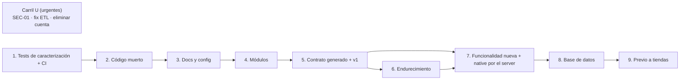

# Fase 5 — Plan de limpieza

> Fecha: 2026-09-28 · Base: `main` de fitogenix-server (`dae49be`) y de fitogenix-native (`976c015`).
> Traduce las Fases 0 a 4 en un backlog ejecutable. Cada ítem cita el requisito (RF/RNF), la decisión (D-xx) o el ADR que lo justifica. Registro de decisiones: [decisiones.md](decisiones.md).

## 0. Cómo leer este plan

### 0.1 Orden obligatorio de etapas

El orden de las etapas 1 a 5 es **obligatorio** (pedido del responsable del proyecto). Las etapas 6 a 9 vienen después y dependen de ellas.

| Etapa | Qué | Por qué en este orden |
|---|---|---|
| **1** | Tests de caracterización en scoring y auth (+ CI) | Nada se toca sin red de seguridad en las dos zonas de alto riesgo |
| **2** | Eliminar código muerto (server y native) | Achica lo que después hay que mover |
| **3** | Corregir docs y config desactualizadas | Deja el repo diciendo la verdad antes de reorganizarlo |
| **4** | Reorganizar el server en módulos (un PR por módulo, < ~400 líneas, reversible, **sin cambios de comportamiento**) | ADR-0001, ADR-0002 |
| **5** | Contrato generado (TypeBox → OpenAPI → tipos de native) + contrato v1 | ADR-0011, D-44 |
| 6 | Endurecimiento del server (fallas de dependencias, JWT local, CORS, límites) | ADR-0006, ADR-0008 |
| 7 | Funcionalidad nueva del server + migración de native a "todo por el server" | ADR-0010, D-28 y RF nuevos |
| 8 | Base de datos: limpieza y tablas nuevas (cuando el código ya no depende de lo que se borra) | ADR-0009 |
| 9 | Previo a publicar en tiendas (no es limpieza; se lista para no perderlo) | D-18, D-24 |

**Excepción al orden (D-67):** la etapa 5 avanza con C-05 (etapa 3) pendiente, porque no toca la base; C-05 es requisito antes de la primera migración nueva (etapa 7).

**Carril paralelo "U" (urgentes), aprobado (D-56):** tres ítems que no tocan la estructura del código y corrigen seguridad o datos hoy, **fuera del orden obligatorio**.

**Ramas (D-59):** en cada repo, una rama de integración `fitogenix/refactor-cleanup` que parte de `main`; cada ítem se hace en su rama y se mergea a la integración; al terminar el refactor, la integración se mergea a `main`.

### 0.2 Columnas del backlog

| Columna | Significado |
|---|---|
| **ID** | `U-` carril urgente · `T-` etapa 1 · `E-` etapa 2 · `C-` etapa 3 (`D-` queda para decisiones) · `M-` etapa 4 · `K-` etapa 5 · `H-` etapa 6 · `F-` etapa 7 · `B-` etapa 8 · `L-` etapa 9 |
| **Prio** | **P0** = bloquea o es un riesgo real hoy · **P1** = necesario para el objetivo · **P2** = mejora |
| **Acción** | ELIMINAR · MOVER · REFACTOR · TESTEAR · DOCUMENTAR (y AGREGAR para funcionalidad nueva) |
| **Riesgo** | Alto · Medio · Bajo (probabilidad × impacto de romper algo en producción) |
| **Tests antes → después** | Qué tiene que estar verde **antes** de mergear y qué tests se **agregan** |
| **PR** | PR sugerido. Cada PR: < ~400 líneas de diff (los renombres puros no cuentan), revertible con `git revert`, con su contraparte en `docs/` (§9) |

---

## 1. Carril U — Urgentes (aprobado, D-56)

| ID | Estado |
|---|---|
| U-01 | ✅ **Aplicado en producción el 2026-09-29** ([`sql/u01/`](sql/u01/README.md), `fix/u01-cerrar-catalogo`). Con la anon key, `products`, `products_staging` y la RPC responden `401 / 42501`; el lookup del server sigue en 200 por barcode y por nombre. Queda mirar los logs de Render (paso 8) |
| U-02 | ✅ Hecho: `d9fabb5` en `fix/etl-paginacion` (server), mergeado a `fitogenix/refactor-cleanup`. Tests nuevos fallan sin el arreglo (verificado) |
| U-03 | ✅ Hecho: `97d4998` en `fix/eliminar-cuenta` (native), mergeado a `fitogenix/refactor-cleanup`. 5 tests nuevos; `tsc` sin errores nuevos |

| ID | Prio | Acción | Repo | Archivos / recurso | RF / ADR / D | Riesgo | Tests antes → después | PR |
|---|---|---|---|---|---|---|---|---|
| U-01 | P0 | REFACTOR (SQL) | Supabase | Borrar la policy `"Anyone can read products"`; `REVOKE` de `anon`/`authenticated` sobre `products` y `products_staging`; `REVOKE EXECUTE` de `search_products_by_name` para `anon`, `authenticated` y `PUBLIC`. Script con rollback: [`sql/u01/`](sql/u01/README.md). Sin tocar default privileges (D-60) | SEC-01, D-08, RNF-S01, ADR-0005 | Medio | Antes: precondiciones V-01/V-02/V-03 (verificadas). Después: 3 pruebas negativas con la anon key + smoke de `POST /products/lookup` por barcode y por nombre en producción | `U1 fix(db): cerrar el catálogo a la anon key` |
| U-02 | P0 | REFACTOR | server | `scripts/etl/lib/staging.ts · fetchRowsForBarcodes` (aplicar [`raw/fix-paginacion-etl-6c4b561.patch`](raw/fix-paginacion-etl-6c4b561.patch)) | RF-052, D-53 | Bajo (fuera del runtime) | Antes: suite del ETL verde. Después: test con más filas que el límite de PostgREST | `U2 fix(etl): paginar fetchRowsForBarcodes` |
| U-03 | P0 | REFACTOR | native | `src/screens/ProfileScreen.tsx` (`/api/delete-account` → `DELETE {BACKEND_URL}/users/me` vía `api/client.ts · deleteAccountRemote`) | RF-029, RNF-S08 (bloquea App Store) | Bajo | Después: test de `deleteAccountRemote` (200, 401, error de red) | `U3 fix(native): eliminar cuenta llama al server` |

---

## 2. Etapa 1 — Tests de caracterización (scoring y auth) + CI

Objetivo: fijar el comportamiento **actual**, aunque sea incorrecto, para que cualquier cambio posterior sea visible. Un test que fija un bug lleva el comentario `// CARACTERIZA: comportamiento actual, cambia en <ID>`.

| ID | Estado |
|---|---|
| T-01 | ✅ Hecho en `ci/t01-tests-y-tipos`, mergeado a `fitogenix/refactor-cleanup`. `npm run typecheck` (src + `tsconfig.scripts.json`: 32 archivos de `scripts/`, 0 errores) y `npm test` (424) en cada push y PR. Primer run en GitHub verde (2026-09-29, run `36511322197`, 22 s) |
| T-02 | ✅ Hecho en `test/t02-caracterizar-presentacion`, mergeado a `fitogenix/refactor-cleanup`. 32 tests nuevos: bordes de banda en `presentation.test.ts`; `fito` y `flagged` por borde en `productLookupService.presentation.test.ts` (motor simulado; `flagged` < 40 marcado `CARACTERIZA … K-04`); snapshot de la respuesta completa de `mapRawToProduct` para 10 goldens (`__snapshots__/`, generado, 966 líneas). Prueba de mutación: mover el corte de `flagged` o un color de banda hace fallar la suite |
| T-03 | ✅ Hecho en `test/t03-golden-catalogo`, mergeado a `fitogenix/refactor-cleanup`. `scoring/catalogGolden.test.ts` + `fixtures/catalog-sample.json`: 200 productos reales (sin id, barcode, marca ni imagen), tomados el 2026-09-29 con la secret key por PostgREST (a pedido del responsable). Snapshot de una línea por producto (puntaje, banda, motivo): 27 Excelente, 21 Bueno, 34 Moderado, 46 Malo y 71 sin puntaje (25 fuera de alcance, 24 sin identificar, 20 sin ingredientes, 2 solo categorías). En vez de `scripts/capture-golden.ts` se usa el snapshot de vitest (`vitest -u` para actualizar a propósito). Mutación: `BASE_SCORE` 75 → 74 hace fallar el golden. Dato: de 1000 filas leídas, solo el 32% tenía ingredientes o nutrientes (DT-01) |
| T-04 | ✅ Hecho en `test/t04-caracterizar-auth`, mergeado a `fitogenix/refactor-cleanup`. `src/plugins/auth.test.ts`: 17 tests con Supabase simulado. Cuatro `CARACTERIZA … H-02`: Auth caído → 401; `getUser` que lanza → 500; `Bearer` sin espacio se manda como token; un header sin prefijo `Bearer` se usa entero como token. Prueba de mutación verificada |
| T-05 | ✅ Hecho en `test/t05-rutas-privadas`, mergeado a `fitogenix/refactor-cleanup`. `src/routes/users/users.test.ts`: 34 tests con `app.inject()` sobre los módulos de rutas reales (Supabase y servicios simulados): 401 sin sesión en las 5 rutas, status y forma de cada respuesta (200, 400, 404, 500), `limit` del historial ajustado a [1, 50], y aislamiento: el id de otro usuario en body, query o headers se ignora. Junto con los tests de `savedProductsService` y `scanHistoryService` (que fijan `.eq('user_id', …)`), la cadena token → ruta → consulta queda cubierta (RNF-S03). Prueba de mutación verificada |
| T-06 | ✅ Hecho en `test/t06-fallas-lookup`, mergeado a `fitogenix/refactor-cleanup`. 7 tests nuevos: `lookup.dependencies.test.ts` corre el camino real ruta → servicio → cache con Supabase y Upstash simulados (el plan decía ampliar `lookup.test.ts`, pero ese archivo simula el servicio entero); `lookup.test.ts` suma el body con campos extra (hoy se acepta y se ignora; ningún ítem lo cambia todavía). `CARACTERIZA … H-01`: base caída → 404 por barcode y por nombre; cliente de Supabase que lanza → 500; Redis colgado → la respuesta espera sin límite. Redis caído (error inmediato) → 200 desde Supabase. Mutación verificada (Supabase que lanza, Redis que no atrapa su error) |
| T-07 | ✅ Hecho en `test/t07-caracterizar-cliente` (native), mergeado a `fitogenix/refactor-cleanup` y pusheado. 42 tests nuevos (native: 54 → 96): 28 en `src/api/client.test.ts` (header `Authorization` con y sin sesión, `Content-Type` solo con body, 401 → `AuthRequiredError`, 404 → `null` en lookup y `ProductNotInCatalogError` al guardar, 5xx, error de red, timeout de 30 s) y 14 en `scanResultStore.test.tsx` (`syncFromServer`, reintento tras fallo, `SIGNED_OUT`, `setResult`, `toggleSaved`). `CARACTERIZA`: `authedFetch` sin timeout → K-05; sesión de Supabase que falla informada como error de conexión → F-08; server que responde antes de hidratar el disco → REFACTOR_PLAN T5.3; guardar sin sesión y borrar del historial solo locales → F-11; guardar sin `productId` con sesión → K-06. Mutación: 13 cambios, cada uno rompe al menos un test. `tsc`: los mismos 6 errores de la auditoría (C-01), por eso el CI de native (`test.yml`, corre `tsc`) queda en rojo en los PRs. `REFACTOR_PLAN.md`: T1.1 y T1.4 hechos |

| ID | Prio | Acción | Repo | Archivos | RF / ADR / D | Riesgo | Tests antes → después | PR |
|---|---|---|---|---|---|---|---|---|
| T-01 | P0 | TESTEAR (infra) | server | `.github/workflows/ci.yml` (nuevo): `npm ci`, `tsc --noEmit`, `vitest run`, **y typecheck de `scripts/`** (hoy `tsconfig` solo incluye `src/`: el ETL no se chequea); `.nvmrc` + `engines.node` (22.x) | ADR-0007 | Bajo | Antes: suite local verde (421). Después: CI verde en el PR | `PR-01 ci: tests y tipos en cada PR` |
| T-02 | P0 | TESTEAR | server | `src/domain/product/scoring/presentation.test.ts` y `src/services/productLookupService.test.ts` (ampliar) | ADR-0003, RF-005 | Bajo | Antes: suites del motor verdes. Después: bordes de banda (0, 24, 25, 39, 40, 49, 50, 74, 75, 100, `null`) para label, color, fito y **`flagged` actual (< 40)**; snapshot de la respuesta completa de `mapRawToProduct` para 10 productos de `regression.test.ts` | `PR-02 test(scoring): caracterizar presentación y respuesta` |
| T-03 | P1 | TESTEAR | server | `scripts/capture-golden.ts` + fixture nuevo (muestra anonimizada de ~200 productos del catálogo) | ADR-0003 | Bajo | Después: golden de `scoreProduct` sobre la muestra; falla si cambia un solo puntaje | `PR-03 test(scoring): golden sobre muestra del catálogo` |
| T-04 | P0 | TESTEAR | server | `src/plugins/auth.test.ts` (nuevo) | RF-030, RNF-S02, ADR-0008 | Bajo | Después: sin header → 401; `Bearer` vacío → 401; token inválido → 401; vencido → 401; válido → `request.userId`; **error de Supabase Auth → 401 (caracteriza RNF-D03, cambia en H-02)**; una ruta pública no pasa por el hook | `PR-04 test(auth): caracterizar requireAuth` |
| T-05 | P0 | TESTEAR | server | `src/routes/users/*.test.ts` (nuevos, con `app.inject()`) | RF-010 a RF-013, RF-029, RNF-S03 | Bajo | Después: status y forma de cada ruta privada; **aislamiento**: el usuario A nunca ve ni borra datos del B (el `user_id` sale del token, nunca del request) | `PR-05 test(users): rutas privadas y aislamiento` |
| T-06 | P1 | TESTEAR | server | `src/routes/products/lookup.test.ts` (ampliar) | RF-003, RNF-D02 | Bajo | Después: **base caída → 404 (caracteriza, cambia en H-01)**; Redis caído → 200 desde Supabase; body con campos extra → hoy se acepta | `PR-06 test(lookup): caracterizar fallas de dependencias` |
| T-07 | P1 | TESTEAR | native | `src/api/client.test.ts`, `src/presentation/scanResultStore.test.tsx` (ampliar) | Coherente con `REFACTOR_PLAN.md` T1.1 (D-55) | Bajo | Después: header de auth, 401 → `AuthRequiredError`, 404 → `null` / `ProductNotInCatalogError`, timeout; sincronización de guardados e historial | `PR-N01 test(native): caracterizar api/client y store` |

---

## 3. Etapa 2 — Eliminar código muerto

| ID | Estado |
|---|---|
| E-01 | ✅ Hecho en `chore/e01-cascada-retirada`, mergeado a `fitogenix/refactor-cleanup`. Borrados `offService.ts`, `fallbackFoodApi.ts` y `openBeautyFactsApi.ts` (+ sus 2 tests, 12 casos) y `EDAMAM_*` de `config.ts` y `.env.example`. Ningún import en `src/` ni `scripts/` (solo comentarios). Suite: 514 → 502. En Render, `EDAMAM_APP_ID` / `EDAMAM_APP_KEY` quedan sin uso y se pueden borrar |
| E-02 | ✅ Hecho en `chore/e02-imagenes`, mergeado a `fitogenix/refactor-cleanup`. Borrados `imageService.ts` y `routes/products/image.ts` (+ su registro en `main.ts`); `serpApiKey` y `removeBgApiKey` salen de `config.ts` y `.env.example`, así que el server ya no exige `SERPAPI_API_KEY` para arrancar (D-05). No había tests de esos archivos. `GET /products/image` → 404 cuando esto llegue a `main` (native cae a la foto original por `CleanProductImage · onError` hasta K-06). En Render, `SERPAPI_API_KEY` y `REMOVE_BG_API_KEY` quedan sin uso. Los tests que setean `SERPAPI_API_KEY` se limpian en C-03 |
| E-03 | ✅ Hecho en `chore/e03-restos-sin-uso`, mergeado a `fitogenix/refactor-cleanup`. Borrados `domain/product/productService.ts` (`productLookupService` importaba de ahí `resolveProductStatus`, que era un re-export: ahora lo importa de `scoring`), `cacheService · getCachedProductByNameKey` (con su test), `ftgEngine · ftgScore`, `scripts/test-search-rpc.ts` (D-31), `MOTOR_V21_INFORME.md` (D-54) y el hook `prestart` (localmente, `npm start` ya no compila: correr `npm run build` antes). Suite: 502 → 501; `npm run build` OK |
| E-04 | ✅ Hecho en `chore/e04-barrel-scoring`, mergeado a `fitogenix/refactor-cleanup`. Salen del barrel de `scoring` 20 re-exports sin consumidores (constantes, utilidades de texto, matching, limpieza, clasificación, `tierFor`, `sealPenalty`, `ScoreLedger`). Se verificó importador por importador, incluidos tests y `scripts/`, que knip `--production` no mira: se quedan `CEILINGS`, `DEDUCTIONS`, `matchesPhrase`, `normalizeText`, `resolveLabelAbbreviation`, `resolvesToSomething` y `computeWarningSeals` (los usan tests) y `resolveProductStatus` (lo usa `productLookupService` desde E-03). Los tipos no se tocaron. T-02 y T-03 idénticos; 503 tests; build OK |
| E-05 | ✅ Hecho en `chore/e05-codigo-sin-uso` (native), mergeado y pusheado. Borrados `domain/product/ftgEngine.ts` y `presentation/hooks/useUserInitial.ts` (0 importadores, confirmado por knip), `@expo/ngrok`, `design_handoff_scan_home/`, el `.zip` del onboarding, `database/openfoodfacts_export.csv` (11 MB) y los `fitogenix_scoring_*.md` (siguen en el historial de git), y la migración de guardados viejos (`migrateLocalSavedIfNeeded`, `SAVED_MIGRATED_KEY`, RF-016), que no tenía tests. `tsc` sin cambios (6); 96 tests en verde |
| E-06 | ✅ Hecho en `chore/e06-pantallas-sin-funcion` (native), mergeado y pusheado. Borrados `LocationScreen.tsx` y la ruta `/location`, la sección "Preferencias" del perfil (Ubicación y Accesibilidad) y el link a `/terms` de Ayuda. `tsc`: 6 → 5 errores (se va el de la ruta tipada `/location`) |
| E-07 | ✅ Hecho en `chore/e07-sin-web` (native), mergeado y pusheado. Borrados `vercel.json`, `app.json · web` y los scripts `web` y `build`; `react-native-web` pasa a `devDependency` con el mismo rango. **Falta el build de EAS** que pide el plan: hoy `expo config` falla porque falta `expo-apple-authentication` (antes y después de E-07), así que se verifica después de C-01 |

| ID | Prio | Acción | Repo | Archivos | RF / ADR / D | Riesgo | Tests antes → después | PR |
|---|---|---|---|---|---|---|---|---|
| E-01 | P1 | ELIMINAR | server | `src/services/offService.ts`; `fallbackFoodApi.ts` + test; `openBeautyFactsApi.ts` + test; `config.ts · edamamAppId/Key`; `.env.example · EDAMAM_*` | 04-analisis §2.1 #1-3 | Bajo | Antes: CI verde. Después: CI verde; `knip` sin esos archivos | `PR-07 chore: eliminar la cascada retirada` |
| E-02 | P1 | ELIMINAR | server | `imageService.ts` completo (`fetchRetailerImage`, `fetchSearchImageUrl`, `removeBackground`); `routes/products/image.ts` y su registro en `main.ts`; `config.ts · serpApiKey, removeBgApiKey`; `.env.example` | D-49, RF-007, RNF-S05, D-05 | Bajo (native cae a la foto original ante error: `CleanProductImage.tsx · onError`) | Antes: CI verde. Después: CI verde; `GET /products/image` → 404 | `PR-08 chore: eliminar remove.bg y el proxy de imágenes` |
| E-03 | P1 | ELIMINAR | server | `domain/product/productService.ts`; `cacheService.ts · getCachedProductByNameKey`; `ftgEngine.ts · ftgScore`; `scripts/test-search-rpc.ts`; `MOTOR_V21_INFORME.md`; hook `prestart` de `package.json` | D-31, D-54, 04-analisis §2.1 | Bajo | Antes/después: CI verde; `knip` | `PR-09 chore: eliminar restos sin uso` |
| E-04 | P2 | ELIMINAR | server | `domain/product/scoring/index.ts`: re-exports sin consumidores (lista de `knip --production`) | ADR-0003 | Medio (scoring) | Antes/después: T-02 y T-03 idénticos | `PR-10 chore(scoring): achicar el barrel` |
| E-05 | P1 | ELIMINAR | native | `src/domain/product/ftgEngine.ts`; `src/presentation/hooks/useUserInitial.ts` (confirmar con knip); `@expo/ngrok`; `design_handoff_scan_home/`, `Fitogenix onboarding flow design.zip`, `database/openfoodfacts_export.csv`, `fitogenix_scoring_*.md`; `scanResultStore.tsx · migrateLocalSavedIfNeeded` y `SAVED_MIGRATED_KEY` (RF-016). **No** se borra `src/analytics/` aunque knip marque tipos sin uso: es el punto de enchufe de DT-05 (D-61) | 04-analisis §2.1 N1-N3, N8 | Bajo | Antes: T-07 verde. Después: T-07 verde; `knip` | `PR-N02 chore(native): eliminar código y archivos sin uso` |
| E-06 | P1 | ELIMINAR | native | `src/screens/LocationScreen.tsx`, `app/location.tsx`, filas "Ubicación" y "Accesibilidad" de `ProfileScreen.tsx`; enlace a `/terms` de `HelpScreen.tsx` | D-23, RF-046, RF-042 | Bajo | Después: `tsc` verde | `PR-N03 chore(native): quitar pantallas sin función` |
| E-07 | P2 | ELIMINAR | native | `vercel.json`, script `build` web, `app.json · web`. **`react-native-web` se queda como `devDependency`**: `vitest.config.ts` lo usa para simular `react-native` en los tests | 04-analisis §2.1 N4 | Medio | Después: build de EAS (development) OK en iOS y Android | `PR-N04 chore(native): quitar el target web` |

---

## 4. Etapa 3 — Corregir docs y config desactualizadas

| ID | Estado |
|---|---|
| C-01 | ✅ Hecho en `fix/c01-compilar-onboarding` (native), mergeado y pusheado. `expo-apple-authentication` (~57.0.2) agregado a `package.json`; `absoluteFillObject` → `absoluteFill`; íconos `mci:` tipados (y `SourceRow` ya no le pasa un `mci:` a Ionicons); `onboardingGate` vuelve a persistir, con 5 tests (mutación verificada). Los errores de rutas tipadas venían de `.expo/types` generado y viejo (local, no está en CI): se regeneró. **`tsc`: 0 errores** (el CI de native deja de estar en rojo); tests 96 → 101. `expo config` y `expo export` iOS/Android OK: E-07 verificado a nivel bundle (el build nativo de EAS sigue sin probar) |
| C-03 | ✅ Hecho en `chore/c03-config`, mergeado a `fitogenix/refactor-cleanup`. `ANTHROPIC_API_KEY` pasa a opcional en `config.ts`; `claudeService` y `qualityAI` la piden con `requireAnthropicApiKey()`, que falla con un mensaje claro. `.env.example` la marca como solo del ETL; `package.json · description` al día; los tests dejan de setear `SERPAPI_API_KEY` (y `ANTHROPIC_API_KEY` donde no la usan). `src/config.test.ts`: 5 tests (el server carga sin la key; mutación verificada). En Render, `ANTHROPIC_API_KEY` también queda sin uso |
| C-04 | ✅ Hecho en `docs/c04-comentarios`, mergeado a `fitogenix/refactor-cleanup`. Solo comentarios: `lookup.ts` y `scanHistoryService` (ya no hay "cold path"), `redisService` (la función citada no existía; el cache texto→barcode ya no evita un OFF search), `productLookupService` (sin la cita a BITACORA), y las citas a `fitogenix-agents` (`06-agente-etl-data.md`, `05-agente-datos.md`) en 12 archivos del ETL, incluido su README. Las citas a `CONTEXT.md` y `NUTRICION.md` en `scoring/` se resolvieron después: lo verificado de esos documentos pasó a [`dominio-scoring.md`](dominio-scoring.md) y las citas apuntan ahí. `lookupSchema.ts` se reescribe en K-01. 508 tests |
| C-02 | ✅ Hecho en `docs/c02-readme`, mergeado a `fitogenix/refactor-cleanup`. README reescrito: apunta a `docs/`, variables y rutas reales, cómo resuelve un producto (incluido el 404 ante caídas, caracterizado), base de datos, ETL, deploy y ramas; sin la cascada retirada ni citas a `fitogenix-agents` |
| C-06 | ✅ Hecho en `docs/c06-docs-config` (native), mergeado y pusheado. README del proyecto; `CLAUDE.md` sin el SSOT externo; `AGENTS.md` y `REFACTOR_PLAN` con docs de Expo v57; `.env.example` sin claves de servidor (las de Supabase marcadas como temporales hasta F-12); `eas.json` sin el Apple ID personal ni el `ascAppId` de ejemplo (siguen en el historial de git); comentarios de `api/client.ts`, `CleanProductImage` y `scanCopy` |
| C-07 | ✅ Hecho en `docs/c07-refactor-plan` (native), mergeado y pusheado. `REFACTOR_PLAN.md`: B1-B3 respondidas, los 3 ajustes aplicados (servicios solo contra el server, tipos generados, imágenes directas) y estado de los bloqueantes B1-B4 |
| C-05 | ✅ Hecho en `chore/c05-baseline-aplicada` (2026-09-30); el paso 7 (`migration repair`) lo corrió el responsable y `migration list` muestra la baseline y la `waitlist`, locales y remotas ([`sql/c05/`](sql/c05/README.md)). `supabase/migrations/20260929000000_baseline.sql`: el dump de producción (`supabase db dump`, corrido por el responsable) con tres correcciones: (1) **sin la tabla `waitlist`**, que apareció en el historial remoto como `20260930115256_create_waitlist` (del sitio www.fitogenix.com, aplicada el 2026-09-30) y va en su propio archivo con el SQL original; (2) **el trigger `on_auth_user_created`** de `auth.users`, que el dump no trae; (3) **`REVOKE` de `anon` y `authenticated` sobre `products`, `products_staging` y `search_products_by_name`**: `pg_dump` no escribe los `REVOKE` y, en una base nueva, los permisos por defecto de `public` dejaban el catálogo abierto (SEC-01). Verificado en una base local vacía (Postgres y Auth de Supabase): las dos migraciones se aplican sin errores y el dump de esa base es **idéntico** al de producción; el alta de un usuario crea su perfil; `anon` no lee el catálogo, se anota en la `waitlist` y no la lee. `supabase/config.toml` y `.gitignore` de `supabase init`. **Hallazgo:** en la `waitlist`, `anon` y `authenticated` conservan `TRUNCATE`, `TRIGGER`, `REFERENCES` y `MAINTAIN` (la migración solo quitó `select`, `update`, `delete`); la API no expone `TRUNCATE`, pero lo prolijo es dejarles solo `INSERT` en una migración nueva. **Cierre en `chore/c05-privilegios`:** `20260930124852_default_privileges_sin_anon` (D-60: lo que se cree en `public` ya no queda abierto a `anon`/`authenticated` por defecto) y `20260930124853_waitlist_solo_insert` (D-81: `anon` y `authenticated` solo `INSERT`). Probadas en una base local vacía con las cuatro migraciones: `waitlist` solo con `INSERT` (`TRUNCATE` → permission denied), una tabla nueva nace cerrada para `anon`/`authenticated` y abierta para `service_role`, lo existente no cambia. **Aplicadas por el responsable el 2026-09-30** (`supabase db push`): `migration list --linked` muestra las cuatro locales y remotas, y en la `waitlist` `anon`/`authenticated` quedaron solo con `INSERT` |
| C-08 | Pendiente: acción manual del responsable |
| C-09 | ✅ Hecho en `chore/c09-comentarios-motor`. Comentarios del motor de puntaje: máximo 3 líneas, sin historia. JS compilado sin comentarios idéntico en los 34 archivos; goldens y snapshots sin cambios |
| C-10 | ✅ Hecho en `chore/c10-comentarios`. Ídem en el resto del server, `etl/` y `scripts/` (91 archivos) |
| C-11 | ✅ Hecho en `chore/c11-comentarios` (native). Ídem en native (40 archivos); regla sumada a `CLAUDE.md` |

| ID | Prio | Acción | Repo | Archivos | RF / ADR / D | Riesgo | Tests antes → después | PR |
|---|---|---|---|---|---|---|---|---|
| C-01 | P0 | REFACTOR (config) | native | `package.json` (+ `expo-apple-authentication`); corregir los 6 errores de `tsc` (rutas tipadas, `absoluteFillObject` → `absoluteFill`, nombre de ícono); `lib/onboardingGate.ts` (restaurar la persistencia) | RF-024, RF-040, RNF-U08 | Bajo | Después: CI de native verde (`tsc` + tests); test de `onboardingGate` (el segundo arranque no muestra el onboarding) | `PR-N05 fix(native): compilar y persistir el onboarding` |
| C-02 | P1 | DOCUMENTAR | server | `README.md` (reescribir: apuntar a `docs/`, variables y rutas reales, sin la cascada ni citas fuera de alcance) | 04-analisis §3.1 | Bajo | — | `PR-11 docs: README al día` |
| C-03 | P1 | REFACTOR (config) | server | `src/config.ts` (`ANTHROPIC_API_KEY` opcional para el server; el ETL la exige al usarla); `.env.example`; `package.json · description` | D-05, SEC-04 | Bajo | Antes/después: CI verde; test: el server arranca sin `ANTHROPIC_API_KEY` | `PR-12 chore(config): el server exige solo lo que usa` |
| C-04 | P2 | DOCUMENTAR | server | Comentarios desactualizados: `productLookupService.ts:18-38`, `lookup.ts:42-47`, `scanHistoryService.ts:35-40`, `redisService.ts:24` y cache texto→barcode, `lookupSchema.ts`; citas a `fitogenix-agents` en `scripts/etl/README.md`, `qualityHeuristics.ts`, `auditDataQuality.ts` | 04-analisis §3.1 | Bajo | CI verde | `PR-13 docs: comentarios que describen lo que existe` |
| C-05 | P1 | DOCUMENTAR | server + Supabase | **Baseline** de migraciones: `supabase init`, `supabase db dump --schema-only` revisado contra [`raw/supabase-schema.json`](raw/supabase-schema.json), `supabase migration repair`; `migrations/001-014` → `supabase/migrations/legacy/`; incluir la `015` (D-09); **default privileges de `public` sin grants para `anon`/`authenticated`** (D-60; foto actual en la consulta 1E de [`sql/u01/`](sql/u01/1-verificacion.sql)) | ADR-0009, DB-02, D-09 | Medio (historial de migraciones, no el schema) | Después: la baseline aplicada a una base vacía reproduce el schema real (diff vacío) | `PR-14 chore(db): baseline de migraciones` |
| C-06 | P1 | DOCUMENTAR | native | `README.md` (real), `AGENTS.md` (Expo 57), `CLAUDE.md` (sin el SSOT externo), `.env.example` (solo `EXPO_PUBLIC_BACKEND_URL` y los client IDs de Google), comentarios de `api/client.ts` y `CleanProductImage.tsx`, encabezado de `scanCopy.ts`; `eas.json · appleId` → configuración de EAS | 04-analisis §3.2, SEC-06 | Bajo | — | `PR-N06 docs(native): docs y config al día` |
| C-07 | P1 | DOCUMENTAR | native | `docs/REFACTOR_PLAN.md`: responder B1-B3 y aplicar los 3 ajustes (capa de servicios solo contra el server, tipos generados, imágenes directas) | D-55, 04-analisis §5 | Bajo | — | `PR-N06` (mismo PR) |
| C-08 | P1 | Acción manual | local | Borrar `SUPABASE_SECRET_KEY`, `ANTHROPIC_API_KEY` y `SERPAPI_API_KEY` del `.env` de native; **vaciar la Papelera** (contiene `ENVIRONMENT.md`) | SEC-02, SEC-03, D-51 | — | — | — |
| C-09 | P1 | DOCUMENTAR | server | Comentarios del motor (`src/modules/scoring/`): máximo 3 líneas, solo el porqué que no se ve en el código | — | Alto (solo comentarios) | El JS compilado sin comentarios no cambia; suite y goldens idénticos | `chore: comentarios cortos del motor` |
| C-10 | P2 | DOCUMENTAR | server | Ídem en el resto de `src/`, `etl/` y `scripts/` | — | Bajo | Ídem | `chore: comentarios cortos` |
| C-11 | P2 | DOCUMENTAR | native | Ídem en `src/` y `scripts/` | — | Bajo | Ídem | `chore(native): comentarios cortos` |

---

## 5. Etapa 4 — Reorganizar el server en módulos

| ID | Estado |
|---|---|
| M-01 | ✅ Hecho en `refactor/m01-platform`, mergeado a `fitogenix/refactor-cleanup`. `src/platform/config.ts` (con su test), `platform/supabase.ts · supabaseAdmin()` (un solo cliente admin: antes había uno por servicio y otro en auth) y `platform/redis.ts · getRedis()`. `deleteMe` sigue creando su cliente por request hasta M-07. `.dependency-cruiser.cjs` desde el borrador, con las reglas de módulos, capas y SDKs en `warn` y las generales (ciclos, importar tests) en `error`; `npm run lint:deps` en CI: 0 errores, 24 avisos (los que resuelven M-02 a M-09). Sin cambios de comportamiento: 508 tests y snapshots idénticos |
| M-02 | ✅ Hecho en `refactor/m02-http-auth`, mergeado a `fitogenix/refactor-cleanup`. `plugins/auth.ts` → `platform/http/auth.ts` (**T-04 idéntico**: el test se movió sin cambios; T-05 pasa sin tocarse). `platform/http/buildApp.ts` arma la app base (CORS, rate limit, `/health`) sin rutas de negocio, para no romper la regla "platform no conoce el negocio"; `main.ts` queda como composition root y registra las rutas. `errors.ts` no se crea acá: el manejador central de errores cambia comportamiento y es H-01. `buildApp.test.ts` (4 tests) encontró un bug: **pasado el rate limit, la respuesta es 500 y no 429** (caracterizado, se corrige en H-03) |
| M-03 | ✅ Hecho en `refactor/m03-scoring`, mergeado a `fitogenix/refactor-cleanup`. `domain/product/scoring/**` → `modules/scoring/domain/**` e `ingredientData.ts` → `modules/scoring/domain/data/ingredients.ts` (renombres puros, salvo el import de la tabla en `catalog.ts`). `modules/scoring/index.ts` fusiona el barrel con la fachada `ftgEngine.ts`, que se borra: la API pública queda en `scoreProduct`, `analyzeIngredients`, `ENGINE_VERSION`, las 4 funciones de presentación y los tipos que ya exponía la fachada (sale el alias `SeverityLevel`, sin usos); `ftgScoreWithBreakdown` y `ftgAnalyzeIngredients` pasan a llamarse como en §8.1 de la arquitectura (eran la misma función). Las utilidades que el barrel exportaba solo para tests (`CEILINGS`, `normalizeText`…) ya no son públicas: los tests del motor las importan de su archivo. `extractNutrition` / `extractCategory` → `modules/catalog/domain/productData.ts`. `ingredientCount` no es puntaje ni catálogo: se muda a `claudeService.ts` (su único uso; se van juntos al ETL en M-08) y su test sale de `rules.test.ts` a `claudeService.test.ts` sin cambios. Regla `scoring-es-puro` en `error` (sin los `*.test.ts`, que usan vitest y `node:fs`); verificada con un import de `platform` y de `node:path` dentro del motor. **T-02, T-03 y las suites del motor idénticas**: los mismos 512 tests con los mismos nombres, 11 snapshots sin cambios; mutación `BASE_SCORE` 75 → 74 sigue rompiendo el golden y T-02. Único cambio en T-02 además del import: el mock simula `scoreProduct` (nuevo nombre). `lint:deps`: 0 errores, 23 avisos (salen los 3 de scripts → `ftgEngine`; entran 2 de `catalog/domain/productData` importado desde afuera del módulo, que resuelve M-05, y 1 de `add-en-aliases` → la tabla de ingredientes, para M-09) |
| M-04 | ✅ Hecho en `refactor/m04-catalog-adaptadores`, mergeado a `fitogenix/refactor-cleanup`. `services/cacheService.ts` se parte en `modules/catalog/infrastructure/{productRow,supabaseProductReader,supabaseProductWriter}.ts`; `redisService.ts` → `infrastructure/redisProductCache.ts`; `queryNormalization.ts` → `domain/query.ts`. `application/ports.ts` define `ProductReader` (`findByBarcode`, `findByName`) y `ProductCache` (`get`, `set`, `getBarcodeForQuery`, `setBarcodeForQuery`) **como se comportan hoy**: error de Supabase = miss (H-01), Redis guarda la respuesta armada con el sobre versionado (K-02), sin `findById` (K-04); los tipos `CachedRaw` / `CachedProductRow` pasan ahí. Cada adaptador exporta su objeto de puerto (`supabaseProductReader`, `redisProductCache`), que el caso de uso recibe en M-05; hasta entonces `productLookupService` sigue llamando a las mismas funciones (sus tests y T-02 solo cambian la ruta de los `vi.mock`). No se creó `ProductWriter`: el ETL solo usa `buildCachePayload`. `setCachedProduct` y `findUpgradableNameRow` no tenían consumidores fuera de sus tests y **se eliminaron en la misma rama** con sus 7 tests (D-65): suite 522 → 515. Tests portados: `cacheService.test` → `supabaseProductAdapters.test.ts` y `redisService.test` → `redisProductCache.test.ts`, con los mismos casos (solo cambian imports). **Los 512 tests anteriores idénticos**, 11 snapshots sin cambios; 10 nuevos: `domain/query.test.ts` (5, `normalizeQuery` no tenía test) y los dos puertos (3 del lector, uno `CARACTERIZA … H-01`; 2 del cache). Mutación verificada en los tres (puerto mal cableado, `\s+` → espacio). Los logs de Redis conservan su prefijo `[redisService]` para no cambiar lo que se busca en Render. `lint:deps`: 0 errores, 32 avisos (+9, todos `modulo-solo-por-index:catalog`: `productLookupService`, `productRowMapper` y sus tests, que entran al módulo en M-05, y dos jobs del ETL → `supabaseProductWriter`, M-08/M-09) |
| M-05 | ✅ Hecho en `refactor/m05-catalog-caso-de-uso`, mergeado a `fitogenix/refactor-cleanup`. `services/productLookupService.ts` se parte en `modules/catalog/application/lookupProduct.ts` (`makeLookupProduct({ reader, cache })`, recibe los puertos de M-04) y `application/productResponse.ts` (`mapRawToProduct`, `cleanName`, `scorePresentation`, sin cambios); `nameKey` e `isBarcode` → `domain/query.ts`. Rutas: `routes/products/lookup.ts` → `modules/catalog/routes/lookup.route.ts` (`lookupRoutes({ lookup, onScan })`) y `lookupSchema.ts` → `routes/lookup.schema.ts`. **catalog ya no importa `scanHistoryService`:** `main.ts` inyecta `onScan`, que resuelve el usuario desde el token y registra el escaneo como antes (hasta H-02 recibe `{ token, productId }`). `modules/catalog/index.ts`: `registerCatalog(app, { onScan })` hace el cableado y expone `productResponseFromRow` (antes `productRowMapper.joinedRowToProduct`, que se borra; lo usan guardados e historial). Tests: `productLookupService.test` → `application/lookupProduct.test.ts` con **fakes de los puertos** en vez de simular módulos (los fakes conservan los nombres de antes, así cada caso y cada aserción quedan idénticos); su bloque T-02 → `application/productResponse.test.ts` con el snapshot movido (mismas claves); `productLookupService.presentation.test` → `application/productResponse.presentation.test.ts` (sin los mocks de adaptadores, que ya no importa); `lookup.test` → `routes/lookup.route.test.ts` con el caso de uso inyectado; T-06 (`lookup.dependencies.test.ts`) corre ahora sobre `registerCatalog`, el mismo cableado que producción. **Los 515 tests anteriores con los mismos nombres y en verde**, 11 snapshots sin cambios; 3 nuevos del registro del escaneo (no tenía tests): con token → `onScan` recibe token y `productId`; sin token o sin producto → nada; `onScan` que falla → igual 200. Mutación: cablear mal el lector en `index.ts` rompe T-06; no llamar a `onScan` rompe los nuevos. Los logs conservan el prefijo `[productLookupService]`. `lint:deps`: 0 errores, 25 avisos (−7: salen los de `productLookupService` y `productRowMapper`; los dos jobs del ETL ahora importan `application/productResponse`, M-08/M-09) |
| M-06 | ✅ Hecho en `refactor/m06-user-library`, mergeado a `fitogenix/refactor-cleanup`. `modules/user-library/`: `application/ports.ts` (`SavedRepository`, `HistoryRepository`, tal como se usan hoy), `application/{saved,history}.ts` (`makeSavedProducts` / `makeScanHistory`, que conservan los nombres `listSavedProducts`, `saveProduct`, `removeSavedProduct`, `recordScan`, `listScanHistory` y presentan las filas con `catalog.productResponseFromRow`), `infrastructure/supabase{Saved,History}Repository.ts` (el SQL de `savedProductsService` y `scanHistoryService`, sin cambios; el "nunca lanza" de `recordScan` queda en el repositorio, con los mismos logs) y `routes/{saved,history}.route.ts` con los casos de uso inyectados. `index.ts`: `registerUserLibrary(app)` y `recordScan`, que `main.ts` usa en el `onScan` de catalog. `resolveUserIdFromToken` → `platform/http/auth.ts` sin cambios (`requireAuth` no se tocó; **T-04 idéntico**). **T-05 idéntico en casos y aserciones:** en vez de simular los módulos de servicios, les pasa a las rutas fakes con los mismos nombres. Los tests de los servicios pasan a los repositorios y prueban el caso de uso cableado con el repositorio real (solo cambia el armado); los 2 de `resolveUserIdFromToken` se mudaron con la función. **Los 518 tests anteriores con los mismos nombres y en verde**, 11 snapshots sin cambios; 5 nuevos de los casos de uso con repositorios falsos (mutación verificada: no filtrar filas inválidas, fecha fija en `recordScan`). `lint:deps`: 0 errores, 29 avisos (+4: T-05, en `src/routes/users/`, importa las rutas y tipos de user-library para inyectarles fakes; se resuelve en M-07 al separar T-05 por módulo junto con `deleteMe`) |
| M-07 | ✅ Hecho en `refactor/m07-account`, mergeado a `fitogenix/refactor-cleanup`. `routes/users/deleteMe.ts` → `modules/account/`: `application/ports.ts` (`AuthAdmin`), `application/deleteAccount.ts`, `infrastructure/supabaseAuthAdmin.ts` (usa el cliente admin compartido: **ya no se crea un cliente Supabase por request**; misma URL y misma key) y `routes/deleteMe.route.ts`; `index.ts`: `registerAccount(app)`. Para no cambiar el comportamiento, la ruta solo atrapa el error que devuelve Supabase (`DeleteUserError` → 500 "No se pudo eliminar la cuenta", mismo log); si el cliente **lanza**, Fastify responde su 500 genérico como antes (test nuevo `CARACTERIZA … H-01`). **T-05 se separó por módulo, con los mismos nombres de casos:** `user-library/routes/library.routes.test.ts` (guardados e historial, con los fakes de M-06) y `account/routes/deleteMe.route.test.ts` (`DELETE /users/me`, sobre `registerAccount` con Supabase simulado). En la fila "sin sesión" cada archivo verifica solo lo de su módulo (antes una ruta de guardados también verificaba que no se borrara la cuenta; ahora están en apps separadas). Los 5 casos de account se corrieron también contra la ruta vieja y pasan. `src/routes/` ya no existe. **Los 523 tests anteriores con los mismos nombres y en verde**, 11 snapshots sin cambios; 1 nuevo. Mutación: atrapar cualquier error rompe el test nuevo. `lint:deps`: 0 errores, 24 avisos (−5: los 4 de T-05 y el SDK de Supabase en `deleteMe.ts`); **todos los que quedan son del ETL y de `scripts/`** (M-08, M-09) |
| M-08 | ✅ Hecho en `refactor/m08-etl`, mergeado a `fitogenix/refactor-cleanup`. `scripts/etl/**` → `etl/**` (renombres; `run-all.sh` ajusta el `cd` a la raíz); `etl/config.ts` propio (`SUPABASE_*` exigidas, `ANTHROPIC_API_KEY` solo para enriquecer) y el server deja de conocer la key (`requireAnthropicApiKey` sale de `platform/config.ts`); `services/claudeService.ts` (con `ingredientCount`) → `etl/enrichment/claudeEnricher.ts`; `domain/product/nutrientPlausibility.ts` → `etl/quality/`. **`src/services/` y `src/domain/` ya no existen.** El ETL importa del server solo `modules/catalog/index.ts`, que ahora expone `mapRawToProduct`, `buildCachePayload` y los tipos `RawOFFProduct` / `FitogenixProduct` (pasan al módulo en M-09). `@anthropic-ai/sdk` → `devDependencies` (misma versión, 0.55.1; en Render se sigue instalando porque `npm install` trae las dev para compilar). `package.json`: scripts `etl:*`, `lint:deps` sobre `etl/`; `vitest` y `tsconfig.scripts.json` incluyen `etl/`. Regla **`etl-solo-apis-publicas` en `error`** (verificada importando `platform/config` desde el ETL). Build limpio: `dist/` sin código del ETL ni del SDK de Anthropic. Tests: los mismos **524 con los mismos nombres y en verde**, 11 snapshots sin cambios; los 2 de `requireAnthropicApiKey` pasaron a `etl/config.test.ts`, y el de "la config del server carga sin la key" ahora verifica que el server ni la lee (`'anthropicApiKey' in config` → false, antes: falsy). Comentarios del ETL al día (decían que `claudeService` era código del scan en vivo, cosa que no es desde el 2026-08-18). `lint:deps`: 0 errores, **2 avisos** (−22), los dos de `scripts/add-en-aliases.ts` → la tabla de ingredientes (M-09) |
| M-09 | ✅ Hecho en `refactor/m09-scripts-y-tipos`, mergeado a `fitogenix/refactor-cleanup`. `src/types/fitogenix.ts` se reparte en catalog: `RawOFFProduct` → `domain/rawProduct.ts` como **`RawProduct`** (el nombre de la arquitectura; renombrado en todo el código, también lo arma el adaptador de VTEX) y `FitogenixProduct` → `application/productResponse.ts`, sin renombrar (K-01 / K-04 lo reemplazan por los tipos del contrato). `catalog/index.ts` exporta los dos tipos; **`src/types/` ya no existe**. `scripts/add-en-aliases.ts` deja de entrar al interior del motor: `scoring/index.ts` expone `INGREDIENTS`, `ADDITIVES` y sus tipos para curaduría (el script lee la tabla, suma aliases en memoria y reescribe el archivo en su propio proceso). Verificado: corrido sobre el código actual agrega 0 aliases y el archivo queda igual (es idempotente). `capture-golden`, `audit-scores` y `score-histogram` ya usaban `scoring/index.ts`. Tests: los mismos 524 en verde, 11 snapshots sin cambios; dos nombres de test cambian solo por el nombre del tipo (`… a un RawOFFProduct` → `… a un RawProduct`, `reconstruye el RawOFFProduct …` → `… el RawProduct …`). **`lint:deps`: 0 errores y 0 avisos** (quedan en `warn` hasta M-10) |
| M-10 | ✅ Hecho en `ci/m10-fronteras`, mergeado a `fitogenix/refactor-cleanup`. **Todas** las reglas de `.dependency-cruiser.cjs` en `error` (incluida `no-orphans`): una violación nueva rompe el CI. `knip` 5 (`devDependency`) con `knip.json` (entradas: `src/main.ts`, `etl/jobs/*`, `scripts/*`, todas de producción de su proceso; `ignoreExportsUsedInFile`) y `npm run lint:unused` = `knip --production`, nuevo paso del CI después de `lint:deps`. Lo que encontró knip: (1) **`fastify-plugin` se usaba en `platform/http/auth.ts` sin estar declarado** (llegaba de rebote por `@fastify/cors` y `@fastify/rate-limit`): se agrega a `dependencies` con la versión que ya estaba instalada (5.1.0); (2) código del ETL sin uso, **eliminado por decisión del responsable (D-66)**: `aiLookupProduct` (con sus 2 tests), `fetchPendingRowsForBarcode`, `fetchAllRowsForBarcode`, `markStagingRows` y `PendingStagingRow`. Verificado que las dos herramientas fallan ante una violación (import del SDK de Supabase en una ruta, export sin uso, archivo huérfano). Tests: 524 → 522 (los 2 de `aiLookupProduct`), el resto con los mismos nombres; 11 snapshots sin cambios. **Etapa 4 completa** |

Reglas: **mudanzas sin cambios de comportamiento**; los tests de las etapas 1 y 2 pasan **sin tocarlos** (solo cambian los imports); un módulo por PR; cada PR revertible por sí solo. Mapa archivo por archivo: [02-arquitectura.md §5](02-arquitectura.md).

| ID | Prio | Acción | Repo | Archivos | RF / ADR / D | Riesgo | Tests antes → después | PR |
|---|---|---|---|---|---|---|---|---|
| M-01 | P1 | MOVER | server | `src/platform/{config,supabase,redis}.ts` (un solo cliente Supabase admin); `.dependency-cruiser.cjs` desde [`borradores/`](borradores/dependency-cruiser.cjs) con las reglas de módulos en `warn` + script `lint:deps` en CI | ADR-0001, ADR-0002, ADR-0005 | Medio | Antes: CI verde. Después: CI verde + `lint:deps` corriendo | `PR-15 refactor(platform): config y clientes compartidos` |
| M-02 | P1 | MOVER | server | `src/platform/http/{buildApp,auth,errors}.ts`; `main.ts` pasa a ser composition root | ADR-0002 | **Alto (auth)** | Antes/después: **T-04 y T-05 idénticos** | `PR-16 refactor(platform): app HTTP y auth` |
| M-03 | P1 | MOVER | server | `domain/product/scoring/**` + `ingredientData.ts` → `modules/scoring/domain/**`; `modules/scoring/index.ts` (fusiona `ftgEngine.ts`); `extractNutrition` / `extractCategory` → `modules/catalog/domain/productData.ts` | ADR-0003 | **Alto (scoring)** | Antes/después: **T-02, T-03 y las 10 suites del motor idénticas**; regla `scoring-es-puro` en `error` | `PR-17 refactor(scoring): módulo de dominio puro` |
| M-04 | P1 | REFACTOR | server | `modules/catalog/infrastructure/{supabaseProductReader,productRow,redisProductCache,supabaseProductWriter}.ts` + `application/ports.ts` (desde `cacheService.ts`, `redisService.ts`, `queryNormalization.ts`) | ADR-0002 | Medio | Antes/después: `cacheService.test` y `redisService.test` portados; tests nuevos de adaptadores | `PR-18 refactor(catalog): adaptadores` |
| M-05 | P1 | REFACTOR | server | `modules/catalog/application/{lookupProduct,productResponse}.ts`, `routes/lookup.*`; `onScan` inyectado desde `main.ts` (elimina `lookup.ts → scanHistoryService`); se borra `productRowMapper.ts` | ADR-0002, 02-arquitectura §3.3 | Medio | Antes/después: `productLookupService.test`, `lookup.test` y T-02 idénticos; tests del caso de uso con fakes | `PR-19 refactor(catalog): caso de uso y rutas` |
| M-06 | P1 | REFACTOR | server | `modules/user-library/**` (desde `savedProductsService`, `scanHistoryService`, `routes/users/{saved,history}.ts`) | ADR-0002 | Medio | Antes/después: T-05 idéntico | `PR-20 refactor(user-library): módulo` |
| M-07 | P1 | REFACTOR | server | `modules/account/**` (desde `routes/users/deleteMe.ts`; sin cliente Supabase por request) | ADR-0002 | Medio | Antes/después: T-05 (`DELETE /users/me`) idéntico | `PR-21 refactor(account): módulo` |
| M-08 | P1 | MOVER | server | `scripts/etl/**` → `etl/**`; `etl/config.ts`; `claudeService.ts` (+ `ingredientCount`) → `etl/enrichment/`; `nutrientPlausibility.ts` → `etl/quality/`; `@anthropic-ai/sdk` → `devDependencies`; scripts `etl:*` de `package.json` | ADR-0004, D-05 | Medio (fuera del runtime) | Antes/después: suites del ETL idénticas; regla `etl-solo-apis-publicas` en `error` | `PR-22 refactor(etl): fuera del runtime` |
| M-09 | P1 | REFACTOR | server | `scripts/*.ts` → APIs públicas de `scoring` / `catalog` (`capture-golden` sigue usando `ftgAnalyzeIngredients` vía `scoring`); `types/fitogenix.ts` → `catalog` (`RawProduct`) | ADR-0004 | Bajo | CI verde | `PR-23 refactor(scripts): APIs públicas` |
| M-10 | P1 | TESTEAR (infra) | server | `.dependency-cruiser.cjs`: **todas** las reglas en `error` (las 30 violaciones resueltas); `knip --production` en CI | ADR-0001 | Bajo | `lint:deps` y `knip` verdes | `PR-24 ci: hacer cumplir las fronteras` |

---

## 6. Etapa 5 — Contrato generado + contrato v1

Se hace con C-05 pendiente (D-67). **Etapa 5 COMPLETA (2026-09-29):** K-01 a K-06, K-08 y K-09 hechos; K-07 descartado (D-57).

| ID | Estado |
|---|---|
| K-01 | ✅ Hecho en `feat/k01-contrato-generado`, mergeado a `fitogenix/refactor-cleanup`. Schemas de todas las rutas en TypeBox (`@sinclair/typebox` 0.34 + `@fastify/type-provider-typebox` 5; la línea 1.x de TypeBox es solo ESM y el server compila a CommonJS): `catalog/routes/lookup.schema.ts` (`Product`), `user-library/routes/library.schema.ts`, el de `account/routes/deleteMe.route.ts` y los compartidos en `platform/http/schemas.ts` (`ApiError`, `InternalError`, `Ok`, `Nullable`, `addSharedSchemas`). Los schemas con `$id` se registran en la raíz desde cada `register<Módulo>` y en el contexto de cada plugin de rutas (idempotente), así los tests que registran una ruta sola no cambian. **Sin cambiar la forma:** el JSON Schema del lookup (body, 200 y 404) es idéntico al escrito a mano (comparado objeto por objeto); las rutas de user-library y account no tenían schema de respuesta y ahora lo tienen, con exactamente lo que respondían (los 200 productos de la muestra salen igual que con `JSON.stringify`; el 500 se declara con sus dos formas de hoy). Validación con el ajv de Fastify, sin cambios: los 400 salen iguales. Comparado contra el server anterior compilado: `/health`, 400, 401 y validaciones, respuestas idénticas. `src/registerModules.ts` registra los módulos para `main.ts` y para `scripts/generate-contract.ts`, que escribe `contract/openapi.json` (OpenAPI 3.1, componentes con nombre, `/health` afuera por D-44) y con `--check` falla si difiere: `npm run contract:generate` / `contract:check`, nuevo paso del CI. `contract/CHANGELOG.md` (0.1.0). Tests: los 522 anteriores con los mismos nombres; **T-05 cambia solo sus dos datos de prueba** de listados (`{ productId, name }` → un producto completo: con schema, un producto a medias da 500, igual que en el lookup; las aserciones son las mismas). 7 nuevos en `src/contract.test.ts` (cada ruta y cada status declarado valida contra el OpenAPI, incluidas las dos formas del 500 de `DELETE /users/me`; y el de "no recorta" con la muestra). Mutación: cambiar un límite del body rompe `contract:check`; sacar un campo del schema rompe el de "no recorta". Dependencias: `@sinclair/typebox` y `@fastify/type-provider-typebox` (runtime), `@fastify/swagger` y `ajv` (dev) |
| K-02 | ✅ Hecho en `refactor/k02-cache-crudos`, mergeado a `fitogenix/refactor-cleanup`. **Cambia comportamiento a propósito (D-45).** Redis guarda `{ productId, dataSource, raw }` (`CachedProduct`, lo mismo que devuelve la base) en vez de la respuesta armada dentro de un sobre `{ engineVersion, product }`; el lookup pasa el hit de Redis por el mismo armado que el de Supabase (`present` → `mapRawToProduct`), así que un cambio del motor o un campo nuevo del contrato no dejan entradas que invalidar. `unwrapCachedProduct` se reemplaza por `parseCachedProduct`: acepta solo crudos con `productId` (lo que era el chequeo pre-006 del caso de uso) y todo lo demás —el sobre viejo, la respuesta pelada, basura— es miss sin error (evento `redis_stale_format`) y el nivel Supabase lo pisa en la misma clave. Claves y TTL sin cambios. Efecto visible: una respuesta servida desde Redis ahora trae el `id` de la búsqueda actual y el puntaje del motor actual (antes, lo que se hubiera calculado al cachear). Costo de recalcular en cada hit, medido sobre la muestra de 200 productos: p50 0,7 ms, p95 2,9 ms (objetivo del lookup con hit: p95 ≤ 300 ms, D-10). `ENGINE_VERSION` ya no invalida Redis: queda para `products.engine_version` hasta B-01. Tests: salen los 14 que fijaban el sobre versionado y entran 15 (formato aceptado, entradas viejas → miss y repoblado en la misma clave, hit de Redis = hit de Supabase, lo que se guarda es el crudo; dos con el cableado real en `lookup.dependencies.test.ts`); el resto, idéntico. Mutación: aceptar el sobre viejo rompe 3. El OpenAPI no cambia |
| K-03 | ✅ Hecho en `feat/k03-v1-y-errores` (server) y `feat/k03-v1` (native), mergeados a `fitogenix/refactor-cleanup` en los dos repos. **Cambia el contrato a propósito (contrato `0.2.0`, D-44, D-57, D-69).** (1) **`/v1`**: `registerModules` registra los tres módulos dentro de un contexto con `prefix: '/v1'` (`API_PREFIX`); los plugins de rutas no cambian y `/health` queda afuera. Sin alias: una ruta sin `/v1` responde `404 NOT_FOUND`. (2) **Errores `{ error, code }`**: `platform/http/schemas.ts` define `ApiErrorSchema` con `code` como `enum` (`ERROR_CODES`, solo los 6 que el server responde hoy: `VALIDATION_ERROR`, `UNAUTHENTICATED`, `NOT_FOUND`, `PRODUCT_NOT_IN_CATALOG`, `RATE_LIMITED`, `INTERNAL`) y `errorResponses(...)`; se borra `InternalError`. Nuevo `platform/http/errors.ts`: `apiError()` para los handlers y `registerErrorHandling` (lo instala `buildApp`), que arma la validación (400, mensaje fijo en español y detalle de ajv al log), los 4xx de Fastify (JSON roto, 413, 415), el 429, la ruta inexistente y el 500 de cualquier excepción, sin devolver el mensaje interno. `auth.ts` (alto riesgo) solo cambia el cuerpo del 401. Cada ruta declara `400` (si recibe datos), `401`, `404`, `429` y `500`. (3) **429 arreglado** (antes 500, M-02; adelantado de H-03 por D-69): `errorResponseBuilder` pasa el status. Verificado: los `200` y `Product` del OpenAPI son idénticos a los de `0.1.0`. Tests: 536 → 545. **Nuevos (9, `src/contract.test.ts`):** todas las rutas del OpenAPI con `/v1` y todos sus errores `ApiError` con `429` y `500` declarados; las rutas viejas → 404; `/health` fuera de `/v1`; 400 en body, params, querystring y JSON roto; 415; 401; los dos 404 con su código; 500 de una excepción; 429 con `retry-after`. **Adaptados a propósito** (mismas aserciones de status y de lógica, el cuerpo suma `code`): T-04 (`auth.test.ts`, nota en el encabezado), T-05 (`library.routes.test.ts`, `deleteMe.route.test.ts`), T-06 (`lookup.dependencies.test.ts`), `lookup.route.test.ts`, `buildApp.test.ts` y `contract.test.ts`. Los tests de ruta que caracterizan el 500 de una excepción instalan `registerErrorHandling` como en producción. Cambian 4 nombres: el del 429 y el de la app base en `buildApp.test.ts`, el del 500 que lanza en `deleteMe.route.test.ts` y el de `DELETE /users/me` en el contrato. Mutación (7 casos, todos detectados por los tests o por `contract:check`): `apiError` sin `code`, sin prefijo, rate limit sin `statusCode`, 400 con el detalle de ajv, 500 con el mensaje interno, sin `notFoundHandler`, una ruta sin `429` declarado. **Native:** `api/client.ts` arma `API_URL = BACKEND_URL + '/v1'`; `EXPO_PUBLIC_BACKEND_URL` sigue siendo el origen. Ya leía solo `error`, así que el formato nuevo no cambia su manejo (`code` se usa en K-05/K-06). T-07 adaptado (URLs con `/v1`, cuerpos de ejemplo con `code`): 101 tests, `tsc` sin errores; sacar el `/v1` rompe 6. Queda afuera, sin ítem asignado: `additionalProperties: false` en bodies y querystrings (03-contratos §B.3; el test de T-06 que acepta campos extra lo marca) → se hizo en K-04 (D-70). `CleanProductImage` sigue pidiendo `/products/image` (ya no existe desde E-02; se va en K-06) |
| K-04 | ✅ Hecho en `feat/k04-detalle-resumen`, mergeado a `fitogenix/refactor-cleanup`. **Cambia el contrato a propósito (contrato `0.3.0`, D-32 a D-38, D-70, D-71; rompe: native se adapta en K-05/K-06).** (1) **`scoring.presentScore(score)`** → `{ label, color, fito, highlight }` (ADR-0003): única fuente de la presentación; `highlight` corta en `GOOD_FROM` (= `TIERS[1].min`, 50) y sin puntaje es `'ninguno'` (D-71); `fito` sale del tono de `resolveProductStatus`, así el sello, el estado y `fito` no pueden divergir. `getScoreTagline` y `resolveProductStatus` dejan de exportarse (`getScoreLabel` y `getSello` quedan para las columnas del ETL hasta B-01). (2) **`ProductSummary`** (7 campos: `id` uuid, `name`, `brand`, `imageUrl`, `score`, `scoreLabel`, `scoreColor`) y **`ProductDetail`** (12: + `noScore`, `fito`, `highlight`, `ingredients[{name, sev, desc}]`, `nutrition`) en `catalog/application/productResponse.ts`, armados por `toProductSummary` / `toProductDetail`; salen `productId` (se unifica con `id`), `subtitle`, `category`, `categoryEmoji`, `scoreAvailable`, `flagged`, `emoji`, `bgColor`, `dataSource`, `aiEnriched` y `tagline`. `cleanName` pasa a `domain/productData.ts`. Nombre de reemplazo: la query en el lookup; el barcode de la fila en listados y detalle (antes, el uuid). (3) **`GET /v1/products/:id`** (`application/getProduct.ts`, `routes/getProduct.route.ts`, `ProductReader.findById`): sesión opcional, no registra el escaneo, `404 NOT_FOUND`; un error de Supabase sigue siendo `null` hasta H-01. (4) **Listados** con `productSummaryFromRow` + `savedAt` / `scannedAt` en ISO (`user-library/application/listItem.ts`); tipos `SavedItem` / `HistoryItem`. (5) **Schemas** en `catalog/routes/product.schema.ts` (`ProductSummary`, `ProductDetail`) y `user-library/routes/library.schema.ts` (`SavedItem`, `HistoryItem`, `date-time`): enums con `StringEnum` (exige la unión completa del motor), `scoreLabel` desde `scoringBands()`, objetos anidados con todos sus campos requeridos, `id` con `format: uuid`. Tipos y schemas atados en compilación con `SameShape` (asignables en los dos sentidos; application no importa routes). (6) **D-70:** `additionalProperties: false` en los bodies (lookup, POST saved) y en el querystring del historial; `AJV_OPTIONS` (`removeAdditional: false`) en `buildApp` y en los tests de ruta que arman `Fastify()` suelto. (7) **ETL:** `buildCachePayload(raw, key)` calcula cada columna desde el crudo, sin pasar por el DTO; `runMerge` pisa `data_source` con la fuente principal como antes. La fila que escribe el ETL para los 200 productos de la muestra quedó **idéntica** (caracterización commiteada antes del cambio, `supabaseProductWriter.test.ts`). Tests: 545 → 596. **Actualizados a propósito:** T-02 (`productResponse.presentation.test.ts`: `flagged` → `highlight`; snapshot de los 10 goldens regenerado con `vitest -u` y revisado: ningún puntaje, label, color, fito ni valor nutricional cambió, solo salen campos y entra `highlight`), T-06 (`lookup.route.test.ts`: body con campos extra → 400), T-05 (`library.routes.test.ts`: `userId` en el body de POST saved y en la query del historial → 400; los headers se siguen ignorando), `lookupProduct.test.ts` (el `dataSource` se verifica en el log), los tests de repositorios y casos de uso de user-library (resumen + fecha) y `supabaseProductAdapters.test.ts` (`buildCachePayload` sin DTO, `findById`). **Nuevos:** `presentScore` en cada borde (0, 24, 25, 39, 40, 49, 50, 74, 75, 100, `null`), `getProduct.test.ts`, `GET /products/:id` con el cableado real (200, nombre de reemplazo, 404, error de base, 400), y en `contract.test.ts` el detalle igual en lookup y `GET :id`, los listados con resumen + fecha, que `GET :id` no registre el escaneo y los campos de más → 400. Mutación (todas detectadas): mover el corte de la banda Buena, `null` → `'beneficiosos'`, dejar `dataSource` en el DTO (falla `tsc` y 13 tests), volver a `removeAdditional: true`, sacar `additionalProperties: false` del lookup (tests y `contract:check`). `isSaved` (D-47) queda para después de H-02 (D-71) |
| K-05 | ✅ Hecho en `feat/k05-tipos-generados` (native), mergeado a `fitogenix/refactor-cleanup` de native; esta fila, en `docs/k05-estado` (server). **Native deja de transcribir el contrato (ADR-0011 paso 4, D-72).** (1) `npm run contract:sync` copia `contract/openapi.json` del checkout del server (`FITOGENIX_SERVER_DIR`, por defecto `../fitogenix-server`) y genera `src/api/schema.d.ts` con `openapi-typescript` 7.13; los dos se commitean. `npm run contract:check` (sumado al CI de native) falla si no coinciden. `openapi-typescript` declara peer `typescript ^5` y native usa TS 6: un `overrides` le hace usar el del proyecto (genera sin diferencias). (2) `src/api/types.ts` nombra los tipos (`ProductDetail`, `ProductSummary`, `SavedItem`, `HistoryItem`, `ApiError`, `Ingredient`…). (3) `api/client.ts` sobre `openapi-fetch` 0.17: mismas funciones y errores (`AuthRequiredError`, `ProductNotInCatalogError`); timeout de 30 s en **todas** las rutas (antes solo el lookup); el lookup devuelve `null` solo con `404 PRODUCT_NOT_IN_CATALOG` (un 404 de ruta inexistente pasa a ser error); nuevo `fetchProduct(id)`. `tsc` detecta ruta inexistente, campo faltante o con tipo equivocado; un campo **de más** en un body no (los genéricos de openapi-fetch no hacen ese chequeo): lo cubren los tests, que comparan cada body exacto. (4) Se borran `lib/contracts/product.ts` y `domain/product/lookupProduct.ts`. (5) Lo que `tsc` obligó a adaptar (adelantado de K-06, D-72): el store guarda resúmenes (`toSummary`) e identifica por `id` = uuid (se va `resolveProductId`, lo que arregla el ícono de guardado); `openProduct(id)` pide el detalle con `GET /v1/products/:id` al abrir desde Inicio o Historial, con carga y error en `ScanResultScreen`; sin `emoji` (`CleanProductImage` usa '📦' por defecto hasta K-06) ni `tagline`. Claves de AsyncStorage `.v2`: lo guardado con la forma vieja se borra y no se migra (D-72). Tests: 101 → 114. **Adaptados a propósito:** T-07 (`client.test.ts` lee el `Request` que arma openapi-fetch; cambia el `CARACTERIZA` del timeout de las rutas con sesión) y `scanResultStore.test.tsx` (claves `.v2`, guardar por `id`; el `CARACTERIZA` "producto sin productId se guarda solo local" se reemplaza: ya no hay productos sin id). **Nuevos:** `fetchProduct` (200, 404, 400, red, timeout), 404 de ruta inexistente en el lookup, `openProduct` (carga, no está, error, respuesta vieja descartada), limpieza de las claves viejas solo con sesión, escaneo persistido como resumen. Mutación (todas detectadas por `tsc`, `contract:check` o tests): sacar `ingredients` del schema generado, cambiar el `openapi.json` sin regenerar, cualquier 404 del lookup como `null`, no descartar la respuesta vieja de `openProduct`, sacar el timeout de guardados, un campo de más en el body del lookup. `expo export --platform ios` empaqueta sin errores (no se probó en un simulador). `npm run lint` da los mismos 24 problemas que antes (no corre en el CI). **Con K-04 + K-05 la integración vuelve a andar**; falta K-06 para lo visual |
| K-06 | ✅ Hecho en `feat/k06-pantallas-v1` (native), mergeado a `fitogenix/refactor-cleanup` de native; esta fila, en `docs/k06-estado` (server). **Las pantallas dejan de decidir sobre el puntaje (ADR-0003, D-73).** (1) `presentation/productResultView.ts · buildProductResultView` (pura): el grupo de ingredientes que va primero y el color de las barras salen de `highlight` (antes `score < 50` en `ScanResultScreen`); con `'ninguno'`, beneficiosos primero, como se veía antes sin puntaje. (2) `NoScoreNotice`: sin puntaje se muestra el título fijo "Sin puntaje" (`scanCopy.NO_SCORE_TITLE`, copy provisorio) más `noScore.message` tal cual; antes el motivo no se mostraba en ningún lado. (3) Grasas trans y colesterol se suman a la tarjeta de nutrición cuando hay dato, después de las 4 filas principales (D-34; barras contra 2 g y 300 mg). (4) `HomeScreen` sin los cortes 75/50/25 de respaldo: label y color del server. (5) `ProductImage` reemplaza a `CleanProductImage` (que se borra): foto directo desde `imageUrl` y, sin foto o si no carga, un placeholder propio (Ionicons `cube-outline`) en vez del emoji (D-49). (6) Si el grupo destacado está vacío, los primeros ingredientes se muestran con su severidad real (antes se pintaban del color del grupo: un ingrediente cuestionable podía verse verde). Tests: 114 → 138. **Nuevos:** `productResultView.test.ts` (cada `highlight`, que decide `highlight` y no el puntaje, `noScore`, nutrición con trans y colesterol, el 0 como dato), `ProductImage.test.tsx`, `NoScoreNotice.test.tsx`, `ScanResultScreen.test.tsx` (primer test de render de la pantalla: aviso, orden por `highlight`, filas nuevas, placeholder, carga y error; los PNG se interceptan en el `require` de Node solo durante ese archivo) y el ícono de guardado en `scanResultStore.test.tsx` (un guardado se ve guardado al escanearlo o abrirlo de la lista). Mutación (todas detectadas): volver a un corte propio en 50, `'ninguno'` destacando cuestionables, sacar grasas trans, sacar el aviso de la pantalla, imagen rota sin placeholder. `contract:check` ✅, `expo export --platform ios` ✅ (sin probar en simulador), `lint` con los mismos 24 problemas de antes. **Con K-04, K-05 y K-06 la integración anda de punta a punta.** Queda en native K-09 (`GuideScreen` y `ScoringExplainerModal` todavía transcriben las bandas) |
| K-08 | ✅ Hecho en `feat/k08-bandas-contrato`, mergeado a `fitogenix/refactor-cleanup`. `scoring/domain/bands.ts · scoringBands()` (pura, expuesta en `scoring/index.ts`) arma las bandas desde `TIERS` y `NO_DATA_TIER`: nombre, label, desde/hasta (inclusive, sobre la escala entera 0–100 de `clampScore`), color, mensaje y sello, más la banda "sin datos". El label, el mensaje y el sello se piden a `getScoreLabel`, `getScoreTagline` y `getSello`, las mismas funciones que presentan un producto. `npm run contract:generate` escribe también `contract/scoring-bands.json` y `contract:check` (ya en el CI) lo verifica. Tests: `bands.test.ts` (5: una banda por `TIER`, escala cubierta sin huecos, **cada puntaje de 0 a 100 se presenta con el label, color, mensaje y sello de su banda**, sellos solo en los extremos, banda "sin datos") y, en `src/contract.test.ts`, que el archivo commiteado es exactamente lo que arma el motor. Mutación: mover el corte de Bueno (50 → 55) rompe `contract:check` y el test del archivo; cambiar el corte de `getSello` (75 → 70) rompe `bands.test.ts`. `contract/CHANGELOG.md` con la tabla de bandas. El OpenAPI no cambia. Los 529 tests anteriores con los mismos nombres; 6 nuevos |
| K-09 | ✅ Hecho en `feat/k09-bandas-contrato` (native), mergeado a `fitogenix/refactor-cleanup` de native; esta fila, en `docs/k09-estado` (server). **Sin cortes escritos a mano en la app (D-62, D-63, D-74).** (1) `contract:sync` copia también `contract/scoring-bands.json`; `contract:check` avisa si las copias quedaron viejas cuando encuentra el checkout del server (en el CI de native, sin server, solo chequea `schema.d.ts`). (2) `src/api/scoringBands.ts` es el único lugar de la app con cortes, colores y sellos. (3) `GuideScreen`: rango, color, label y sello de cada banda desde el contrato; el texto propio de la guía queda, por nombre de banda (`constants/scoringCopy.ts`). **Deja de prometer el sello FITOGÉNICO a la banda Buena.** (4) `ScoringExplainerModal`: bandas del contrato (antes, otros colores) y "Cómo se calcula" según el motor v2.1 (`dominio-scoring.md` §S2), sin NOVA (D-36) ni las capas del motor v2; copy provisorio para UX. (5) Test guardián (`scoringBands.test.ts`): falla si aparece un rango `desde–hasta` o una comparación de puntaje contra un corte fuera de `api/scoringBands.ts`; los patrones salen del contrato (al estrenarlo encontró un comentario con `score < 50`, que se sacó). `HomeScreen` y `ScanResultScreen` ya usaban lo del server desde K-06. Tests: 138 → 148 (guardián, contrato, render de la guía y del explicador). Mutación (todas detectadas): un rango escrito a mano, sello en Bueno, JSON viejo (`contract:check`), NOVA de vuelta en el explicador. **Hallazgo sin ítem:** la demo del onboarding (`OnboardingScreen`) muestra un producto de 41 como "Malo", que por las bandas es Moderado (contenido de marketing; queda para decidir). **Resuelto 2026-09-30 (D-80):** pasa a 18, y la etiqueta y el color de los dos ejemplos salen de las bandas del contrato (`bandForScore`, native `ce3cb7f`) |

| ID | Prio | Acción | Repo | Archivos | RF / ADR / D | Riesgo | Tests antes → después | PR |
|---|---|---|---|---|---|---|---|---|
| K-01 | P1 | REFACTOR | server | TypeBox + `@fastify/type-provider-typebox` + `@fastify/swagger`; schemas de los endpoints **tal como están hoy** (sin cambiar la forma); `npm run contract:generate` → `contract/openapi.json`; CI falla si hay diferencias | ADR-0011 | Medio | Antes/después: `lookup.test` y T-05 idénticos; tests de contrato (cada respuesta valida contra su schema) | `PR-25 feat(contract): OpenAPI generado del contrato actual` |
| K-02 | P1 | REFACTOR | server | Redis guarda **datos crudos** (`RawProduct` + `id`), no el DTO; se elimina el sobre versionado (`unwrapCachedProduct`) | D-45, 03-contratos §B.4.1 | Medio | Antes: `redisService.test`. Después: las entradas viejas se ignoran sin error; un campo nuevo del contrato no rompe las entradas cacheadas | `PR-26 refactor(catalog): cache de datos crudos` |
| K-03 | P1 | REFACTOR | server + native | Prefijo **`/v1`** en todas las rutas + formato de error único `{ error, code }`; **sin alias** de las rutas viejas (D-57): server y native cambian en el mismo release; el 429 del rate limit se arregla acá (D-69) | D-44, D-69, 03-contratos §B.2 | Medio | Después: tests de contrato de errores (400, 401, 404, 429) | `PR-27 feat(contract): v1 y errores uniformes` |
| K-04 | P1 | REFACTOR | server | ✅ `ProductDetail` de 12 campos (`id` = uuid, `highlight`, `noScore`; ~~`isSaved`~~ diferido hasta después de H-02, D-71); `ProductSummary` + `savedAt` / `scannedAt` en listados; `scoring.presentScore` (sin `tagline` ni `sello`, `highlight` en vez de `flagged`); `GET /v1/products/:id`; campos de más → 400 (D-70) | D-32 a D-38, D-47, D-70, D-71, ADR-0003, RF-005, RNF-U06 | **Alto (contrato + scoring)** | Antes: K-01 a K-03. Después: T-02 actualizado **a propósito** (el cambio de `flagged` → `highlight` queda en el diff y en `contract/CHANGELOG.md`) | `PR-28 feat(contract): detalle y resumen v1` |
| K-05 | P1 | REFACTOR | native | ✅ `openapi-typescript` → `src/api/schema.d.ts` (commiteado) + `openapi-fetch` en `api/client.ts`; se borran `lib/contracts/product.ts` y `domain/product/lookupProduct.ts`; además, `id` único y abrir el detalle con `GET /v1/products/:id` (adelantados de K-06, D-72) | ADR-0011, D-72 | Medio | Antes: T-07. Después: T-07 adaptado; `tsc` verde | `PR-N07 feat(native): tipos generados del contrato` |
| K-06 | P1 | REFACTOR | native | ✅ Pantallas con el contrato v1: ~~`id` único (arregla el ícono de guardado)~~ (hecho en K-05), mostrar `noScore`, `highlight` en vez de `score < 50`, sin los fallbacks 75/50/25 de `HomeScreen`, filas de grasas trans y colesterol, imagen directa desde `imageUrl` con placeholder propio (se va `CleanProductImage`), ~~abrir el detalle con `GET /v1/products/:id`~~ (hecho en K-05; K-06 puede pulir la carga) | RNF-U03, RNF-U06, D-32, D-34, D-49, RF-008 | Medio | Después: tests de `useProductResult` y del ícono de guardado | `PR-N08 feat(native): pantallas con el contrato v1` |
| ~~K-07~~ | — | — | — | Innecesario: sin alias (D-57) | D-57 | — | — | — |
| K-08 | P1 | AGREGAR | server | **Bandas como parte del contrato, sin endpoint (D-63):** `npm run contract:generate` (K-01) escribe también `contract/scoring-bands.json` (nombre, color, desde/hasta, mensaje y sello de cada banda, y la banda "sin datos") armado desde `TIERS`, `NO_DATA_TIER` y `getSello`. CI falla si el archivo commiteado no coincide con el motor; un cambio de bandas queda en `contract/CHANGELOG.md` | D-63, ADR-0003, ADR-0011 | Bajo | Después: test de que el archivo sale de `TIERS` (cambiar un corte cambia el archivo) y de que el sello coincide con `getSello` en cada banda | `PR-29 feat(contract): bandas del puntaje en el contrato` |
| K-09 | P1 | REFACTOR | native | ✅ Sin umbrales escritos a mano: un solo módulo (`src/api/scoringBands.ts`) generado desde `contract/scoring-bands.json`, igual que los tipos de K-05. `GuideScreen` y `ScoringExplainerModal` se arman con él (hoy tienen su propia tabla: la guía le promete el sello FITOGÉNICO a una banda del medio, el modal usa otros colores y su texto describe el motor v2 —capas, toxicidad, NOVA— que ya no existe, ver `dominio-scoring.md` §S2); `HomeScreen · scoreColor/scoreLabel` y `ScanResultScreen · isBad` usan lo que trae el producto (se coordina con K-06). Test que falla si aparece una tabla de cortes fuera de ese módulo | D-63, RNF-U06 | Medio | Después: tests de las dos pantallas; el test guardián; CI de native falla si el módulo generado no coincide con el contrato | `PR-N08b feat(native): bandas del contrato en toda la app` |

---

## 7. Etapas 6 a 9

### 7.1 Etapa 6 — Endurecimiento del server

**Etapa 6 COMPLETA (2026-09-29):** H-01 a H-05 hechos. H-06 (actualizar `fastify`, D-77) se sumó después y quedó hecho el 2026-09-30.

| ID | Estado |
|---|---|
| H-04 | ✅ Hecho en `fix/h04-normalizacion-unica`. El cache `query → barcode` de Redis usa `domain/query.ts · normalizeQuery` (antes solo minúsculas y recorte): una query con acentos o espacios de más comparte clave con la equivalente. Las claves viejas con acentos quedan como miss una vez (cache, sin costo). Test nuevo; mutación (volver a la normalización propia) detectada |
| H-05 | ✅ Hecho en `chore/h05-dockerfile`. `Dockerfile` multi-stage (build con dependencias de desarrollo → runtime `node:22-alpine` con `npm ci --omit=dev`, usuario `node`, `HEALTHCHECK` sobre `/health`) y `.dockerignore`. Job `docker` en el CI: construye la imagen, la levanta con variables de relleno y exige `/health` 200. Verificado local simulando el runtime (solo dependencias de producción + `dist/`): arranca y `/health` responde 200 |
| H-03 | ✅ Hecho en `feat/h03-cors-limites-redact`. (1) **CORS** con lista explícita (`CORS_ORIGINS`); vacía = sin CORS, que es lo que usa la app nativa (antes `origin: true` reflejaba cualquier origen). (2) **IP del cliente:** sin `trustProxy`, detrás del balanceador de Render el rate limit veía la IP del proxy y todos compartían los 60/min; ahora `TRUST_PROXY_HOPS` (por defecto 0: **hay que definirla en Render**, verificando cuántos proxies hay). (3) **`logger.redact`** de `authorization` y `cookie`. (4) **Límites por ruta:** el general sigue en 60/min; los de D-48 son para `/auth/*` y `/feedback`, que todavía no existen: se aplican con F-02 y F-07. Tests: el `CARACTERIZA` de CORS cambia a propósito; nuevos: CORS con y sin lista (también preflight), límite por cliente detrás del proxy, logs sin token ni cookies, parseo de las variables. Mutación (CORS abierto, redact sin `authorization`) detectada. **`TRUST_PROXY_HOPS` se reemplazó por `TRUST_PROXY` en H-06** |
| H-01 | ✅ Hecho en `fix/h01-caidas-503`. **Cambia comportamiento a propósito (contrato `0.4.0`, aditivo).** (1) `DependencyUnavailableError` (`platform/dependencyError.ts`): el lector del catálogo y los repositorios de user-library traducen un `error` de PostgREST o una excepción (red, timeout) al error tipado; `null` queda solo para una consulta que salió bien sin filas. (2) El manejador central responde **503 `DEPENDENCY_UNAVAILABLE` + `Retry-After: 10`**; las rutas de user-library dejan pasar ese error. (3) Supabase: `fetch` con tope de 2 s y **`.retry(false)` en los SELECT** (postgrest-js 2.110 reintenta los GET 3 veces con backoff; medido: la caída tardaba 15 s en responder, ahora 2 s). (4) Redis: 200 ms y sin reintentos (cliente y adaptador); si no responde, miss. (5) `/health/ready`: 503 si Supabase no contesta en 1 s; Redis se informa sin bloquear. Tests 601 → 618. **Actualizados a propósito:** T-06 (base caída → 503, también si el cliente lanza; Redis colgado → 200 en menos de 1 s), la caracterización del lector (`null` → error tipado), los 500 de base de guardados e historial en el contrato (→ 503) y el `createClient` de T-04 (ahora con el `fetch` con tope). **Nuevos:** timeouts de Supabase y Redis, `runQuery`, `/health/ready`, 503 por ruta en T-05 y en el contrato. Mutación (error como miss, manejador sin 503, ruta que se traga la caída, Redis sin tope, sin `.retry(false)`) detectada. Verificado de punta a punta con Supabase inalcanzable: lookup y detalle → 503 en 2 s; `/health/ready` → 503 en 1 s. El 503 de Auth caído va con H-02 |
| H-02 | ✅ Hecho en `feat/h02-jwt-local`. **Cambia comportamiento a propósito (contrato `0.5.0`, aditivo; D-75).** (1) `requireAuth` verifica el JWT **localmente** con `jose` 6 (`platform/http/auth.ts`): firma con el JWKS de `${SUPABASE_URL}/auth/v1/.well-known/jwks.json` (ES256 o RS256), `exp` y `sub` obligatorios, `iss` = `${SUPABASE_URL}/auth/v1`, `aud` = `authenticated`; `request.userId` = `sub`. El JWKS se cachea en memoria (`createRemoteJWKSet`, `jose` lo refresca cada 10 min): sin red por request. (2) **Auth caído:** si no se puede traer el JWKS se siguen usando las últimas claves; sin ninguna → `DependencyUnavailableError('auth')` → 503 (ADR-0006, punto 4). (3) `optionalAuth(request)` reemplaza a `resolveUserIdFromToken`: el lookup verifica el token en segundo plano y `OnScan` recibe `{ userId, productId }`; token inválido o vencido, o Auth sin claves → anónimo, sin registrar. (4) `DELETE /v1/users/me` registra `requireAuth` con `checkSession`: además consulta `getUser` (sesión revocada o usuario borrado → 401; si lanza, no responde o da 5xx → 503). (5) Se exige `Bearer <token>`. `jose` 6 es solo ESM: el server (CommonJS) lo carga con el `require(esm)` de Node ≥ 22.12 (verificado con `node dist/main.js` y en el job `docker` del CI). Tests 618 → 664. **Actualizados a propósito:** T-04 (Auth caído → 503; `getUser` que lanza, ahora solo con `checkSession` → 503; `Bearer` sin espacio → "Falta el token"; header sin prefijo → 401), T-05 y el contrato con tokens firmados por una clave de test (`src/testing/supabaseAuth.ts`: JWKS servido por un `fetch` falso, nada a la red; fuera de `knip --production`); el caso de 500 genérico del contrato pasa a `DELETE /v1/users/me`, porque `requireAuth` ya no llama a Supabase. `resolveUserIdFromToken.test.ts` se borra con la función: sus dos casos pasan a los de `optionalAuth`. **Nuevos:** firma inválida, vencido, `iss` o `aud` incorrectos, sin `exp` o `sub`, HS256, `kid` desconocido → 401; JWKS inaccesible en frío (red, timeout, 500, respuesta que no es un JWKS) → 503; con claves en cache, y con la cache vencida, Auth caído → 200; `kid` nuevo con Auth caído → 503; `optionalAuth`; lookup con token inválido, vencido o sin prefijo, o con Auth caído → 200 anónimo sin `onScan`; sesión revocada y Auth caído en `DELETE /v1/users/me`; en el contrato, las rutas con sesión con Auth caído → 503. Mutación (aceptar otro `aud` o `iss`, JWKS caído como 401, sin `getUser` en `DELETE /v1/users/me`, header sin `Bearer`, sin `exp` obligatorio, sin respaldo de claves, 5xx de `getUser` como 401, `getUser` que lanza sin atrapar) detectada; permitir HS256 no se detecta porque `jose` igual lo rechaza (el JWKS no publica claves simétricas). Verificado de punta a punta con el server compilado: sin token, basura, `Bearer` sin token, sin prefijo y un JWT con el `kid` real firmado con otra clave → 401 (contra el JWKS real del proyecto); Auth inalcanzable → 503 con `Retry-After` (20 ms si rechaza la conexión, 2 s si no contesta) |
| H-06 | ✅ Hecho en `chore/h06-fastify` (D-77, D-78). `fastify` 5.9 → 5.12.5 y `fast-uri` 3.1.5 → 3.1.8: `npm audit --omit=dev` sin avisos. El arreglo del aviso de `X-Forwarded-*` (GHSA-3m5p-2c4r-xxw2) hace que un `trustProxy` numérico no confíe en nadie, así que **`TRUST_PROXY_HOPS` se reemplaza por `TRUST_PROXY`**: direcciones de los proxies (IPs, CIDR o nombres de `proxy-addr`), vacía = sin proxy. En Render, `10.0.0.0/8` (el balanceador llega desde la red interna, p. ej. `10.235.24.249` en los logs). Con la actualización, el test de H-03 con saltos falló como se esperaba; se reescribió por dirección. Tests 678 → 683: límite por cliente detrás del proxy, quien llega directo no cambia su IP con `X-Forwarded-For`, `request.ip` con una IP falsa adelante, valor inválido → no arranca, parseo de la variable. Verificado con el server compilado: con `TRUST_PROXY` vacía el log muestra la IP del que conecta; con la del proxy, la del cliente. **Pendiente del responsable (cuando el refactor pase a `main`):** definir `TRUST_PROXY=10.0.0.0/8` en Render y verificar en el log `incoming request` que `remoteAddress` sea su IP pública |

| ID | Prio | Acción | Repo | Archivos | RF / ADR / D | Riesgo | Tests antes → después | PR |
|---|---|---|---|---|---|---|---|---|
| H-01 | P0 | REFACTOR | server | ✅ `DependencyUnavailableError`, manejador de errores central, timeouts (Redis 200 ms sin reintentos; Supabase 2 s), `/health/ready` | ADR-0006, RNF-D01/D02/D05, RNF-U01 | Medio | Antes: T-06. Después: T-06 actualizado a propósito (**base caída → 503**, también cuando el cliente lanza; Redis caído o colgado → 200 rápido) | `PR-30 fix: 503 ante caídas, nunca 404` |
| H-02 | P1 | REFACTOR | server | ✅ JWT local con JWKS (`jose`); `optionalAuth` reemplaza a `resolveUserIdFromToken`; `getUser` extra en `DELETE /v1/users/me` | ADR-0008 (aceptado), RNF-D03 | **Alto (auth)** | Antes: T-04 y T-05. Después: T-04 actualizado a propósito (**Auth caído → 503**; y decidir los otros tres `CARACTERIZA` de `auth.test.ts`: `getUser` que lanza, `Bearer` sin espacio, header sin prefijo) + `iss` / `aud` incorrectos → 401 | `PR-31 feat(auth): validación local del JWT` |
| H-03 | P1 | REFACTOR | server | ✅ CORS con lista explícita (o deshabilitado: la app nativa no lo necesita); límites por ruta (D-48); `logger.redact`. (El 429 en vez de 500 ya se arregló en K-03, D-69) | RNF-S04, RNF-S06, D-48 | Bajo | Antes: `buildApp.test.ts` (M-02). Después: tests de 429 por ruta | `PR-32 feat: CORS, límites y redact` |
| H-04 | P2 | REFACTOR | server | ✅ Una sola `normalizeQuery`, también para las claves de Redis | 03-contratos §B.4.9 | Bajo | Después: test de normalización con acentos | `PR-33 fix(catalog): normalización única` |
| H-05 | P2 | AGREGAR | server | ✅ `Dockerfile` multi-stage | ADR-0007 | Bajo | Después: build de la imagen en CI | `PR-34 chore: Dockerfile portable` |
| H-06 | P1 | REFACTOR | server | ✅ Actualizar `fastify` (y `fast-uri`) por los avisos de `npm audit`, en especial `X-Forwarded-*` con `trustProxy` por saltos | D-77, H-03 | Medio | Antes y después: toda la suite, `buildApp.test.ts` (IP detrás del proxy) y el contrato sin cambios | `PR-34b chore: fastify al día` |

### 7.2 Etapa 7 — Funcionalidad nueva y native "todo por el server"

| ID | Estado |
|---|---|
| F-01 | ✅ Hecho en `feat/f01-borrar-historial`. **Contrato `0.6.0` (aditivo).** `DELETE /v1/users/me/history/:productId` en `user-library`: `HistoryRepository.remove` (borra por `user_id` y `product_id`; un error o una excepción de la base → `DependencyUnavailableError`, 503), caso de uso `removeFromHistory` y ruta en `history.route.ts` con `requireAuth` (params uuid → 400; error inesperado → 500 "No se pudo borrar del historial"). Tests 664 → 678: repositorio (filtros, error y excepción → error tipado), caso de uso, ruta en T-05 (200, idempotente, 400, 401, 500, 503 y aislamiento: el id de otro usuario en query o headers se ignora; cada token borra de su historial) y contrato (200, 400, 401, 503; declarado en las listas de rutas con base y con sesión). Mutación (sin filtro por usuario, sin filtro por producto, tragarse el error de la base, `userId` de la query, caída como 500, `productId` sin uuid) detectada. Verificado de punta a punta con el server compilado contra un Supabase falso local: 401 sin token, 200 dos veces y 400 sin uuid; el `DELETE` que llega a PostgREST filtra `user_id` (del token) y `product_id`. Native sincroniza el contrato; la app lo usa en F-11 |
| F-11a | ✅ Hecho en `feat/f11a-historial-y-guardar` (native), mergeado a `fitogenix/refactor-cleanup` de native; esta fila, en `docs/f11a-estado` (server). Primera mitad de F-11 (D-76). (1) **Borrar del historial:** con sesión, `removeFromHistory` llama a `removeFromHistoryRemote` (`DELETE /v1/users/me/history/{productId}`, F-01) con update optimista; si el server falla (incluido un 503), el ítem vuelve a su lugar, salvo que un escaneo nuevo ya lo haya traído. Sin sesión sigue siendo local. (2) **Guardar sin cuenta (D-14, RNF-U05):** `toggleSaved` sin sesión no hace nada (antes marcaba el producto como guardado en memoria) y `ScanResultScreen` abre una alerta que invita a crear una cuenta ("Crear cuenta" → `/welcome`; copy provisorio en `constants/scanCopy.ts`). El botón de guardar suma rol y etiqueta accesibles. Tests 150 → 162. **Actualizados a propósito:** los dos `CARACTERIZA` de F-11 en `scanResultStore.test.tsx` (guardar sin sesión; borrar del historial). **Nuevos:** cliente (URL, sin sesión, 401, 500, 503 no es "iniciá sesión"), store (borrar con y sin sesión, revertir sin duplicar, `clearHistory` sigue local) y pantalla (invitación sin sesión, con sesión guarda sin preguntar). Mutación (borrar sin avisar al server, sin revertir, revertir duplicando, guardar sin sesión en memoria, pantalla que guarda sin sesión, invitación que no lleva a crear cuenta, URL equivocada) detectada. `expo lint` sigue con los 24 problemas previos (ninguno nuevo). **F-11b** (feedback y reportes) queda para después de F-07 |
| F-13 | ✅ Hecho en `feat/f13-accesibilidad` (native), mergeado a `fitogenix/refactor-cleanup` de native; esta fila, en `docs/f13-estado` (server). **Falta el checklist manual del responsable** ([checklist-accesibilidad.md](checklist-accesibilidad.md)). (1) **Etiquetas:** rol y `accessibilityLabel` en los 18 controles de solo ícono (tabs con su nombre y estado, volver, buscar, cerrar cámara, linterna, ojitos de contraseña, redes, fondos de los modales); `CircleButton` exige la etiqueta; compartir, que todavía no hace nada, se anuncia deshabilitado; `Button` y `SocialButton` con rol. (2) **Reducir movimiento:** las animaciones de Reanimated (deslizamiento de tabs, indicador, modales) ya lo respetaban solas (`ReduceMotion.System`, verificado en su código); `useReduceMotion` (`presentation/hooks/useAccessibilitySettings.ts`) lo suma a la línea del escáner, el dial del puntaje, el rebote de guardar, el desplegable (`LayoutAnimation`) y el modal del selector de país. (3) **Letra grande:** `useLargeText` (escala ≥ 1,3) lleva a 3 líneas los nombres de producto de Inicio y de las filas del historial; no hay `allowFontScaling={false}` ni alturas fijas en contenedores de texto de P-07 a P-10. (4) Borrar o quitar una fila se ofrece como acción del lector de pantalla (el deslizamiento no le llega). Tests 162 → 173: **test guardián** (`src/accessibility.test.ts`, falla si aparece un control de solo ícono sin etiqueta), `useReduceMotion`, desplegable, dial y encabezado del resultado. Mutación (sacar etiquetas de la linterna, de `CircleButton` y de las tabs; animar siempre el desplegable y el dial; no escuchar los cambios del sistema) detectada. Lo que los tests no ven (línea del escáner, selector de país, rebote, acciones del lector, letra al 200 %) va en el checklist. El contraste AA de RNF-U11 queda fuera de F-13 |
| F-05 | ✅ Hecho en `feat/f05-perfil`. **Contrato `0.7.0` (aditivo).** `account`: `ProfileRepository` (`supabaseProfileRepository`: `select` y `update` sobre `profiles` filtrando por `id` = usuario del token; `23505` → `username_taken`; sin fila → `null` / `not_found`; errores → `DependencyUnavailableError`, 503), caso de uso `makeProfile` y `profile.route.ts` con `requireAuth`. `GET /v1/users/me/profile` → `Profile` (4 campos, `string | null`) o 404; `PATCH` cambia solo los campos que vienen (al menos uno, sin `null`, sin campos de más) con las reglas del registro (03-contratos §B.3.3) → `Profile`, 404 o **409 `USERNAME_TAKEN`** (código nuevo). Tests 683 → 726: repositorio (filtros, columnas, 23505, sin fila, errores), caso de uso, ruta (401, 200, 404, 16 casos de 400, 409, 503, aislamiento) y contrato (todas las respuestas contra el OpenAPI; rutas con base y con sesión con Auth caído). Mutación (sin filtro por usuario en `select` o `update`, 23505 como caída, sin fila como perfil vacío, campos de más, body vacío, username o teléfono sin reglas, 409 como 500) detectada. Verificado de punta a punta con el server compilado contra un Supabase falso: la consulta filtra `id=eq.<usuario del token>`, el PATCH manda solo la columna cambiada con `return=representation`, username tomado → 409, sin fila → 404. **Para F-09:** native hoy guarda el username como se escribe y el teléfono como texto libre; tiene que mandar solo lo que cambió, ya normalizado |
| F-04 | ✅ Hecho en `feat/f04-recuperar-contrasena`. **Contrato `0.8.0` (aditivo; D-79).** Primer pedazo del módulo `auth` (ADR-0010): `AuthGateway` con `sendPasswordResetCode` y `resetPassword` (`supabaseAuthGateway`), caso de uso `makePasswordReset` con `failedAttempts` (5 códigos fallidos por email cada 15 min, D-48; email normalizado) y `password.route.ts` (`POST /v1/auth/password/forgot` → `202`; `/reset` → `200`, `401 INVALID_CODE` —código nuevo—, `400` con el motivo si Supabase rechaza la contraseña, `429` con `Retry-After`, `503`). Límite de 10/min por IP en cada ruta de `/auth/*` (D-48). **Seguridad:** el canje del código (`verifyOtp`) corre en `supabaseAuthClient()`, un cliente descartable sin sesión persistente (`platform/supabase.ts`): hacerlo en el admin compartido habría dejado la sesión del usuario firmando las consultas siguientes; la sesión de recuperación se revoca al terminar. Tests 726 → 775: límite de intentos (ventana, bloqueo, limpieza), caso de uso, adaptador (cliente descartable por reseteo, cada error de Supabase, Auth caído), ruta (202/200/401/400/429/503, validaciones, 11ª request → 429, logs sin email, código ni contraseña) y contrato. Mutación (canjear en el cliente admin, revelar los 4xx en `forgot`, caída como código inválido, sin revocar la sesión, sin contar fallos, sin normalizar el email, sin límite por ruta, código o contraseña sin reglas) detectada. Verificado de punta a punta con el server compilado contra un Supabase Auth falso: `PUT /auth/v1/user` va con el token de la sesión de recuperación (no con la secret key), `logout?scope=local` al final, y el log del server no tiene secretos. **Pendiente:** Supabase ve la IP del server en `/recover` y `/verify` hasta F-03 (D-30); en F-08 native pasa a contraseñas de 8 caracteres |
| F-07 | ✅ Hecho en `feat/f07-feedback`. **Contrato `0.9.0` (aditivo; D-82).** Módulo nuevo `feedback`: `FeedbackRepository` (`supabaseFeedbackRepository`: `insert` en `feedback` y `product_reports`; FK del producto (`23503`) → `product_not_found`; otro error o excepción → `DependencyUnavailableError`, 503), caso de uso `makeFeedback` (recorta espacios; mensaje de reporte vacío → `null`) y `feedback.route.ts`. `POST /v1/feedback` y `POST /v1/products/:productId/reports` → `202 { ok: true }`, con `optionalAuth` (token inválido → anónimo), `additionalProperties: false`, 404 si el producto no existe y **5 pedidos por minuto por IP en cada ruta** (D-48). **Migración `20260930130025_feedback_y_reportes`**: tablas con RLS activo, sin policies ni grants para `anon`/`authenticated` (solo `service_role`), checks de largo y de valores, `user_id` con cascada al borrar la cuenta, `product_id` con cascada al borrar el producto, sin IP. Probada en una base local vacía con las cinco migraciones (permisos, checks, cascadas). Tests 775 → 811: caso de uso, repositorio (columnas, 23503, errores), ruta con la app base (anónimo, con sesión, token vencido o roto → anónimo, 13 casos de 400, 404, 503, 429 en la sexta y las inválidas también cuentan) y contrato (202, 400, 404 y 503 contra el OpenAPI; el `insert` lleva el usuario del token). Mutación (13 cambios: sin límite, límite 6, siempre anónimo, 404 como 202, mensaje sin texto, campos de más, sin recortar, vacío no es null, FK como 503, tragarse el error, cualquier error como 404, sin `user_id`) detectada. Verificado de punta a punta con el server compilado contra el Supabase local: anónimo y con sesión guardan lo que corresponde, producto inexistente → 404, sexta request → 429, los mensajes no van a los logs. **Aplicada por el responsable el 2026-09-30** (`supabase db push`; en remoto, la tabla solo da permisos a `postgres` y `service_role`) |
| F-11b | ✅ Hecho en `feat/f11b-feedback` (native), mergeado a `fitogenix/refactor-cleanup` de native (`f207b6c`); esta fila, en `docs/f11b-estado` (server). Segunda mitad de F-11 (D-76), sobre el contrato `0.9.0` (F-07). (1) **Cliente:** `sendFeedback` (`POST /v1/feedback`) y `reportProduct` (`POST /v1/products/{productId}/reports`), con el Bearer si hay sesión y sin él si no; un error se informa con el `error` del server (400, 404, 429, 503) o con un mensaje propio; red o timeout, como el resto. Tipos `FeedbackInput`, `ReportInput` y `ReportType` desde el contrato generado. La parte común de las rutas con sesión opcional (`optionalAuthRequest`) sale de `catalogRequest`. (2) **Pantallas:** `FeedbackScreen` y `ProductIssueModal` muestran "enviado" **solo con 2xx** (RF-043, RF-044); si falla, el error queda a la vista (`accessibilityRole="alert"`) y el texto, para reintentar. El feedback manda el texto recortado y la plataforma (`ios`/`android`); el reporte, el tipo y los detalles recortados (sin detalles, solo el tipo). `ScanResultScreen` le pasa al modal el id del producto. Los campos cortan en 2000 caracteres (el tope del contrato); los chips de tipo suman rol y estado accesibles. **No manda `appVersion`**: necesitaría sumar `expo-constants` como dependencia directa; queda para cuando haga falta. Tests 175 → 196: cliente (URL, body, con y sin sesión, 429/503/400 con el mensaje del server, 404, error sin cuerpo, red), `FeedbackScreen` y `ProductIssueModal` (primer test de cada uno: enviado solo después de la respuesta, error y reintento, sin texto o sin tipo no manda, sin producto no manda, tope de 2000) y `ScanResultScreen` (el modal recibe el id). Mutación (14 cambios: enviado optimista o aunque falle, sin recortar, tragarse el error, mensaje vacío, sin tope, pantalla sin id, cliente que ignora el status, sin el mensaje del server, sin Bearer) detectada; quitar el guard de producto lo detecta `tsc`. `expo lint` sigue con los 24 problemas previos. **Después (`test/f11b-reintento`, native `51f9e76`):** los tests de reintento fallaban con la máquina cargada (2 de 6 corridas en paralelo; lo frenó el hook de pre-push): react-native-web actualiza el `disabled` del `Pressable` en un efecto y el segundo toque llegaba antes. Ahora vacían los efectos (`act`) antes de reintentar; 12 de 12 con la misma carga |
| F-06 | ✅ Hecho en `feat/f06-onboarding`. **Contrato `0.10.0` (aditivo; D-83).** En `account`: tipos y claves estables de `OnboardingAnswers` en `application/ports.ts` (salen de las constantes de `OnboardingScreen.tsx`), caso de uso `makeOnboarding` (`hasHealthData`: cualquier respuesta en síntomas, dietas o alergias pide consentimiento → si falta, `consent_required` y no guarda nada), `supabaseOnboardingRepository` (`upsert` por `user_id`: una fila por usuario; errores → `DependencyUnavailableError`, 503) y `onboarding.route.ts` con `requireAuth`. `POST /v1/users/me/onboarding` → `200 { ok: true }`; sin consentimiento → 400 con el motivo; `healthData` validado con `const: true` **sin `type`**, porque Fastify convierte tipos en los bodies y `"true"` o `1` pasaban como consentimiento. **Migración `20260930131803_onboarding_responses`**: una fila por usuario, cascada al borrar la cuenta, RLS activo y solo `service_role`; la base también rechaza síntomas, dietas o alergias sin consentimiento y un consentimiento a medias (fecha sin versión o al revés). Probada en una base local vacía con las seis migraciones. Tests 811 → 846: caso de uso (reglas de consentimiento, incluido "ninguna"), repositorio (columnas, `onConflict`, errores), ruta (401, 200, 400 por consentimiento, 16 casos de validación, 503, sin datos de salud en los logs ni al rechazar) y contrato (200, 400, 401 y 503 contra el OpenAPI; en las listas de rutas con base y con sesión). Mutación (15 cambios: alergias, síntomas o dietas que no piden consentimiento, "ninguna" que no cuenta, guardar sin consentimiento, no guardar el consentimiento, `healthData` booleano, repetidos, campos de más, 400 como 200, sin `requireAuth`, versión sin patrón, sin `onConflict`, sin versión, tragarse el error) detectada. Verificado de punta a punta con el server compilado contra el Supabase local: 401, 400 sin consentimiento y con `"true"`, 200 con consentimiento (fila con fecha y versión), reenviar reemplaza, borrar la cuenta borra la fila, nada de salud en los logs. **Aplicada por el responsable el 2026-09-30** (`supabase db push`; en remoto, la tabla solo da permisos a `postgres` y `service_role`). Para F-10: la app manda las claves (no las etiquetas) y pide el consentimiento antes de mandar síntomas, dietas o alergias. Native sincronizó el contrato `0.10.0` (`chore/contrato-0.10.0`, merge `14f8bdc`) |
| F-02 | ✅ Hecho en `feat/f02-registro`. **Contrato `0.11.0` (aditivo; D-84).** En `auth`: `AuthGateway.signUp` (en `supabaseAuthClient()`, solo email y contraseña: **sin datos personales en la metadata**, D-46; si Auth abre una sesión, se revoca) y `deleteUser` (Admin API; `404` = nada que deshacer), caso de uso `makeSignUp` y `signup.route.ts`: `POST /v1/auth/signup` → `201 { status: 'confirmation_required' }`, `409 EMAIL_TAKEN` (código nuevo) y `409 USERNAME_TAKEN`, `400` si Supabase rechaza la contraseña o los datos, `429` con `Retry-After`, `503`; `GET /v1/auth/username-availability?username=` → `200 { available }`. Límite de 10/min por IP en cada ruta (D-48). El perfil lo crea `account` (`ProfileRepository.isUsernameTaken` —`ilike` con `_` escapado— y `create`), inyectado en `registerAuth` desde `registerModules` (auth no importa account). **Orden:** (1) username libre, antes de crear el usuario (Auth manda el mail de confirmación apenas lo crea); (2) `signUp`; (3) perfil con **teléfono** (D-17); si el perfil no se puede crear (username ganado en carrera o base caída), **se borra el usuario recién creado**. Un email registrado **sin confirmar** devuelve el mismo usuario: si ya tiene perfil con username no se toca ni se borra (Auth reenvió el mail) → `201`. Las reglas de nombre, username y teléfono pasaron a `platform/http/schemas.ts` (las usan el registro y el perfil; el OpenAPI del perfil no cambió). **El trigger `handle_new_user` sigue** hasta que native registre por el server (F-08): la fila vacía que crea se completa (B-02, D-84). Tests 846 → 908: caso de uso (orden, deshacer, `exists`, normalizar email), adaptador (cliente descartable, cada error de Supabase, borrado), repositorio (`ilike` escapado, `exists`, fila del trigger, `23505`), ruta (201/409/400/429/503, validaciones, 11ª request → 429, logs sin email, contraseña ni teléfono) y contrato. Mutación (18 cambios: sin deshacer, sin chequeo previo, pisar un perfil existente, LIKE sin escapar, distinguir mayúsculas, metadata en el `signUp`, `signUp` en el admin, sin revocar la sesión, 429 o caída como rechazo, sin límites, campos de más, username laxo, auth sin registrar) detectada. Verificado de punta a punta con el server compilado contra el Supabase local con confirmación de email: con y sin el trigger, reintento sin confirmar (perfil intacto), email confirmado → 409, carrera de username simulada con un trigger local → 409 y el usuario borrado; el log del server no tiene email, contraseña ni teléfono (el username sí aparece en la URL del GET). **Pendiente:** Supabase ve la IP del server en `/signup` hasta F-03 (D-30, L-02) |

| ID | Prio | Acción | Repo | Archivos | RF / ADR / D | Riesgo | Tests antes → después | PR |
|---|---|---|---|---|---|---|---|---|
| F-01 | P1 | AGREGAR | server | ✅ `DELETE /v1/users/me/history/:productId` | RF-017, D-13 | Bajo | Tests de ruta (200, 400, 401, aislamiento) | `PR-35 feat(user-library): borrar del historial` |
| F-02 | P0 | AGREGAR | server | ✅ Módulo `auth`: `signup` + `username-availability` (con los límites de D-48 para `/auth/*`, pendientes de H-03) (el server crea `profiles` con el teléfono, D-46) | ADR-0010, RF-020/021, D-17, D-46 | **Alto** | Tests de contrato y de error (email tomado, username tomado, se deshace el usuario si falla el perfil) | `PR-36 feat(auth): registro` |
| F-03 | P0 | AGREGAR | server | `login`, `oauth/google`, `oauth/apple`, `refresh`, `logout`; reenvío de IP con `trustProxy` (D-30); rate limit por email | ADR-0010, D-30, RF-022/023/024/027 | **Alto** | Tests de contrato; la IP que se reenvía sale de `request.ip` y nunca del cliente | `PR-37 feat(auth): sesión` |
| F-04 | P1 | AGREGAR | server | ✅ `password/forgot` (202 siempre) y `password/reset` | ADR-0010, RF-025 | Medio | Tests: no revela si el email existe | `PR-38 feat(auth): recuperar contraseña` |
| F-05 | P1 | AGREGAR | server | ✅ `GET` / `PATCH /v1/users/me/profile` | ADR-0010, RF-028 | Medio | Tests de ruta + username duplicado → 409 | `PR-39 feat(account): perfil` |
| F-06 | P1 | AGREGAR | server | ✅ `POST /v1/users/me/onboarding` + tabla `onboarding_responses` con consentimiento | RF-048, RNF-S10, D-20 | Medio | Tests: datos de salud sin consentimiento → 400; cascada al borrar la cuenta | `PR-40 feat(account): respuestas del onboarding` |
| F-07 | P1 | AGREGAR | server | ✅ `POST /v1/feedback` y `POST /v1/products/:productId/reports` + tablas (con el límite de D-48, pendiente de H-03) | RF-043/044, D-15, D-21, D-26 | Bajo | Tests: anónimo y con sesión; 429 | `PR-41 feat(feedback): feedback y reportes` |
| F-08 | P0 | REFACTOR | native | Cliente de auth propio contra `/v1/auth/*`: tokens en `expo-secure-store` y refresh. Migración **por flujo** (login → registro → reset → OAuth), un PR por flujo, conviviendo con el SDK de Supabase hasta el último | ADR-0010, D-28 | **Alto** | Antes: T-07. Después: tests por flujo | `PR-N09…N12 feat(native): auth por el server` |
| F-09 | P1 | REFACTOR | native | Perfil por el server (`/v1/users/me/profile`) | ADR-0010, RF-028 | Medio | Tests de la pantalla de datos personales | `PR-N13 feat(native): perfil por el server` |
| F-10 | P1 | REFACTOR | native | Onboarding: respuestas en memoria + guardado temporal de 24 h al registrarse (D-27) + consentimiento + envío después del primer login | RF-048, D-20, D-27, RNF-S10 | Medio | Tests: se envía tras el login; se borra al vencer o al elegir "sin cuenta" | `PR-N14 feat(native): guardar el onboarding con cuenta` |
| F-11 | P1 | REFACTOR | native | En dos partes (D-76): ✅ **F-11a** borrar del historial llama al server; guardar sin cuenta invita a crear una. ✅ **F-11b** feedback y reportes reales | RF-043/044, RF-017, D-14, RNF-U05, RNF-U07 | Bajo | Tests de cada acción | `PR-N15 feat(native): acciones reales` |
| F-12 | P1 | ELIMINAR | native | `@supabase/supabase-js`, `src/lib/supabase.ts`, `EXPO_PUBLIC_SUPABASE_*` (cuando F-08 y F-09 estén completos) | D-28 | Medio | Después: `grep supabase src/` vacío; CI verde | `PR-N16 chore(native): sin Supabase en la app` |
| F-13 | P2 | REFACTOR | native | ✅ Accesibilidad transversal: `accessibilityLabel` en controles de solo ícono, "reducir movimiento", escalado de texto | RNF-U11, D-23 | Bajo | Checklist manual con VoiceOver y TalkBack | `PR-N17 feat(native): accesibilidad` |

### 7.3 Etapa 8 — Base de datos

| ID | Prio | Acción | Repo | Archivos / recurso | RF / ADR / D | Riesgo | Tests antes → después | PR |
|---|---|---|---|---|---|---|---|---|
| B-01 | P1 | ELIMINAR | Supabase | Columnas `score`, `score_label`, `sello`, `engine_version` (+ índice), `nova_group`, `name_key` (+ UNIQUE), `manufacturer_info`; índice `products_barcode_unique_idx`; las 5 filas `data_source='ai'` (antes: verificar guardados e historial) | D-35, D-36, D-41, DB-02 | Medio | Antes: el escritor del catálogo (ETL) ya no escribe esas columnas; `scripts/audit-scores.ts` deja de leer `nova_group` (su chequeo pasa a usar el veredicto de procesamiento del motor, D-36); `grep` de las columnas en el código vacío. Después: smoke del lookup y del ETL | `PR-42 chore(db): limpiar columnas sin uso` |
| B-02 | P1 | ELIMINAR | Supabase | Trigger `on_auth_user_created` + `handle_new_user()` (F-02 ya crea el perfil; **después de F-08**, cuando native registre por el server, D-84) | D-46 | Medio | Después: el registro crea el perfil una sola vez | `PR-43 chore(db): sin trigger de perfil` |
| B-03 | P1 | REFACTOR | Supabase | `REVOKE` de `anon` sobre `profiles` e `is_username_available` (cuando F-12 esté en producción) | ADR-0010, D-28 | Bajo | Después: prueba negativa con la anon key | `PR-44 fix(db): anon sin acceso` |
| B-04 | P1 | ELIMINAR | Supabase | Tablas `productos_validados`, `registro_controles`, `validation_runs` en 3 pasos: backup → `REVOKE` (incluido `service_role`) durante 14 días → `DROP` | DB-01, D-07 | Medio | Cada paso con su criterio (00-inventario §7.2) | `PR-45a/b/c chore(db): tablas de validación` |

### 7.4 Etapa 9 — Previo a publicar en tiendas (fuera de la limpieza)

| ID | Qué | Origen |
|---|---|---|
| L-01 | Instancia **siempre encendida** (del proveedor que sea) | D-18, ADR-0007 |
| L-02 | Activar **IP Address Forwarding** en Supabase Auth antes de migrar el login (acompaña a F-03) | D-30 |
| L-03 | **SMTP propio** o subir el límite de emails (hoy 30 por hora para todo el proyecto) | ADR-0010 |
| L-04 | Alternativas mejores (RF-060) y lectura de etiquetas (RF-061) | D-24 |
| L-05 | Metales pesados en el motor (RF-062), con ADR propio y tests de caracterización | D-25 |
| L-06 | Catálogo limpio y cobertura de puntaje ≥ 95% | DT-01, DT-02 |
| L-07 | Política de privacidad actualizada (datos de salud, flujos por el server) | RF-045, RNF-S10 |
| L-08 | Medir el p95 desde los logs y monitoreo externo de disponibilidad | RNF-P01–P04, RNF-D07 |
| L-09 | Destino de la analítica: **diferido** (D-61). Cuando se retome, endpoint propio `POST /v1/events` ([DT-05](deuda-tecnica.md)) | RF-047, D-61 |
| L-10 | Hosting propio de imágenes por HTTPS | DT-04 |

### 7.5 Tamaño del backlog

| Etapa | Ítems | PRs server | PRs native | Otros |
|---|---|---|---|---|
| Carril U | 3 | 1 | 1 | 1 SQL |
| 1 · Tests | 7 | 6 | 1 | — |
| 2 · Código muerto | 7 | 4 | 3 | — |
| 3 · Docs y config | 8 | 4 | 2 | 1 manual |
| 4 · Módulos | 10 | 10 | — | — |
| 5 · Contrato | 7 | 5 | 2 | — |
| 6 · Endurecimiento | 5 | 5 | — | — |
| 7 · Funcionalidad | 13 | 7 | 9 | — |
| 8 · Base de datos | 4 | — | — | 6 migraciones |
| 9 · Previo a tiendas | 10 | — | — | — |

---

## 8. Decisiones de la Fase 5 y [PREGUNTA]

| # | Tema | Decisión |
|---|---|---|
| D-56 | Carril U | Aprobado: U-01, U-02 y U-03 antes de la etapa 1 |
| D-57 | Transición a `/v1` | **Sin alias:** se migra todo a `/v1` de una vez (K-07 deja de existir) |
| D-58 | Consultas y migraciones en Supabase | Se entregan las queries al responsable, que las corre y devuelve los resultados (aplica a U-01, C-05 y la etapa 8) |
| D-59 | Estrategia de ramas | Rama de integración `fitogenix/refactor-cleanup` desde `main` en los dos repos; cada ítem en su rama, mergeada a la integración; al terminar, integración → `main` |
| D-60 | Default privileges de `public` | U-01 **no los cambia**: solo los muestra (consulta 1E). Cambiarlos afecta a todo objeto futuro, así que va con la baseline de migraciones (C-05) y el checklist del ADR-0009 |
| D-61 | Analítica (L-09) | Se difiere como DT-05; rumbo: endpoint propio `POST /v1/events` en el server |
| D-62 | Bandas del puntaje en la app | Coherentes en todos lados; manda el server (K-08, K-09) |
| D-63 | Bandas: contrato, no endpoint | Reemplaza la parte de D-62 que proponía un endpoint: las bandas son parte del **contrato generado** (`contract/scoring-bands.json`, desde el motor) y cada repo lo refleja en su código |
| D-65 | Escritura sin uso en catalog | Se eliminan `setCachedProduct` y `findUpgradableNameRow` con sus tests (M-04); lo que queda de `name_key` se limpia antes de B-01 |
| D-66 | Código del ETL sin uso | Se eliminan `aiLookupProduct` (con sus 2 tests) y las funciones de a un barcode de `staging.ts` (M-10) |
| D-67 | Etapa 5 sin C-05 | La etapa 5 avanza con C-05 pendiente (no toca la base); C-05 es requisito antes de la primera migración nueva (etapa 7) |
| D-68 | ADR-0011 | Aceptado después de K-01 |
| D-69 | Errores del contrato v1 | 429 arreglado en K-03 (no en H-03); `ErrorCode` solo con los códigos en uso; 400 con mensaje fijo en español y detalle al log; native cambia a `/v1` en K-03 |
| D-70 | Campos de más en requests | Se rechazan con `400 VALIDATION_ERROR`: `additionalProperties: false` en bodies y querystrings + ajv con `removeAdditional: false`. Va en K-04 |
| D-71 | `highlight` sin puntaje; `isSaved` | Sin puntaje, `highlight: 'ninguno'`. `isSaved` (D-47) se difiere hasta después de H-02. K-04 en un solo PR; después, K-05 y K-06 en native |
| D-72 | Cómo se hace K-05 | `openapi.json` desde el checkout vecino del server (`contract:sync`); AsyncStorage con claves nuevas, sin migrar; `id` único y abrir el detalle pasan a K-05 porque `tsc` los exige; el estado de K-05 va en una rama de docs del server |
| D-73 | Pantallas de K-06 | Con `highlight: 'ninguno'`, beneficiosos primero sin destacar lo cuestionable; placeholder de imagen = ícono genérico (`cube-outline`) hasta que haya uno de diseño; `noScore` con título fijo "Sin puntaje" + el mensaje del server |
| D-74 | Explicador y guía de K-09 | Texto provisorio del explicador según el motor v2.1 (para UX); la guía conserva su texto y toma del contrato solo rango, color, label y sello |
| D-75 | Bordes de la sesión (H-02) | `getUser` de `DELETE /v1/users/me` que lanza o no responde → 503; `Bearer` sin token o sin espacio → 401 "Falta el token de sesión"; se exige `Bearer <token>` (sin prefijo → 401); lookup con token inválido o vencido → anónimo, sin registrar el escaneo |
| D-76 | F-11 en dos partes | F-11a (historial y guardar sin cuenta) ya; F-11b (feedback y reportes) después de F-07. Invitación con alerta nativa y copy provisorio |
| D-77 | Actualizar `fastify` | Ítem H-06, antes de F-05 y de definir `TRUST_PROXY_HOPS` |
| D-78 | Proxy por dirección | `TRUST_PROXY` con las direcciones del proxy (en Render, `10.0.0.0/8`) en vez de `TRUST_PROXY_HOPS`; `fastify` 5.12.5 |
| D-79 | Recuperar la contraseña | `forgot` 202 salvo Auth caído (503); `reset` 200 `{ ok: true }`; código de 6 a 10 dígitos; canje en cliente descartable y sesión de recuperación revocada |
| D-80 | Demo del onboarding | 18 como "Malo"; etiqueta y color desde las bandas del contrato. Las bandas se revisan después |
| D-81 | `waitlist` y cambios de la base | La `waitlist` queda con solo `INSERT` para `anon`/`authenticated`. Desde C-05, la base cambia solo con migraciones de `supabase/migrations/` (nunca con queries desde la web) |
| D-82 | Feedback y reportes | Borrar la cuenta borra lo que escribió; antispam = 5/min por IP en cada ruta + validación (sin captcha por ahora); el producto se valida con la FK; token inválido → anónimo |
| D-83 | Onboarding | Síntomas, dietas y alergias piden consentimiento (unión de RNF-S10 y el contrato); `healthData` exactamente `true`; una fila por usuario; `200 { ok: true }` |

1. ~~**Analítica (L-09):** pendiente de decisión~~ → resuelta por **D-61** (2026-09-28): se difiere como [DT-05](deuda-tecnica.md), con rumbo a un endpoint propio.
2. ~~**Escritura sin uso en catalog (M-04):** ¿borrar `setCachedProduct` / `findUpgradableNameRow`?~~ → resuelta por **D-65** (2026-09-29): se borraron en M-04.

## 9. Definition of Done

Un cambio (PR) está terminado solo si cumple **todo** lo siguiente:

1. **Tests:** los tests de las zonas de alto riesgo (scoring, auth) pasan. Si el PR cambia un comportamiento caracterizado, el test se actualiza **en el mismo PR** con el motivo y el ID del ítem, y nunca se borra para que pase.
2. **CI verde:** `tsc`, `vitest`, `lint:deps` (dependency-cruiser) y `knip`; en native, `tsc` y tests.
3. **Tamaño:** < ~400 líneas de diff sin contar renombres; un ítem del plan por PR; revertible con `git revert`.
4. **Contrato:** si cambia un endpoint, `contract/openapi.json` regenerado, `contract/CHANGELOG.md` actualizado y los tipos de native regenerados en un PR enlazado.
5. **Base de datos:** toda migración vive en `supabase/migrations/`, con rollback escrito, RLS activo y sin grants para `anon` (checklist del ADR-0009). Nada se aplica pegando SQL en el editor.
6. **Documentación (obligatorio):** todo cambio de código tiene su **contraparte en `docs/`** en el mismo PR:
   - si cambia un requisito, endpoint, campo o tabla → `01-requerimientos.md`, `03-contratos.md` o `02-arquitectura.md`;
   - si se toma una decisión nueva → nueva fila en `decisiones.md` (y un ADR si es de arquitectura; un ADR aceptado no se edita, se reemplaza);
   - si se cierra un ítem del plan → se marca en `05-plan.md` con el número de PR;
   - si se difiere algo → `deuda-tecnica.md`.
7. **Seguridad:** sin secretos en el código, en los logs ni en `docs/`; toda variable nueva documentada en `.env.example`.
8. **Revisión:** los PRs que tocan scoring, auth, el contrato o la base tienen al menos una revisión explícita de esas partes.
