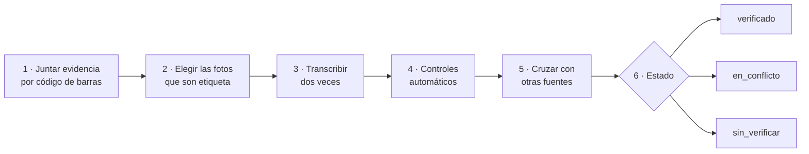

# Catálogo confiable: plan de trabajo (propuesta para discutir)

> 2026-10-02 · Estado: **propuesta, sin OK** (revisada el mismo día: verificación 100 % automática, sin revisión manual ni fotos subidas a mano; research de fuentes en §3). Reemplaza el "saneamiento en una sesión aparte" de D-42 / DT-01 por un plan concreto, y ordena DT-02, DT-03 y DT-06 detrás de él (D-92).

**Principio:** el puntaje solo puede ser tan bueno como los datos. Primero datos **completos, verificados y con fuente**; después se recalibra el motor. Ningún dato del catálogo puede ser inventado, tampoco por una IA.

## 1. Diagnóstico (lo verificado en el código el 2026-10-02)

El diagnóstico completo de la base, con mediciones sobre todo el catálogo y los casos de las pruebas manuales, está en [analisis_BD_Productos.md](analisis_BD_Productos.md) (2026-10-08).

| # | Hallazgo | Evidencia |
|---|---|---|
| 1 | **El ETL completa datos con IA "de memoria".** Con `--enrich`, `etl/enrichment/claudeEnricher.ts` le pide a Claude nutrientes e ingredientes de productos que no tienen ("Sos una base de datos nutricional experta…"). No lee ninguna etiqueta: los genera. Esos productos quedan con `ai_enriched = true` | `claudeEnricher.ts · SYSTEM_PROMPT`, `runMerge.ts · enrichWithAI` |
| 2 | **No hay procedencia por dato.** `products` guarda un `data_source` por producto (off, vtex…), no por campo, y ninguna evidencia (URL, foto de etiqueta, fecha). Hoy no se puede demostrar que un ingrediente o un valor nutricional es verdadero | Esquema de `products` (13 columnas, B-01) |
| 3 | **La nutrición está "por 100 g" y casi nunca hay porción ni contenido neto.** El contenido neto está en ~5 % del catálogo (OFF) y hasta ~16 % en el nombre del producto | DT-03, D-37 |
| 4 | **Datos incompletos que el motor puntúa igual.** Ejemplo real: Rhodesia con sodio 0 teniendo sal; ~28,7 % del catálogo sin puntaje en la última medición | PM-08, DT-02 |
| 5 | **El motor tiene errores de lectura** (aditivo contado 2-3 veces, texto partido, vitaminas obligatorias penalizadas) y **temas de criterio abiertos** (M-1 a M-8: puntúa sin cobertura mínima, el 75 % cae en una banda) | PM-08, `dominio-scoring.md §S7` |
| 6 | **Las descripciones de ingredientes tienen errores y tono de marketing o alarma.** "Aromatizante" con el texto de un cítrico; cacao "Superfood real"; lecitina "Generalmente de soja transgénica. Contiene fitoestrógenos"; sal "Preferir sal marina sin refinar" | `scoring/domain/data/ingredients.ts` (271 entradas), `rubric/impactTable.ts` (54) |

## 2. Principios (no negociables)

1. **Nada sin fuente.** Cada dato (lista de ingredientes, cada nutriente, porción, contenido neto) se guarda con: fuente, evidencia (URL o foto), fecha de captura y estado (`sin_verificar`, `verificado`, `en_conflicto`).
2. **La IA no crea datos.** Se apaga el enriquecimiento "de memoria". Si se usa IA, es solo para **transcribir una evidencia publicada online** (la foto de una etiqueta en OFF o en un supermercado), y esa transcripción cuenta como una fuente más: nunca alcanza sola ([PREGUNTA] 2).
3. **Sin revisión manual del catálogo** (decisión del responsable, 2026-10-02): todo se verifica por **consenso automático entre fuentes** y controles de coherencia. Lo que no se puede verificar así no se completa a mano: el producto queda sin puntaje. La única revisión manual es la de los productos de control (§7), acotada, para comprobar que el proceso automático no se equivoca (D-95).
4. **Lo no verificado no se presenta como verdad.** Un producto sin datos verificados suficientes queda **"sin puntaje: datos incompletos"**. Mientras la app está en desarrollo no hay usuarios que lo vean ([PREGUNTA] 1 resuelta).
5. **Lo más reciente y lo que coincide, gana.** Cada dato guarda su fecha; ante fuentes que difieren, gana el acuerdo entre fuentes independientes y, si no lo hay, el producto queda `en_conflicto` (sin puntaje), sin elegir a mano.
6. **La referencia es la etiqueta o la marca** (D-95). Un dato cuenta como validado cuando se contrastó con una fuente confiable: la etiqueta del producto (el envase o una foto publicada) o una fuente que viene de la marca (GS1, ficha técnica, sitio del fabricante). Las demás fuentes (supermercados, Open Food Facts) sirven para encontrar el dato y para detectar conflictos, pero dos de ellas que coinciden no reemplazan a la etiqueta.

## 3. Fuentes (research del 2026-10-02) y verificación automática

Probado en vivo con la Rhodesia (EAN `77995681`) y relevado online:

| Fuente | Qué trae, verificado | Acceso | Independencia y límites |
|---|---|---|---|
| **Cencosud** (Jumbo, Disco, Vea), API pública de VTEX | **Estructurado:** `Ingredientes`, `Tabla Nutricional` (con porción: "1 unidad = 22 g"), `Sellos` (octógonos y certificaciones), `Contenido` | `GET /api/catalog_system/pub/products/search?fq=alternateIds_Ean:<EAN>`; el ETL ya lo usa (`vtexAdapter`, `enrichCencosud`) | **Las tres tiendas son el mismo backend: cuentan como UNA fuente** |
| **Open Food Facts** | Ingredientes, nutrición por 100 g, porción, contenido neto; a veces fotos de etiqueta | API (15 lecturas/min por IP) o **volcado diario completo** (mejor para el catálogo entero) | Colaborativo. **Licencia ODbL: atribución y "share-alike"** (si se combina con otra base, la base resultante debería publicarse abierta) → [PREGUNTA] 7 |
| **Carrefour**, API pública de VTEX | Nombre, marca, **gramaje** (contenido neto), proveedor, fotos | Igual que Cencosud | Sin ingredientes ni nutrición |
| **ChangoMás** (masonline), VTEX | Descripción, fotos | Igual | Sin datos estructurados |
| **SEPA / Precios Claros** (datos abiertos del Estado, Res. 12/2016) | EAN, descripción, marca y **presentación** (contenido neto) de ~70.000 productos de 3.600 comercios | Volcado diario abierto (~4 GB) en datos.produccion.gob.ar | Oficial; sin ingredientes ni nutrición. Sirve para validar EAN, marca y contenido neto |
| **GS1 Argentina** (API de consulta / Verified by GS1) | GTIN, marca, descripción, imagen, **contenido neto** y **detalle de octógonos**, cargados por el **fabricante** | API, **requiere ser socio** de GS1 Argentina | La fuente más autoritativa para contenido neto y octógonos → [PREGUNTA] 8 |
| **Sitios de fabricantes** | Ingredientes y tabla oficial | Scraping por marca | **Poco confiable como única fuente:** el de Mondelez (`mondelezinternationalnutricionybienestar.com`) ya no responde y la versión indexada listaba una fórmula vieja (con aceite hidrogenado) |
| Coto, Día | — | No son VTEX públicos; Día devolvió HTML | Investigar más adelante |
| Excluidas | IA generativa "de memoria", apps de calorías (FatSecret, Fitia), blogs | — | No citan fuente |

**Dónde hay fotos de etiqueta (probado el 2026-10-03 con la manteca Tonadita `7798060850026` y la Rhodesia `77995681`):**

| Fuente | Qué se encontró | Cómo se accede |
|---|---|---|
| **Open Food Facts** | Fotos del envase recortadas y clasificadas: una de ingredientes y una de la tabla nutricional, en los dos productos | Campos `image_ingredients_url` e `image_nutrition_url` de la API, por código de barras |
| **Jumbo (Cencosud)** | En la Tonadita, la segunda foto es una **placa hecha por la marca** con la tabla nutricional y los ingredientes. La Rhodesia tiene 4 fotos | `items[].images[]` de la API de VTEX, por código de barras |
| **Carrefour** | Fotos numeradas; en la Rhodesia hay una `_N02`, que por el nombre parece la de nutrición (sin abrir) | Igual |
| **Fotos de usuarios** | No existe todavía: es RF-061 (leer la etiqueta desde una foto), en el roadmap | — |

Falta medir en la fase 0 cuántos productos del catálogo tienen al menos una de estas fotos.

**Ejemplo de por qué hace falta cruzar:** en la Tonadita, la foto del envase en OFF dice **sodio 12 mg** por porción y la placa de la marca en Jumbo dice **20 mg**. Las dos son "etiqueta"; probablemente son versiones distintas del envase. Con la regla del principio 5, ese dato queda `en_conflicto` hasta saber cuál es la vigente.

**Jerarquía de fuentes (principio 6):** primero la etiqueta y lo que viene de la marca (foto de etiqueta, GS1, ficha técnica, sitio del fabricante); después, supermercados y Open Food Facts. Queda por definir en la fase 0 cuántos productos tienen al menos una fuente del primer grupo: de eso depende la cobertura.

**Verificación automática (sin personas):**

1. **Ingredientes:** se normalizan las listas de cada fuente (nombres canónicos; "lecitina de soja (INS 322)" = un solo ingrediente) y se comparan. `verificado` si **dos fuentes independientes** coinciden en los **3 primeros** y en al menos el **85 %** del resto; si no, `en_conflicto`.
2. **Nutrición:** `verificado` si dos fuentes independientes coinciden dentro de la tolerancia del rotulado (±20 %) y pasan los controles de coherencia (energía ≈ 4·carbohidratos + 4·proteínas + 9·grasas; azúcares ≤ carbohidratos; sodio presente si hay sal; unidades).
3. **Octógonos como control cruzado:** los sellos que declara el fabricante o el supermercado (GS1, `Sellos` de Cencosud) tienen que coincidir con los que salen de calcular la Ley 27.642 sobre los nutrientes. Si no coinciden, la nutrición queda `en_conflicto`. Es un verificador automático muy fuerte, porque los sellos los define el fabricante.
4. **Porción y contenido neto:** de Cencosud, OFF, Carrefour (gramaje), SEPA y GS1; `verificado` con dos que coincidan.
5. **Fotos de etiqueta publicadas** (aprobado, D-96): una IA transcribe la foto y esa transcripción entra como **una fuente más** en los pasos 1 a 4. Nunca alcanza sola.

**Lo que esto no resuelve:** un producto que figura en una sola fuente no se puede verificar y queda sin puntaje. El costo de no tener revisión manual es **cobertura, no precisión**. La fase 0 mide cuántos productos tienen al menos dos fuentes.

## 4. Los cinco frentes

### W1 · Lista de ingredientes completa y verificada

- **Objetivo:** la lista tal como figura en la etiqueta, completa, en el orden declarado, con los aditivos con su nombre y su INS.
- **Cómo:** cruce automático de fuentes por código de barras (§3); si coinciden, `verificado`; si no, `en_conflicto` (sin puntaje). Detectores automáticos de listas incompletas (cortadas, sin aditivos cuando el producto es ultraprocesado, con texto de fabricante mezclado: ya existe `etl/lib/qualityHeuristics.ts`).
- **Hecho cuando:** el producto tiene la lista `verificada` y el motor identifica al menos el **70 % de sus ingredientes, incluidos los 3 primeros** (M-1; [PREGUNTA] 4 resuelta, con el agregado de los 3 primeros).

### W2 · Información nutricional real y por unidad

- **Objetivo:** la tabla nutricional de la etiqueta con **porción declarada, porciones por envase y contenido neto**, además de los valores por 100 g / 100 ml. La app puede mostrar "por porción" y "por envase" (RF-063, DT-03).
- **Cómo:** mismas fuentes y regla que W1, más el control cruzado de octógonos (§3). Controles automáticos de plausibilidad (ya existe `etl/quality/nutrientPlausibility.ts`): energía coherente con macronutrientes (4·carb + 4·prot + 9·grasa ≈ kcal), sodio con sal declarada, azúcares ≤ carbohidratos, unidades (mg contra g).
- **Hecho cuando:** los nutrientes críticos (energía, azúcares, grasas totales y saturadas, sodio) más porción y contenido neto están `verificados`.

### W3 · Componentes comunes de los ultraprocesados, con cuánto restan

- **Objetivo:** una **tabla curada y revisada por el responsable** de los componentes típicos de ultraprocesados: qué es cada uno, para qué se usa, en qué evidencia se apoya y cuánto resta.
- **Punto de partida:** el motor ya tiene 54 entradas de rúbrica y 271 ingredientes; se exportan a una planilla para revisarlas, no se arranca de cero. Más la frecuencia real de cada componente en el catálogo, para priorizar.
- **Grupos iniciales:** aceites refinados (girasol, soja, palma, "aceite vegetal" sin especificar); azúcares agregados (jarabe de maíz de alta fructosa, glucosa, azúcar invertido, maltodextrina); almidones modificados; proteínas aisladas; emulsionantes (lecitina INS 322, mono y diglicéridos INS 471, PGPR INS 476); espesantes (goma xántica INS 415, carragenina INS 407); edulcorantes (sucralosa INS 955, acesulfame K INS 950, aspartamo INS 951); colorantes (caramelo INS 150, tartrazina INS 102); conservantes (sorbato INS 202, benzoato INS 211); resaltadores (glutamato INS 621); aromatizantes; grasas hidrogenadas.
- **Hecho cuando:** cada componente tiene nombre y sinónimos (incluido "nombre (INS nnn)"), función, fuente (CAA, Codex/JECFA, EFSA, OMS/IARC, OPS), impacto propuesto y el OK del responsable. Esto resuelve también los errores de lectura de PM-08.

### W4 · Descripciones de ingredientes útiles y precisas

- **Objetivo:** textos que informen algo real, sin marketing ni alarma.
- **Guía de estilo:** (1) qué es; (2) para qué está en el producto; (3) qué se sabe, con fuente; (4) a quién le importa (alergias, celiaquía, etc.). Máximo ~200 caracteres, sin "superfood", sin "tóxico", sin consejos médicos, sin afirmaciones sin respaldo.
- **Cómo:** cada descripción con su fuente al lado (campo `source`). Se reescriben las 325 entradas por prioridad (las más frecuentes en el catálogo primero) y el responsable las revisa.
- **Hecho cuando:** las descripciones de los componentes que cubren el 90 % de las apariciones en el catálogo están reescritas, con fuente y revisadas.

### W5 · Presentación legible y coherente en la app

- **Objetivo:** que lo que se muestra de cada producto se pueda leer y sirva, con el mismo criterio en todos los productos.
- **Tareas (del testing manual del 2026-10-03):**

| Tarea | Origen |
|---|---|
| Tabla nutricional con criterio común: calorías, proteínas, carbohidratos y grasas totales **siempre**, en ese orden; un macro sin dato se muestra como "sin dato". El resto (azúcares, grasas saturadas, grasas trans, fibra, sodio, colesterol) solo si el valor es mayor que cero | RF-064, D-94, PM-24, PM-25 |
| Letra más grande en ingredientes y descripciones; la cantidad de ingredientes, más grande y con más contraste | PM-20, PM-21, RNF-U11 |
| Layout del resultado sin puntaje: el texto no se sale del círculo | PM-16 |
| Imagen del producto tocable, para verla en grande | PM-15 |
| La búsqueda por nombre se hace con un solo "enter" | PM-19 |

- **Hecho cuando:** los productos de control (§7) se ven con la misma tabla, y el checklist de legibilidad de §7 pasa en el teléfono.

## 5. Modelo de datos (propuesta)

- **`product_facts`**: un dato por fila, con `product_id`, `field` (ingredientes, energía, azúcares… porción, contenido neto), `value`, `unit`, `basis` (100 g, porción, envase), `source`, `evidence_url`, `captured_at` y `status`.
- **`products` limpia (D-42)**: se arma **solo con datos `verificados`**. Es lo que lee el server; la app no cambia de contrato.
- Los productos hoy `ai_enriched` pasan a `sin_verificar` (no se borran: se re-verifican).

## 6. Fases, en orden

| Fase | Qué | Quién | Sale cuando |
|---|---|---|---|
| 0 | **Medir.** Consultas sobre el catálogo actual (por fuente, cuántos `ai_enriched`, con ingredientes, nutrición, porción y contenido neto) y **cuántos EAN tienen al menos dos fuentes independientes** (Cencosud, OFF, SEPA) | Te paso las consultas, las corrés vos (D-58); el cruce con fuentes externas lo corro yo | Sabemos qué cobertura podemos alcanzar sin manual |
| 1 | **Cortar la IA generativa.** Sacar `claudeEnricher` del ETL; marcar los `ai_enriched` como `sin_verificar`; decidir qué ve el usuario de esos productos | Yo, con tu OK | El ETL no puede inventar datos |
| 2 | **Procedencia.** Tablas `product_facts` y la `products` limpia, con migraciones y pruebas | Yo | Cada dato nuevo entra con fuente y estado |
| 3 | **Verificar todo el catálogo automáticamente**: ingesta de las fuentes de §3 por EAN, normalización, consenso y controles; los conflictos quedan sin puntaje (sin revisión manual) | Yo | Cada producto queda `verificado`, `en_conflicto` o `sin_verificar`, con métricas de cobertura |
| 4 | **W3, W4 y W5** (en paralelo con la 3): tabla de componentes, descripciones y presentación en la app | Yo armo; vos aprobás | Tabla aprobada, descripciones revisadas y productos de control (§7) bien presentados |
| 5 | **Recalibrar el motor** con datos verificados: arreglos de PM-08, mínimo de cobertura (M-1), discriminación (M-6), cobertura de puntaje (DT-02) | Yo, con tu OK sobre cada cambio de puntajes | El puntaje discrimina y se apoya en datos verificados |

## 6b. Plan de ejecución: verificar todo el catálogo

Detalle de las fases 0 a 3. Todo corre en el ETL (`etl/`), por lotes, y nada toca `products` hasta la fase 3.

### Recorrido de un producto

| Paso | Qué hace | Regla |
|---|---|---|
| 1 · Juntar evidencia | Por código de barras: fotos y datos de OFF (volcado diario, sin límite de pedidos), Cencosud y Carrefour (VTEX). Se guarda cada foto con su URL, fecha y hash | Nada se descarta: toda evidencia queda registrada, sirva o no |
| 2 · Elegir las fotos | Una IA clasifica cada foto: ¿tiene lista de ingredientes?, ¿tabla nutricional?, ¿se lee? | Una foto borrosa o cortada se marca `ilegible` y no se transcribe |
| 3 · Transcribir dos veces | Dos transcripciones independientes de la misma foto. Se copia **lo que dice**, tal cual: texto de ingredientes, cada fila de la tabla con su valor, unidad y %VD, la porción y el contenido neto | Prohibido completar. Lo que no se lee va como `null`. Si las dos transcripciones no coinciden en un número o en la lista de ingredientes, esa foto se descarta |
| 4 · Controles automáticos | Sobre lo transcripto, sin IA (ver abajo) | Un control que falla deja el dato `en_conflicto` |
| 5 · Cruzar | La transcripción se compara con los datos estructurados de Cencosud, el texto de OFF y la otra foto, si hay | Si coinciden, sube la confianza. Si difieren (como el sodio de la Tonadita: 12 mg contra 20 mg), `en_conflicto` |
| 6 · Estado | `verificado`: hay una fuente de etiqueta o de marca, pasó los controles y ninguna fuente la contradice. `en_conflicto`: hay fuentes que difieren. `sin_verificar`: no hay ninguna foto ni fuente de marca | Solo lo `verificado` llega a la app con puntaje |

### Cómo se asegura que una transcripción es correcta

La etiqueta trae información redundante: eso permite detectar errores de lectura sin que nadie mire la foto.

| Control | Qué detecta |
|---|---|
| Doble transcripción que coincide | Errores de lectura al azar |
| kcal contra kJ (la etiqueta trae los dos: 75 kcal = 307 kJ) | Un dígito mal leído en la energía |
| Valor contra %VD (cada fila trae los dos) | Un dígito o una unidad mal leídos (mg por g) |
| Energía ≈ 4·carbohidratos + 4·proteínas + 9·grasas | Filas cruzadas o faltantes |
| Azúcares ≤ carbohidratos; grasas saturadas y trans ≤ grasas totales | Filas cruzadas |
| Valor por porción contra valor por 100 g, con la porción declarada | Columna equivocada |
| Octógonos declarados contra los que salen de calcular la Ley 27.642 | Nutrición que no corresponde al producto |
| Ingredientes: sin rótulos ni leyendas ("Ingredientes:", "libre de gluten", "contiene…"), sin unidades sueltas, sin repetidos | Los errores de PM-17, PM-18 y PM-22 |
| **Productos de control** (§7), revisados contra el envase | Que todo lo anterior funcione: es la única medición contra la verdad |
| Muestra al azar por lote, revisada por el responsable (acotada: unas decenas por lote) | Errores sistemáticos que los controles no ven |

### Cómo se llenan los datos

- Cada dato va a `product_facts` (§5) con su fuente, la URL de la foto, la fecha y su estado. Lo transcripto se guarda **tal cual** (por porción, con la unidad de la etiqueta), y el valor por 100 g se calcula aparte con la porción declarada.
- Nunca se pisa un dato: una evidencia nueva agrega una fila, y la regla del paso 6 decide cuál vale.
- La `products` limpia se arma solo con datos `verificados`. Los cuatro macros (RF-064) se llenan todos o el producto queda sin puntaje.
- Cada lote deja un informe: cuántos productos en cada estado, qué controles fallaron más y la lista de conflictos.

### Etapas

| Etapa | Qué | Quién | Sale cuando |
|---|---|---|---|
| A · Medir | Consultas sobre el catálogo (cuántos productos, con código de barras, por fuente, `ai_enriched`) y cobertura de fotos sobre una muestra de 500 códigos | Las consultas las corre el responsable (D-58); el cruce con las fuentes, el ETL | Se sabe cuántos productos pueden llegar a `verificado` y cuánto cuesta |
| B · Productos de control | El responsable transcribe del envase entre 30 y 50 productos (los de §7 y otros de categorías distintas) | Responsable | Hay una verdad contra la que medir |
| C · Piloto | El recorrido completo sobre los productos de control y 200 más. Se mide el acierto contra el envase | ETL | **100 % de los números** y de los ingredientes de los productos de control coinciden con el envase, o el producto quedó `en_conflicto`. Ningún dato equivocado quedó `verificado` |
| D · Corte de la IA que inventa | Se saca `claudeEnricher` y los `ai_enriched` pasan a `sin_verificar` | ETL, con OK | El ETL no puede generar datos |
| E · Lotes | Todo el catálogo por lotes, empezando por los productos más escaneados. Informe y muestra al azar por lote | ETL; la muestra, el responsable | Cada producto tiene estado |
| F · Publicar | La `products` limpia reemplaza a la actual | Migración, con OK | La app muestra solo datos verificados |

El criterio del piloto es deliberadamente asimétrico: se acepta que un producto quede sin verificar, no se acepta que un dato equivocado quede como verificado.

## 7. Cómo se comprueba

Tres objetivos pedidos por el responsable (2026-10-03), cada uno con su forma de comprobarlo:

| Objetivo | Cómo se comprueba | Frente |
|---|---|---|
| La información que se muestra es correcta y está validada | Cada producto con puntaje tiene sus ingredientes en estado `verificado` (dos fuentes independientes que coinciden, §3). Métrica: % del catálogo `verificado`, `en_conflicto` y `sin_verificar` | W1 |
| Los valores nutricionales son precisos y están validados | Igual, más los controles de coherencia (energía contra macros, azúcares ≤ carbohidratos, sodio con sal) y el cruce con los octógonos declarados. Métrica: % de productos con los 4 macros `verificados` | W2 |
| La información es legible y útil | Checklist en el teléfono sobre los productos de control: misma tabla nutricional en todos, textos que se leen sin esfuerzo, ningún "ingrediente" que no lo sea, descripciones según la guía de W4 | W4, W5 |

**Productos de control** (aceptado por el responsable el 2026-10-03, D-95). Un conjunto fijo y acotado de productos reales que se revisa contra el envase después de cada cambio de datos, de parseo o de pantalla. Lo que hoy sale bien tiene que seguir saliendo bien, y lo que sale mal tiene que quedar arreglado o sin puntaje.

| Producto | Hoy | Qué falla | Origen |
|---|---|---|---|
| Manteca Tonadita (`7798060850026`) | ✅ Bien | Nada: ingredientes y nutrición coinciden con el envase | PM-23 |
| Turrón de maní Bariloche | ❌ | Ingredientes falsos: `mg/kg`, maní repetido, "Ngredientes", "(Ins n?322)" | PM-17 |
| Pan Sacaan | ❌ | Ingredientes que el producto no tiene | PM-18 |
| Queso rallado Ilolay 120 g | ❌ | Leyendas del envase tomadas como ingredientes: "libre de", "gluten", "pasteurizada", "encimas" | PM-22 |
| Doritos | ❌ | Sin ingredientes ni puntaje | PM-25 |
| Protein Bar de Arcor | ⚠ | Nutrición correcta, pero la tabla no muestra carbohidratos ni grasas totales | PM-24 |
| Monster Punch | ⚠ | Ingredientes correctos que el motor no reconoce | PM-26 |
| Rhodesia (`77995681`) | ❌ | Puntaje inflado por errores de lectura del motor; sodio 0 teniendo sal | PM-08 |

Faltan los códigos de barras de los demás. El conjunto crece con cada producto que aparezca en las pruebas.

## 8. [PREGUNTA]

Resueltas el 2026-10-03: (2) **sí a la IA para transcribir fotos de etiqueta publicadas**: copia lo que dice la foto, no completa nada, y cuenta como fuente de etiqueta (D-96); (10) **revisión manual acotada a los productos de control**, aceptada; y la validación se hace contra la etiqueta o fuentes de la marca (principio 6, D-95). Esto vuelve más importantes las preguntas 2 (fotos de etiqueta), 6 (fichas de las marcas) y 8 (GS1), que son justamente esas fuentes.

Resueltas el 2026-10-02: (1) no hay usuarios todavía: lo no verificado queda sin puntaje; (3) **sin revisión manual**: consenso automático; (4) **70 % de ingredientes identificados**, más los **3 primeros** (en una lista ordenada por peso, los primeros son la mayor parte del producto: un 70 % sin el ingrediente principal no alcanza).

Abiertas:

5. **Primer lote para medir y ajustar:** ¿los más escaneados, una categoría (galletitas, bebidas…) o todo el catálogo de una vez?
6. ¿Hay contacto con alguna marca para fichas técnicas oficiales?
7. **Licencia de Open Food Facts (ODbL):** combinar sus datos con la base propia obliga a publicar esa base como datos abiertos. ¿Lo aceptamos, usamos OFF solo para **verificar** (comparar sin copiar sus valores) o lo consultamos con un abogado?
8. **GS1 Argentina:** ser socio da acceso a contenido neto y octógonos cargados por el fabricante (la fuente más autoritativa). ¿Fitogenix es o puede ser socio?
9. **Términos de uso de los supermercados:** las APIs de VTEX son públicas, pero conviene revisar que el uso sistemático no viole sus condiciones.

### Fuentes del research

- [Base SEPA — Datos abiertos de Desarrollo Productivo](https://datos.produccion.gob.ar/dataset?tags=SEPA) · [Precios SEPA (argentina.gob.ar)](https://www.argentina.gob.ar/economia/industria-y-comercio/defensadelconsumidor/precios-sepa)
- [GS1 Argentina — API de consulta](https://www.gs1.org.ar/Site/EstandaresSoluciones_Bootstrap5/API.html) · [Verified by GS1 (GS1 Argentina)](https://www.gs1.org.ar/Site/Servicios_Bootstrap5/Verified.html)
- [Open Food Facts — Data, API and SDKs](https://world.openfoodfacts.org/data) · [Documentación de la API](https://openfoodfacts.github.io/openfoodfacts-server/api/) · [Condiciones de uso de la API](https://forum.openfoodfacts.org/t/conditions-to-use-the-open-food-facts-api/443)
- [Rhodesia en Open Food Facts (77995681)](https://world.openfoodfacts.org/product/77995681/rhodesia-terrabusi)
