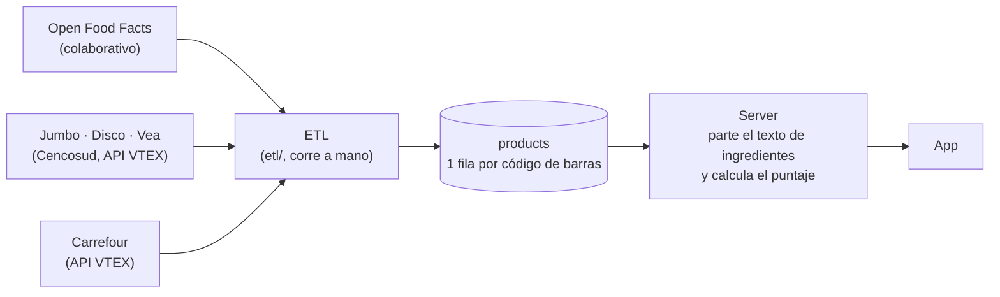

# Análisis de la base de datos de productos

> Medido el 2026-10-08 sobre la tabla `products` de producción, en solo lectura. Este documento describe **el problema**; la propuesta de solución está en [06-catalogo-confiable.md](06-catalogo-confiable.md).

## 1. Resumen

La app muestra, para cada producto, un puntaje, una lista de ingredientes y una tabla nutricional. Hoy gran parte de esa información está incompleta, es incorrecta o no se puede comprobar:

1. **3 de cada 4 productos están vacíos.** De 81.444 filas, 59.893 (73,5 %) no tienen ni ingredientes ni nutrición. Para la app es como si no existieran.
2. **Solo el 2,9 % tiene lo mínimo completo:** 2.383 productos tienen lista de ingredientes y los cuatro macronutrientes (calorías, proteínas, carbohidratos y grasas).
3. **Faltan los carbohidratos en casi todo el catálogo.** El 99 % de los productos de Jumbo, Disco y Vea con tabla nutricional no los tiene, porque esa fuente no los publica.
4. **Una parte de las listas de ingredientes trae texto que no son ingredientes:** leyendas del envase, unidades (`mg/kg`), palabras cortadas. Se concentra en Open Food Facts: al menos 1 de cada 5 de sus productos.
5. **Ningún dato tiene fuente ni fecha.** No se puede saber de dónde salió un valor ni si sigue vigente, así que no hay forma de validarlo.
6. **Además, el server y la app introducen errores propios al mostrar datos correctos:** el sodio se redondea de a 100 mg (1 de cada 4 productos con sodio muestra "0") y la tabla nutricional oculta filas según el producto.

## 2. Contexto: cómo llega un producto a la pantalla



**Las fuentes** son tres, y cada una trae cosas distintas:

| Fuente | Qué es | Qué trae | Calidad |
|---|---|---|---|
| **Open Food Facts (OFF)** | Base abierta que cargan voluntarios, muchas veces sacándole una foto al envase y pasándola a texto con OCR | Ingredientes, nutrición por 100 g y por porción, aditivos detectados | Muy despareja: desde fichas perfectas hasta texto de OCR sin corregir |
| **Cencosud** (Jumbo, Disco, Vea) | Las tres tiendas comparten catálogo. La ficha la carga el supermercado o el proveedor | Ingredientes ya separados, tabla nutricional estructurada (con porción), sellos | Buena, pero la tabla **no incluye carbohidratos** |
| **Carrefour** | Tienda online | Solo nombre, marca, foto y categoría | Sin ingredientes ni nutrición |

**El ETL** (`etl/`) baja esas fuentes, junta lo que encuentra de cada código de barras y escribe una fila en `products`. Elige campo por campo según una prioridad fija: OFF le gana a los supermercados (`etl/lib/merge.ts`).

**La tabla `products`** tiene 13 columnas. Las que importan acá:

| Columna | Qué guarda |
|---|---|
| `barcode`, `product_name`, `brand`, `category`, `image_url` | Identidad del producto |
| `ingredients_text` | La lista de ingredientes como **un solo texto**, tal como vino de la fuente |
| `nutriments` | Un JSON con los nutrientes, con las claves de OFF (`energy-kcal_100g`, `sodium_100g`…), en gramos por 100 g |
| `additives_tags` | Aditivos detectados por OFF (`en:e330`) |
| `data_source` | **Una sola** fuente por producto (`off`, `jumbo`, `disco`, `vea`, `carrefour`) |
| `ai_enriched` | Si una IA completó datos de ese producto |

**El server** no guarda el puntaje: cada vez que alguien abre un producto, parte `ingredients_text` en ingredientes (`scoring/domain/cleaning.ts`), busca cada uno en su tabla de ingredientes conocidos y calcula el puntaje. La tabla nutricional sale de `nutriments`.

Esto significa que **un error en `ingredients_text` o en `nutriments` llega directo a la pantalla**, y que hay tres lugares donde algo puede salir mal: el dato de la fuente, el parseo del server y la presentación de la app.

## 3. Cómo se midió

- Conteos sobre las 81.444 filas de `products`.
- Las 19.303 filas con ingredientes se bajaron y se pasaron por **el mismo código que usa el server** para armar la respuesta de un producto. Lo que se describe es lo que ve el usuario, no una estimación.
- Los detectores de texto basura son conservadores (buscan patrones evidentes). Sus números son un **piso**: hay más casos de los que cuentan.
- Los productos de la sección 6 son los reportados en las pruebas manuales ([pruebas-manuales.md](pruebas-manuales.md), PM-08 y PM-15 a PM-26), con su dato real de la base.

## 4. Foto general

| | Productos | % del total |
|---|---|---|
| Filas en `products` | 81.444 | 100 % |
| Con algún dato (ingredientes o nutrición) | 21.551 | 26,5 % |
| Con lista de ingredientes | 19.303 | 23,7 % |
| Con ingredientes y calorías | 13.192 | 16,2 % |
| **Con puntaje** | 13.606 | 16,7 % |
| Con los 4 macros (calorías, proteínas, carbohidratos, grasas) | 4.157 | 5,1 % |
| **Con ingredientes y los 4 macros** | 2.383 | 2,9 % |

Por fuente (según `data_source`):

| Fuente | Filas | Vacías | Con ingredientes | Con calorías | De esas, sin carbohidratos |
|---|---|---|---|---|---|
| Jumbo | 41.834 | 31.904 (76 %) | 9.883 | 7.128 | 7.082 (99 %) |
| Disco | 15.563 | 14.705 (94 %) | 858 | 624 | 609 (98 %) |
| Carrefour | 11.330 | 9.488 (84 %) | 1.839 | 1.486 | 1.458 (98 %) |
| Open Food Facts | 7.834 | 5 (0 %) | 5.634 | 5.143 | 837 (16 %) |
| Vea | 4.883 | 3.791 (78 %) | 1.089 | 844 | 840 (99 %) |

## 5. Los problemas

### P1 · La mayoría de las filas están vacías

- **Qué pasa:** 59.893 productos tienen nombre, marca y foto, pero ni ingredientes ni nutrición. El server los trata como "no está en el catálogo".
- **Causa:** el ETL carga el surtido completo de los supermercados, y la mayoría de sus fichas no trae ingredientes (son productos de limpieza, frescos, bazar, o simplemente fichas sin completar). El merge los escribe igual, marcados como incompletos (`etl/jobs/runMerge.ts`, estado `merged_incomplete`).
- **Impacto:** el tamaño del catálogo engaña: no son 81 mil productos, son unos 21 mil con algo y 13 mil con puntaje. Además esas filas compiten en la búsqueda por nombre con las que sí tienen datos.
- **Ejemplo:** de 8 panes Sacaan que vienen de los supermercados, los 8 están vacíos.

### P2 · El texto de ingredientes trae cosas que no son ingredientes

- **Qué pasa:** `ingredients_text` contiene la lista mezclada con leyendas del envase, el rótulo "Ingredientes:", advertencias, cantidades y saltos de línea en el medio de las palabras. El server parte ese texto por comas, puntos, dos puntos y saltos de línea, y **cada pedazo se muestra como un ingrediente**.
- **Causa:** es texto de OCR sin corregir que cargaron voluntarios en OFF: alguien fotografió el envase entero y el texto quedó como salió. El ETL no lo filtra. Existe un detector (`etl/lib/qualityHeuristics.ts`), pero solo busca direcciones y datos del fabricante, y solo marca, no corrige.
- **Alcance:** al menos **1.141 productos** (5,9 % de los que tienen ingredientes) muestran algún fragmento que no es un ingrediente. **1.097 son de OFF**: 1 de cada 5 productos de esa fuente. Además, 586 textos tienen saltos de línea y 333 traen el rótulo "Ingredientes" adentro.

**Ejemplo 1: queso rallado Ilolay 120 g** (`7790787002931`, OFF). Lo que está guardado:

```
SINT
Sin T.A.C.C.
QUESO RALLAD0, LIBRE DE
GLUTEN, SIN TACC.
INGREDIENTES, QUESO REGGIANITO
(Leche parcialmente descremada
pasteurizada, Cultivos de bacterias
lacticas especificas, Cloruro de sodio,
Enzimas coagulantes, Agente
de firmeza (cloruro de calcio)
```

Lo que muestra la app como ingredientes: *Sint · Queso rallad0 · Libre de · Gluten · Ingredientes · Queso reggianito · Leche parcialmente descremada · Pasteurizada · Cultivos de bacterias · Lacticas especificas · Cloruro de sodio · Enzimas · Agente · Cloruro de calcio*. El producto real tiene un ingrediente (queso) con cinco componentes.

**Ejemplo 2: pan de hamburguesa Sacaan** (`7793890001846`, OFF). El texto incluye la lista, una frase publicitaria y el párrafo legal de la harina enriquecida:

```
…Antioxidante: INS
300. Este producto, al igual que todos los de origen vegetal, NO CONTIENE COLESTEROL.
Según la ley N 25630 la Harina es Adicionado con: Hierro-30 mg/kg. Ácido Folico-2.2mg/kg. Tiamina
(B)-6.3 mg/kg. Riboflavina (82)-1,3 mg/kg. Niacina 13 mg/kg.
```

La app muestra 38 "ingredientes", entre ellos: *Este producto · Al igual que todos los de origen vegetal · No contiene colesterol · Hierro-30 mg/kg · 6.3 mg/kg · 3 mg/kg · Ins*. También hay errores de lectura del OCR: "Aguo" (agua), "IMAF" (JMAF), "INS 71" (INS 471), "INS 4821" (INS 482i).

Otros fragmentos reales encontrados en la base: *Mantener en lugar fresco* (Mantecol), *Una vez abierto* (salsa Knorr), *De 2 000 kcal u8400 kJ* (Club Social), *Contiene fenilalanina* (jugo en polvo).

### P3 · El server parte mal textos que están bien

- **Qué pasa:** aunque el texto de la fuente sea correcto, el parseo lo rompe en casos frecuentes:

| Texto en la base | Lo que muestra la app | Por qué |
|---|---|---|
| `aromatizante/saborizante aroma art. a vainilla` | "Aromatizante" y "A vainilla" (en verde, como ingrediente bueno) | El punto de la abreviatura "art." se toma como separador |
| `emulsionante (lecitina de soja: ins 322, ins 476)` | "Lecitina de soja", "Ins 322", "Ins 476" | Los dos puntos separan el nombre de su propio código: la lecitina aparece dos veces |
| `aromatizante idéntico al natural: vainillina` | "Aromatizante", "Identico al natural" (rojo), "Vainillina" | Ídem |
| `Emulsionantes: INS 4821 y INS 471` | "Emulsionantes" e "INS 4821 y INS 471" | La función del aditivo se muestra como un ingrediente más, y dos aditivos quedan como uno |
| `Gluten de\nTrigo` | "Gluten de" y "Trigo" | Salto de línea en el medio |

- **Alcance:** 370 productos muestran fragmentos cortados; en 6.375 (33 %) aparece el nombre de una función ("Emulsionante", "Conservador", "Aromatizante") como ingrediente. Parte de esos casos son legítimos (la etiqueta dice solo "aromatizante"), pero muchos salen de separar la función de su aditivo.
- **Impacto en el puntaje:** el mismo producto da puntajes distintos según cómo esté escrito el texto. El **turrón de maní Bariloche** está dos veces en la base (`7792430608637` y `7792430608651`), con los mismos ingredientes y la misma tabla nutricional. Uno dice `ins 428` y `aroma art a vainilla`; el otro, `(ins n° 428)` y `aroma art. a vainilla`. Resultado: **16 puntos uno, 20 el otro**.

### P4 · Ingredientes y aditivos repetidos

- **Qué pasa:** el mismo aditivo aparece dos o tres veces: por su nombre, por su código INS dentro del texto, y otra vez desde `additives_tags` (que el server agrega al final de la lista).
- **Ejemplo:** en el pan Sacaan, el texto ya trae `INS 282`, `INS 300` e `INS 330`, y la lista termina con "Propionato de calcio", "Vitamina C (Ácido ascórbico)" y "Ácido cítrico", que son esos mismos tres. En la Rhodesia, la lecitina aparece como "Lecitina de soja", "Ins 322" y "E322I".
- **Alcance:** 1.502 productos (7,8 %) tienen un aditivo en el texto y de nuevo en `additives_tags`. En 2.999 (15,5 %) la lista mostrada repite un nombre.
- **Impacto:** cada repetición resta puntos otra vez. Es parte de por qué la Rhodesia da 0 (PM-08).

### P5 · Ingredientes reales que el sistema no reconoce

- **Qué pasa:** el texto es correcto, pero el ingrediente no está en la tabla del motor (o le falta un sinónimo) y queda como "no reconocido".
- **Ejemplo:** Monster Punch (`0070847017332`) tiene una lista coherente de 25 ingredientes. Quedan sin reconocer *citrato de sodio, L-carnitina, inositol, glucuronolactona, ácido L-tartárico* y *extracto de raíz de panax ginseng*, y el producto queda **sin puntaje**. En el queso Ilolay, "cloruro de sodio" (sal) tampoco se reconoce.
- **Alcance:** de 206.649 ingredientes mostrados, 24.028 (11,6 %) son no reconocidos. En 1.637 productos (8,5 %) son el 30 % de la lista o más. **2.931 productos quedan sin puntaje** porque el motor no identifica lo suficiente de su lista (el número incluye los textos rotos de P2).
- **Nota:** esto no es un problema del dato sino de la tabla de ingredientes del motor. Se incluye porque el usuario lo ve igual: una lista con muchos ingredientes "desconocidos".

### P6 · La información nutricional está incompleta

| Situación | Productos |
|---|---|
| Tienen ingredientes pero **no** calorías | 6.111 |
| Tienen calorías pero **no** ingredientes (quedan sin puntaje) | 2.033 |
| Tienen calorías pero **no** carbohidratos | 10.826 de 15.225 (71 %) |
| `nutriments` con datos, pero ninguno es un nutriente (entre los que tienen ingredientes) | 1.271 |
| Tienen los 4 macros | 4.157 |

- **Los carbohidratos:** la tabla nutricional que publica Cencosud trae energía, proteínas, grasas totales, saturadas y trans, azúcares, fibra y sodio. **No trae carbohidratos.** Se verificó contra su API con el turrón Bariloche, y coincide con los datos: al 99 % de los productos de Jumbo, Disco y Vea les falta. Como esa es la fuente de la mayoría de los productos con datos, casi todo el catálogo queda sin ese macro.
- **`nutriments` sin nutrientes:** OFF agrega campos calculados (`nova-group`, `fruits-vegetables-nuts-estimate…`). Hay 1.271 filas cuyo `nutriments` tiene solo eso. Para el ETL esas filas "tienen nutrición" (el control solo mira que el JSON no esté vacío), pero no hay ni un valor real. Es el caso del pan Sacaan.
- **"Sin dato" no es lo mismo que "cero":** la manteca Tonadita tiene 4 valores (energía, grasas, saturadas, sodio). Su envase dice "no aporta cantidades significativas de carbohidratos, proteínas…". En la base esos campos están vacíos, igual que en un producto al que nadie le cargó el dato. Hoy no hay forma de distinguir los dos casos.

### P7 · Hay datos que están mal, y no hay forma de saberlo

- **Sodio en cero:** la Rhodesia (`77995681`) tiene `sodium_100g: 0` y sal en sus ingredientes. Hay 1.929 filas con sodio exactamente 0; no todas son errores, pero no hay cómo distinguirlas.
- **Fuentes que no coinciden:** en la manteca Tonadita, la foto del envase en OFF dice 12 mg de sodio por porción y la placa de la marca publicada en Jumbo dice 20 mg. La base tiene 20 mg. No sabemos cuál es la vigente.
- **Datos generados por IA:** 99 productos están marcados `ai_enriched`. Sus ingredientes o nutrientes los escribió una IA a partir del nombre del producto, sin leer ninguna etiqueta (`etl/enrichment/claudeEnricher.ts`). Se muestran igual que los demás.
- **Sin procedencia:** `data_source` es uno por producto, no por dato, y no hay fecha ni enlace a la evidencia. Hay 1.839 productos con fuente `carrefour` que tienen ingredientes, aunque Carrefour no los publica: lo más probable es que se hayan completado después desde Cencosud (`etl:enrich-cencosud`), y la fila no lo refleja.
- **Impacto:** no se puede afirmar que ningún valor de la base sea correcto, ni detectar cuándo un fabricante cambió la fórmula.

### P8 · El ETL descarta información que las fuentes sí traen

La ficha de Cencosud trae la porción ("1/4 unidad = 20 g"), las porciones por envase, cada nutriente por porción, las trazas, los sellos y las condiciones alimentarias. OFF trae la porción y el contenido neto. **Nada de eso se guarda:** `products` no tiene columnas para porción, contenido neto, sellos ni alérgenos.

Consecuencias: la app solo puede mostrar "por 100 g" (nunca "por porción" ni "por envase"), no se pueden cruzar los octógonos declarados contra los calculados, y los alérgenos quedan pegados al texto de ingredientes (`sal CONTIENE DERIVADOS DE LECHE` en la Tonadita).

### P9 · Productos duplicados y repartidos en varias filas

- **Qué pasa:** el mismo producto aparece en varias filas, cada una con un pedazo de la información.
- **Ejemplo:** el queso rallado Ilolay tiene 4 filas:

| Código | Fuente | Ingredientes | Nutrición |
|---|---|---|---|
| `7790787018031` | OFF | — | Completa |
| `7790787002931` | OFF | Texto de OCR (P2) | Sin nutrientes reales |
| `7790787251780` | OFF | Correctos | — |
| `7790787251803` | Carrefour | — | — |

Ninguna fila tiene el producto completo, aunque entre todas lo tienen.

- **Causa:** cada presentación tiene su código de barras (legítimo), pero no existe el concepto de "mismo producto, distinto envase". Además, la misma ficha se cargó varias veces desde tiendas distintas.
- **Alcance:** 1.400 filas (7,3 %) comparten nombre y marca con otra, y 2.412 (12,5 %) tienen un texto de ingredientes idéntico al de otra fila.
- **Impacto:** al buscar por nombre, la app devuelve una de esas filas, y cuál sea define si el usuario ve un producto completo, uno roto o uno sin puntaje.

### P10 · Nombres, marcas y categorías sin normalizar

| Problema | Ejemplo | Alcance (sobre las 19.303 con ingredientes) |
|---|---|---|
| Nombres cortados | "Turrón De Maní Bariloche X", "Pan De Mesa Sacaan X-paq-gr.-570" | 480 |
| El nombre es el código de barras | `7790036975108` | 122 |
| La misma marca escrita de varias formas | PATY / Paty / paty · TARAGUI / Taragüi / Taragüí | 751 marcas de 3.109 |
| Marca vacía o "SIN MARCA" | — | 571 |
| Categorías sin criterio común | "Botanas", "Alimento", "Almacén > Golosinas y Chocolates > Turrones y Grageas", "Alimentos De Origen Vegetal" | 922 categorías distintas |
| Categoría con mayúsculas rotas | "AlmacéN > Mesa Dulce NavideñA", "LáCteos" | 2.155 |

La última la produce el propio ETL: `extractCategory` pone en mayúscula la letra que sigue a una vocal con tilde o a una ñ (`src/modules/catalog/domain/productData.ts`).

### P11 · Errores al mostrar datos que están bien

No son problemas de la base, pero afectan lo mismo que se quiere garantizar: que la información nutricional que ve el usuario sea correcta.

- **El sodio se redondea de a 100 mg.** El server redondea el valor en gramos a un decimal **antes** de pasarlo a miligramos (`extractNutrition`). El turrón Bariloche tiene 46 mg y se muestra **0 mg**; la Protein Bar de Arcor tiene 362 mg y se muestra 400. De 12.541 productos con ingredientes y sodio cargado, **3.174 (25 %) muestran 0 teniendo sodio**, y 4.963 (40 %) se muestran con un error del 20 % o más. El puntaje no se ve afectado: usa otro cálculo.
- **El colesterol** sufre lo mismo: 2,2 mg se muestran como "Colesterol 0" (PM-24).
- **La tabla oculta filas.** La app muestra solo 4 de 6 valores principales, según cuáles tengan dato (PM-24, RF-064). Por eso los Doritos (`7790310983737`) no muestran sus carbohidratos aunque la base los tiene (48 g).
- **"Por 100 g" o "por 100 ml"** se decide según si el producto tiene calorías, no según si es un líquido (`ScanResultScreen.tsx`).

## 6. Los casos reportados, explicados

| Producto | Qué se vio | Qué pasa en realidad | Problema |
|---|---|---|---|
| Queso rallado Ilolay 120 g (PM-22) | "Libre de", "gluten", "ingredientes", "pasteurizada" como ingredientes | Texto de OCR del envase completo | P2, P9 |
| Pan Sacaan (PM-18) | Ingredientes que no existen | OCR con el párrafo legal de la harina y una frase publicitaria; sin nutrición real | P2, P4, P6 |
| Turrón de maní Bariloche (PM-17) | Ingredientes raros, maní repetido | Texto correcto, mal partido; dos filas con puntajes distintos; sin carbohidratos; sodio mostrado en 0 | P3, P6, P9, P11 |
| Doritos (PM-25) | Sin puntaje ni ingredientes; sin carbohidratos | La fila no tiene ingredientes; los carbohidratos están pero la app no los muestra | P6, P11 |
| Protein Bar de Arcor (PM-24) | Sin carbohidratos ni grasas; "Colesterol 0" | No tiene ingredientes (sin puntaje); la nutrición está completa y la app la recorta y la redondea | P6, P11 |
| Monster Punch (PM-26) | Ingredientes correctos, muchos sin reconocer | Faltan en la tabla del motor; sin ningún dato nutricional | P5, P6 |
| Rhodesia (PM-08) | Puntaje 0 | Aditivos contados varias veces; sodio 0 teniendo sal | P3, P4, P7 |
| Manteca Tonadita (PM-23) | Todo bien | Ingredientes correctos. Aun así: sin proteínas ni carbohidratos cargados, y dos fuentes que difieren en el sodio | P6, P7 |

## 7. Dónde se origina cada problema

| Problema | La fuente | El ETL | El diseño de la tabla | El server | La app |
|---|---|---|---|---|---|
| P1 Filas vacías | ● | ● | | | |
| P2 Texto que no son ingredientes | ● | ● (no filtra) | | ● (lo muestra todo) | |
| P3 Texto mal partido | | | ● (un solo texto) | ● | |
| P4 Repetidos | | | | ● | |
| P5 No reconocidos | | | | ● (tabla del motor) | |
| P6 Nutrición incompleta | ● | ● | | | |
| P7 Datos sin verificar | ● | ● (IA, sin procedencia) | ● | | |
| P8 Información descartada | | ● | ● | | |
| P9 Duplicados | ● | ● | ● | | |
| P10 Nombres, marcas, categorías | ● | ● | | | |
| P11 Errores al mostrar | | | | ● | ● |

Dos conclusiones para pensar la solución:

1. **No alcanza con limpiar los datos una vez.** Los problemas nacen en las fuentes y el ETL los deja pasar: sin controles de entrada, vuelven con la próxima carga.
2. **Guardar los ingredientes como un solo texto es la raíz de P2, P3 y P4.** Cada vez que alguien abre un producto, el server vuelve a adivinar dónde empieza y termina cada ingrediente. Cencosud ya los entrega separados, y el ETL los vuelve a unir en un texto.

## 8. Preguntas para plantear la solución

1. **Filas vacías (P1):** ¿se sacan de `products`, se dejan en una tabla aparte o se completan? ¿Tiene sentido cargar productos que no son alimentos?
2. **Texto de OCR (P2):** ¿se intenta limpiar, o directamente se descarta y se vuelve a obtener de una fuente mejor (la foto de la etiqueta transcripta, D-96)?
3. **Estructura (P3, P4, P8):** ¿se guardan los ingredientes como lista estructurada (nombre, función, código INS, sub-ingredientes), y la porción, el contenido neto, los alérgenos y los sellos en campos propios?
4. **Carbohidratos (P6):** si Cencosud no los publica, ¿de dónde salen? ¿De la foto de la etiqueta, de OFF, o se calculan a partir de la energía y los otros macros?
5. **"Sin dato" contra "cero" (P6):** ¿cómo se registra que una etiqueta declara "no aporta cantidades significativas"?
6. **Procedencia (P7):** ¿qué se guarda por cada dato (fuente, evidencia, fecha, estado) y qué pasa con los 99 productos completados por IA?
7. **Duplicados (P9):** ¿hace falta el concepto de "producto" separado del de "presentación" (código de barras)?
8. **Mínimo para mostrar un producto:** ¿qué tiene que tener un producto para aparecer en la app, y qué para tener puntaje?
9. **Orden:** P11 y parte de P3 y P4 son errores de código que se pueden arreglar ya, sin esperar a los datos. ¿Se hacen primero? (Ojo: arreglar P3 y P4 cambia puntajes, y D-92 dice que no se tocan hasta tener datos verificados.)

El plan propuesto hasta ahora, con las decisiones ya tomadas (D-92 a D-96), está en [06-catalogo-confiable.md](06-catalogo-confiable.md).

## Anexo: cómo reproducir las mediciones

Todos los conteos de la sección 4 salen de filtros simples sobre `products`:

| Medición | Condición |
|---|---|
| Fila vacía | `ingredients_text IS NULL AND nutriments IS NULL` |
| Con calorías | `nutriments->>'energy-kcal_100g' IS NOT NULL` |
| Sin carbohidratos | lo anterior y `nutriments->>'carbohydrates_100g' IS NULL` |
| 4 macros | `energy-kcal_100g`, `proteins_100g`, `carbohydrates_100g` y `fat_100g` no nulos |
| Por fuente | `data_source = '…'` |

Las mediciones de las secciones P2 a P5 salen de pasar cada fila con ingredientes por `toProductDetail` (`src/modules/catalog/application/productResponse.ts`) y revisar la lista resultante. Las de P11, de comparar `sodium_100g × 1000` contra lo que devuelve `extractNutrition`.
