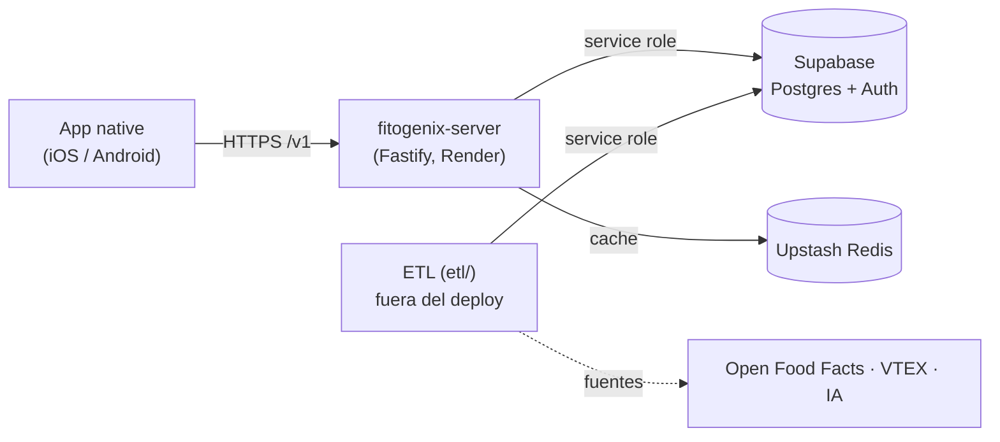
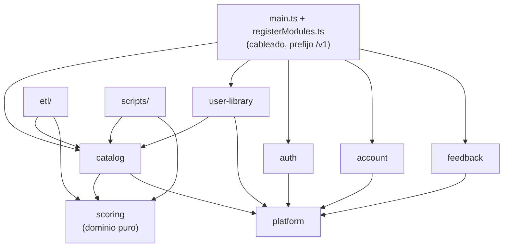
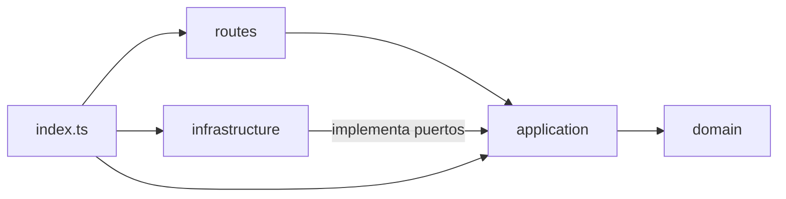
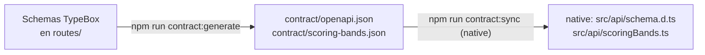
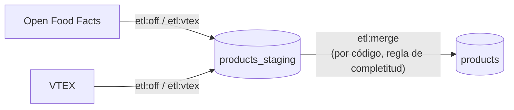

# Arquitectura

Cómo está organizado Fitogenix. El *por qué* de cada regla está en su ADR; acá va el *qué*.

## Sistema

| Regla | ADR |
|---|---|
| La app habla **solo** con el server: no tiene SDK ni claves de Supabase | [0010](adr/0010-server-unica-puerta-de-entrada.md) |
| El catálogo lo carga el ETL; el server solo lo lee y nunca llama a proveedores externos | [0004](adr/0004-etl-fuera-del-runtime.md) |
| El contrato HTTP sale del código del server (TypeBox → OpenAPI → tipos de la app) | [0011](adr/0011-contrato-http-fuente-unica.md) |
| La imagen corre en cualquier lado que ejecute Docker; la config va por variables de entorno | [0007](adr/0007-portabilidad-de-hosting.md) |

## Server: monolito modular

Un proceso y un deploy, con módulos por capacidad y fronteras verificadas por `npm run lint:deps` ([`.dependency-cruiser.cjs`](../.dependency-cruiser.cjs), [ADR-0001](adr/0001-monolito-modular.md)).

| Módulo | Qué hace | Tablas / recursos | API pública (`index.ts`) |
|---|---|---|---|
| `scoring` | Calcula el puntaje y su presentación (banda, color, sello). Sin I/O ni dependencias ([ADR-0003](adr/0003-scoring-dominio-puro.md), [dominio-scoring.md](dominio-scoring.md)) | — | `scoreProduct`, `analyzeIngredients`, `ENGINE_VERSION`, bandas y tipos |
| `catalog` | Lookup por código o nombre, detalle por id | `products`, RPC `search_products_by_name`, Redis `ftg:product:*` (7 días) y `ftg:search:*` (30 días) | `registerCatalog`, `productSummaryFromRow`, `buildCachePayload`, tipos |
| `user-library` | Guardados e historial | `saved_products`, `scan_history` | `registerUserLibrary`, `recordScan` |
| `auth` | Registro, login (email, Google, Apple), refresh, logout, recuperación de contraseña, disponibilidad de username | Supabase Auth | `registerAuth` |
| `account` | Perfil, respuestas del onboarding, baja de la cuenta | `profiles`, `onboarding_responses`; borra en `auth.users` | `registerAccount`, `profiles` |
| `feedback` | Feedback y reportes de producto, con o sin sesión | `feedback`, `product_reports` | `registerFeedback` |
| `platform` | Config, logger, clientes de Supabase y Redis con timeout, armado de Fastify (CORS, rate limit, errores), `requireAuth` / `optionalAuth`, health, apagado | — | Funciones por archivo |

**Dependencias entre módulos:**

- Un módulo importa a otro **solo por su `index.ts`**.
- `scoring` no importa nada.
- `platform` no importa módulos.
- `src/` no importa `etl/` ni `scripts/`.
- Dos dependencias se inyectan desde `registerModules.ts` para no crear acoplamientos:
  - `catalog` recibe `onScan`, que registra el escaneo en `user-library`. Así `catalog` no conoce el historial.
  - `auth` recibe `profiles` de `account`, para crear el perfil al registrarse.

**Una tabla, un dueño** ([ADR-0005](adr/0005-acceso-a-datos-y-propiedad-de-tablas.md)): solo la infraestructura del módulo dueño toca su tabla. El ETL escribe `products` y `products_staging`. La tabla `waitlist` es del sitio web: solo admite `INSERT` y el server no la usa.

### Capas de cada módulo

| Capa | Qué tiene | No puede importar |
|---|---|---|
| `domain/` | Tipos y funciones puras | `application`, `infrastructure`, `routes`, `platform`, Fastify, SDKs |
| `application/` | Casos de uso y **puertos** (interfaces) | `infrastructure`, `routes`, Fastify, SDKs, `process.env` |
| `infrastructure/` | Adaptadores de Supabase y Redis que implementan los puertos | `routes` |
| `routes/` | Plugins de Fastify: schema TypeBox, mapeo de resultados a status HTTP | `infrastructure` |
| `index.ts` | Cableado a mano (sin contenedor de DI, [ADR-0002](adr/0002-capas-y-cableado.md)) | — |

Las capas son opcionales: un módulo sin reglas de negocio no tiene `domain/`.

### Fallas de dependencias

[ADR-0006](adr/0006-fallas-de-dependencias.md):

| Si falla… | El server… |
|---|---|
| Redis | Sigue desde Supabase (tope de 200 ms, sin reintentos) |
| Supabase (base) | Responde 503 con `Retry-After` (tope de 2 s); nunca 404 |
| Supabase Auth | Valida el JWT localmente con las claves JWKS en cache ([ADR-0008](adr/0008-validacion-de-jwt.md)); sin claves, 503 |

`/health` dice si el proceso responde. `/health/ready` dice si responde Supabase.

## Contrato HTTP

- **Fuente única:** los schemas de las rutas. `contract:check` falla en el CI si `openapi.json` no está al día.
- **Versionado:** las rutas cuelgan de `/v1`, y la versión del contrato está en `info.version` del OpenAPI, con los cambios en [`contract/CHANGELOG.md`](../contract/CHANGELOG.md).
- **Cambios:** los que agregan algo son libres; los que rompen se coordinan con un release de la app.
- **Errores:** todos con la forma `ApiError`: `{ error, code }`, con `error` como mensaje y `code` de una lista cerrada (`NOT_FOUND`, `DEPENDENCY_UNAVAILABLE`, …).
- **Bandas del puntaje:** sus cortes se publican en `scoring-bands.json` para que la app no los copie a mano.

## Base de datos

- **Migraciones:** viven en `supabase/migrations/` y se aplican **solo** con `supabase db push` ([ADR-0009](adr/0009-migraciones.md), D-81). Nada se aplica desde el editor web.
- **Permisos:** `anon` y `authenticated` no tienen acceso a los datos de la app. Todo pasa por el server con service role (RNF-S01, D-90). El CI levanta la base local y verifica los permisos y que `database.types.ts` esté al día.
- **Cascada:** `profiles`, `saved_products`, `scan_history` y `onboarding_responses` se borran en cascada con el usuario de `auth.users`.

| Tabla | Dueño | Qué guarda |
|---|---|---|
| `products` | catalog (lee) · ETL (escribe) | Catálogo: nombre, marca, código, ingredientes, nutrientes, `nutrition_basis` (`100g` o `100ml`; nula si la fuente no lo dice), imagen, fuente |
| `products_staging` | ETL | Filas crudas por fuente, pendientes de merge |
| `product_facts` | ETL | Un dato observado por fila, con fuente, evidencia (URL y hash de la foto), fecha y estado (`sin_verificar`, `verificado`, `en_conflicto`). Solo se agregan filas; lo único que cambia es el estado. Sin acceso para `anon` ni `authenticated` |
| `saved_products` | user-library | `(user_id, product_id, created_at)` |
| `scan_history` | user-library | `(user_id, product_id, scanned_at)`, una fila por producto |
| `profiles` | account | Nombre, apellido, username único, teléfono |
| `onboarding_responses` | account | Respuestas del onboarding; los datos de salud solo con consentimiento (fecha y versión) |
| `feedback`, `product_reports` | feedback | Comentarios y reportes, con usuario opcional |
| `waitlist` | sitio web | Solo `INSERT` |

## ETL

Vive en `etl/`, corre con `tsx` desde la máquina del operador y no entra en el build. Usa solo las APIs públicas de `catalog` y `scoring`, y su propia config (`etl/config.ts`). La IA (`ANTHROPIC_API_KEY`) solo existe acá. Uso: [`etl/README.md`](../etl/README.md).

## Calidad

| Qué | Dónde |
|---|---|
| Typecheck, tests con cobertura, reglas de dependencias, código sin uso, contrato al día, `npm audit` | CI, job `test` |
| La imagen Docker se construye, se levanta y responde `/health` | CI, job `docker` |
| Migraciones aplicadas sobre una base limpia, permisos y tipos al día | CI, job `migraciones` |
| Deploy y rollback | [deploy.md](deploy.md) |

La app (fitogenix-native) tiene su propia arquitectura en su repo: `docs/arquitectura.md`.
